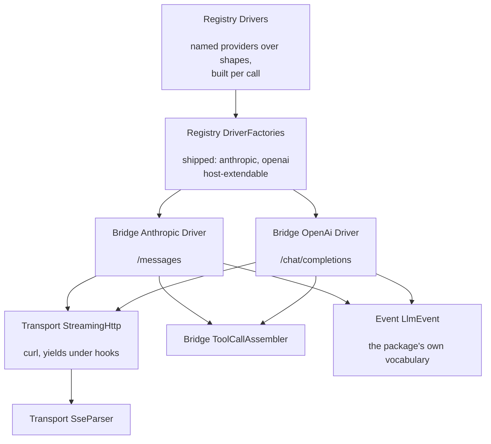

# phpdot/ai

> **This is an experimental package.** The API surface may change in any release without a
> deprecation cycle — pin the constraint and read the release notes before upgrading.

The LLM client layer for the PHPdot ecosystem — one streaming turn API over the two wire
shapes that matter (Anthropic `/messages` and OpenAI-compatible `/chat/completions`), with
tools, usage, and mid-turn cancellation, on ext-curl that yields coroutines under Swoole
hooks. No vendor SDK, no PSR HTTP abstraction: the wire is hand-rolled because the wire is
the part worth owning.

## Table of Contents

- [Requirements](#requirements)
- [Installation](#installation)
- [Usage](#usage)
- [Architecture](#architecture)
- [Testing](#testing)
- [License](#license)

## Requirements

| Requirement | Constraint |
|---|---|
| PHP | `>= 8.5` |
| `ext-curl` | `*` |
| `ext-json` | `*` |
| `phpdot/config` | `^0.3` |

`phpdot/container` (dev-only suggestion) autowires the `#[Singleton]` accessors;
`ext-swoole` is the runtime the client is proven under — the concurrency suite runs with
the production hook flags.

## Installation

```bash
composer require phpdot/ai
```

## Usage

Providers are configuration, not code — a named block per provider, each declaring the
wire `driver` it speaks. Two shapes cover the market, so the blocks scale into the
hundreds while the factories stay at two:

```php
// config/ai.php
return [
    'default'   => 'anthropic',
    'timeout'   => 300,    // seconds a whole turn may take
    'maxTokens' => 8192,

    'providers' => [
        'anthropic' => ['driver' => 'anthropic', 'label' => 'Anthropic', 'baseUrl' => 'https://api.anthropic.com/v1',
                        'apiKey' => env('ANTHROPIC_API_KEY'), 'version' => '2023-06-01',
                        'models' => ['claude-sonnet-4-20250514' => 'Claude Sonnet 4']],

        'openai'    => ['driver' => 'openai', 'label' => 'OpenAI', 'baseUrl' => 'https://api.openai.com/v1',
                        'apiKey' => env('OPENAI_API_KEY'), 'models' => ['gpt-4o' => 'GPT-4o']],

        'groq'      => ['driver' => 'openai', 'label' => 'Groq', 'baseUrl' => 'https://api.groq.com/openai/v1',
                        'apiKey' => env('GROQ_API_KEY'), 'models' => ['llama-3.3-70b' => 'Llama 3.3 70B']],
    ],
];
```

One turn, any provider, streaming as it lands:

```php
$driver = $drivers->for('groq');

$driver->stream(
    new ConversationDTO($messages, 'You are terse.'),   // the window is already applied
    'llama-3.3-70b',                                    // the provider's own model id
    $tools,                                             // list<ToolDefinition>, or []
    function (LlmEvent $event) use ($emit): bool {
        return match ($event->type) {
            LlmEventType::Delta    => $emit('delta', ['text' => $event->text]),
            LlmEventType::ToolCall => $emit('tool_call', ['call' => $event->toolCall]),
            LlmEventType::Done     => $emit('done', ['usage' => $event->usage]),
            LlmEventType::Error    => $emit('failed', ['message' => $event->message]),
        };
    },
);
```

The callback returning `false` abandons the turn — a reader who closed the page — and the
transfer actually stops: curl aborts, the driver emits no tail, and the worker is free.
Cancellation propagates from whatever your SSE writer answers, through the callback, to
the socket.

The event vocabulary is the package's own; no vendor's event names cross a driver. Tool
calls arrive only once their arguments are complete and decoded. Token usage of zero means
not reported, never free. A failure before or at stream start throws `LlmError`; a failure
mid-stream is an `Error` event, so the reader gets an answer and not a dead connection.

## Architecture

`Registry\Drivers` (singleton) reads the host's `ai` configuration and builds one driver
per call: named `ProviderBlock`s over `LlmShape`s, through `DriverFactories`. The two
shipped factories cover both wire shapes; a host binds its own aggregate to add a
genuinely new wire. **Adding a provider is a config block. Adding a wire shape is a
folder** — `Bridge/<Vendor>/` with a `Driver` and a `Factory`, nothing else moves:

```
src/
    Bridge/               one folder per wire shape
        Anthropic/        Driver, Factory
        OpenAi/           Driver, Factory
        ToolCallAssembler the shared fragment assembly
    Contract/             the port: LlmDriver, DriverFactoryInterface,
                          LlmCapabilities, ToolDefinition
    Registry/             Drivers, DriverFactories, ProviderBlock, LlmShape
    Transport/            StreamingHttp, SseParser, Json — the shared wire machinery
    Conversation/         the thread DTOs (symfony/ai's Message/)
    Event/                LlmEvent, LlmEventType, LlmUsage — the turn vocabulary
    Exception/            AiException base, the LlmError leaf
    Internal/             Values (@internal) — the coercions
```

`Bridge\Anthropic\Driver` and `Bridge\OpenAi\Driver` translate the platform's DTOs to
their vendor's spelling and share `Transport\StreamingHttp` (curl `WRITEFUNCTION`, status
captured in the header callback, error bodies buffered and raised whole),
`Transport\SseParser` (complete frames only, arbitrary chunk boundaries), and
`Bridge\ToolCallAssembler` (index-keyed partial-JSON assembly; invalid JSON dropped,
never guessed at).



## Testing

```bash
composer install
composer test        # PHPUnit
composer analyse     # PHPStan, level max + strict rules
composer cs-check    # PHP-CS-Fixer
composer check       # All three
```

The wire suites run against a local fake provider — raw stream sockets serving recorded
SSE fixtures, logging every request as the executable wire spec — and prove incremental
delivery, every refusal branch, timeout, abandonment timing, both request shapes, and
Swoole concurrency under the production hook flags (four held turns complete in one hold,
not four).

A live suite makes ONE real streaming call against OpenAI. It is excluded from every gate
(`live` group; the root run never includes it) and is opt-in by suite selection, with the
key read from the environment at run time and stored nowhere:

```bash
OPENAI_API_KEY=<the key> vendor/bin/phpunit -c packages/ai/phpunit.xml --testsuite Live
```

## License

MIT.

**This repository is a read-only mirror**, generated by CI from
[phpdot/monorepo](https://github.com/phpdot/monorepo). [Pull requests](https://github.com/phpdot/monorepo/pulls)
and [issues](https://github.com/phpdot/monorepo/issues) belong in the monorepo.
