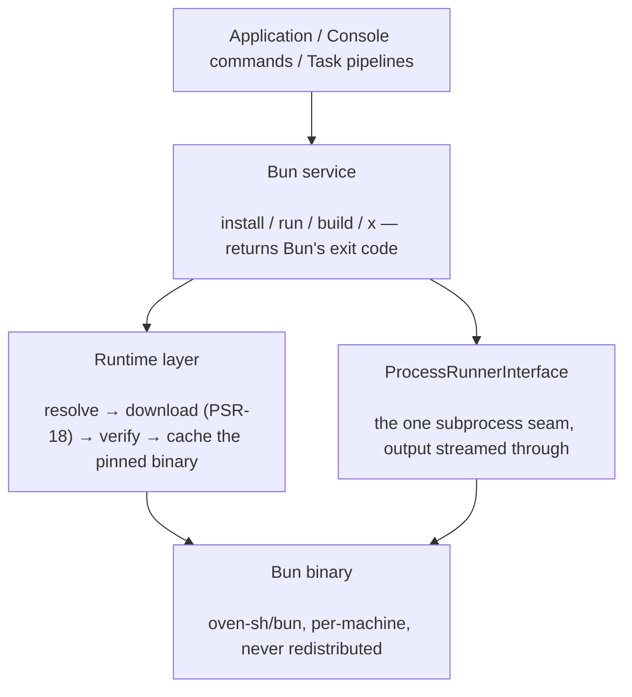

# phpdot/bun

A PHP wrapper around the [Bun](https://github.com/oven-sh/bun) toolkit for the PHPdot ecosystem. It
manages a hidden, version-pinned Bun binary — downloaded on first use, integrity-verified, and cached
per machine — and exposes Bun's package manager, script runner, and bundler as console commands, an
injectable service, and composable task pipelines. It's a thin wrapper: it resolves the right binary
for your platform and delegates, streaming output through; every subprocess goes through one
`ProcessRunnerInterface` seam and every HTTP call through PSR-18.

## Table of Contents

- [Requirements](#requirements)
- [Installation](#installation)
- [Usage](#usage)
- [Architecture](#architecture)
- [Testing](#testing)
- [License](#license)

## Requirements

| Requirement | Constraint |
|---|---|
| PHP | `>= 8.5` |
| `ext-curl` | `*` |
| `nyholm/psr7` | `^1.8` |
| `phpdot/console` | `^0.1` |
| `psr/container` | `^2.0` |
| `psr/http-client` | `^1.0` |
| `psr/http-factory` | `^1.0` |
| `psr/http-message` | `^1.1 \|\| ^2.0` |
| `symfony/console` | `^8.0` |
| `symfony/http-client` | `^8.0` |
| `symfony/process` | `^8.0` |

`ext-pcntl` is suggested — it forwards `SIGINT`/`SIGTERM` to long-lived children (`run`, `build --watch`).

## Installation

```bash
composer require phpdot/bun
```

The Bun binary is downloaded per machine into a runtime directory — never committed. Add it to
`.gitignore`:

```gitignore
/.phpdot/
```

On Alpine/musl, `apk add libstdc++` (the downloaded binary links against it); glibc distros and
macOS/Windows already provide it.

## Usage

### The `Bun` service

Inject `Bun` and call it; each call resolves the binary (downloading on first use), streams Bun's output
to the console, and returns Bun's exit code:

```php
use PHPdot\Bun\Bun;

final class Assets
{
    public function __construct(private readonly Bun $bun) {}

    public function compile(): int
    {
        $this->bun->install(['lodash']);                  // bun add lodash
        return $this->bun->build('resources/js/app.ts');  // minify + split + hash + manifest
    }
}
```

### Console commands

Discovered automatically via `#[AsCommand]`: `bun:search`, `bun:install`, `bun:remove`, `bun:view`,
`bun:run`, `bun:x`, and `bun:build`.

```bash
dot bun:install lodash
dot bun:build resources/js/app.ts --out-dir=public/build --minify --splitting --hashed-names
dot bun:run dev -- --port 3000     # flags for the script go after --
dot bun:build src/index.ts --watch # long-lived; exits cleanly on signal
```

### Build configuration and task pipelines

`BuildSpec` is an immutable, fluent builder for the full `bun build` flag set (out dir/file, target,
format, minification, splitting, sourcemaps, hashed names, define/external, …); a build with an out-dir
also writes an asset `Manifest` mapping entry names to hashed URLs. `Tasks`, `Task`, and `Flow` compose
several Bun steps into a pipeline with a structured `FlowResult`.

## Architecture

The `Bun` service is the façade. It asks the runtime layer to resolve the platform's binary — downloading
it from the npm registry over PSR-18 on first use, verifying its integrity, and caching it per machine —
then delegates every operation to that binary through a single `ProcessRunnerInterface` seam. Console
commands and task pipelines are thin callers of the same service.



## Testing

```bash
composer install
composer test        # PHPUnit
composer analyse     # PHPStan, level max + strict rules
composer cs-check    # PHP-CS-Fixer
composer check       # All three
```

## License

MIT — see [LICENSE](LICENSE).

phpdot/bun wraps [Bun](https://github.com/oven-sh/bun) (oven-sh/bun), which is MIT licensed. The binary
is downloaded per machine from the npm registry and is never redistributed inside this package.

This repository is a **read-only mirror**. The canonical source lives in
[phpdot/monorepo](https://github.com/phpdot/monorepo); pull requests and issues are handled there:
[pulls](https://github.com/phpdot/monorepo/pulls) · [issues](https://github.com/phpdot/monorepo/issues).
