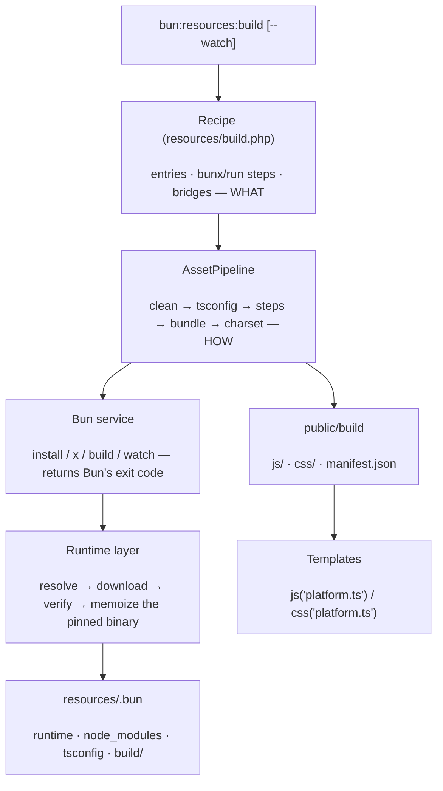

# phpdot/bun

The asset pipeline and JavaScript bridge for the PHPdot ecosystem. A version-pinned
[Bun](https://github.com/oven-sh/bun) binary is installed once into your project, invisibly; the npm
ecosystem is reached through the console you already use; and one command turns the TypeScript and
CSS you author in `resources/` into hashed, manifest-tracked assets in `public/build`. Nothing
JavaScript ever lands in the project root.

## Table of Contents

- [Requirements](#requirements)
- [Installation](#installation)
- [Usage](#usage)
  - [Where things live](#where-things-live)
  - [Console commands](#console-commands)
  - [Building assets: TypeScript + Tailwind CSS](#building-assets-typescript--tailwind-css)
  - [Using the built assets in templates](#using-the-built-assets-in-templates)
  - [The `Bun` service](#the-bun-service)
- [Configuration](#configuration)
- [Architecture](#architecture)
- [Testing](#testing)
- [License](#license)

## Requirements

| Requirement | Constraint |
|---|---|
| PHP | `>= 8.5` |
| `ext-mbstring` | `*` |
| `nyholm/psr7` | `^1.8` |
| `phpdot/console` | `^0.3` |
| `psr/http-client` | `^1.0` |
| `psr/http-factory` | `^1.0` |
| `psr/http-message` | `^1.1 \|\| ^2.0` |
| `symfony/console` | `^8.0` |
| `symfony/http-client` | `^8.0` |
| `symfony/process` | `^8.0` |

`phpdot/package` and `phpdot/container` are `require-dev` + `suggest` entries, `phpdot/config` a
`suggest` entry: in a PHPdot application they scaffold `config/bun.php`, fill its directories and
wire the services automatically; a plain PHP project constructs `BunConfig` by hand.
`ext-pcntl` is suggested — it forwards `SIGINT`/`SIGTERM` to long-lived children (`run`, `--watch`).
`ext-curl` is suggested — symfony/http-client uses its curl transport for runtime downloads when present.

## Installation

```bash
composer require phpdot/bun
```

In a PHPdot application that is the whole install: `config/bun.php` is generated, its three
directories are filled with portable absolute paths, and the Bun binary downloads itself on first use.
No Node, no nvm, no global tooling.

## Usage

### Where things live

Two configured directories, plus the JavaScript yard derived from one of them — all absolute:

| directory | default | holds |
|---|---|---|
| `resourcesDir` | `resources` | your sources — TypeScript, CSS, and the build recipe `build.php`; nothing is ever generated here |
| `outputDir` | `public/build` | built `js/`, `css/`, `assets/` and `manifest.json`; wiped on every build |
| home (derived) | `resources/.bun` | everything JavaScript, never configured: the Bun binary (`runtime/`), `package.json`, `bun.lock`, `node_modules/`, `tsconfig.json`, build intermediates (`build/`) |

The JavaScript manifest is committed; the heavy state is not. Add this to your `.gitignore`:

```gitignore
resources/.bun/*
!resources/.bun/package.json
!resources/.bun/bun.lock
!resources/.bun/tsconfig.json
```

Everything else under `resources/.bun` is developer-machine state. A fresh clone is just
`bun:resources:build`: the binary downloads from the pin, `bun install` restores `node_modules`
from the committed lockfile, and the recipe runs.

### Console commands

```bash
php dot bun:install typescript @tailwindcss/cli --dev   # bun add — lands in resources/.bun
php dot bun:install                                     # no args — install from the committed lockfile
php dot bun:remove lodash
php dot bun:search chart                                 # npm registry search, no binary needed
php dot bun:view react
php dot bun:run dev                                      # a package.json script
php dot bun:x prettier -- --write .                      # any installed CLI tool

php dot bun:resources:build                              # build the assets
php dot bun:resources:build --watch                      # rebuild on change — Ctrl+C to stop
```

`bun:build` exposes bun's raw bundler flags for one-off builds; the pipeline above is the everyday path.

### Building assets: TypeScript + Tailwind CSS

**1. Install the tooling** — it lands in `resources/.bun`, never in the project root:

```bash
php dot bun:install typescript @tailwindcss/cli --dev
```

**2. Author your sources in `resources/`:**

```ts
// resources/platform.ts
import '@build/app.build.css';          // the compiled stylesheet rides this entry
import { greet } from './greeting';

document.body.className = 'p-4';
console.log(greet('world'));
```

```css
/* resources/app.css */
@source "../resources";                 /* tailwind scans your sources for class names */
.brand { color: red; }
```

**3. Write the recipe** — `resources/build.php`, your file. It declares *what* to build; the pipeline
knows *how*:

```php
<?php

declare(strict_types=1);

use PHPdot\Bun\Resources\Recipe;

return static function (Recipe $recipe): void {
    $root = dirname(__DIR__);

    $bridge = $recipe->bridge('app.css', "@import \"tailwindcss\";\n@import \"{$root}/resources/app.css\";\n");
    $recipe->bunx(
        '@tailwindcss/cli',
        ['-i', $bridge, '-o', $recipe->buildDir() . '/app.build.css'],
        watch: ['--watch'],
    );
    $recipe->entries($root . '/resources/platform.ts');
};
```

The `bridge()` line exists because tailwind resolves `@import "tailwindcss"` from the input file's own
directory: a bridge inside `resources/.bun/build` sits beside `node_modules`, names the package, and pulls
your stylesheet in by path. Your CSS never names a package. Steps run in declaration order as one
fail-fast flow — the first failing step fails the build and nothing after it runs. `bunx()` runs any
installed tool from `resources/.bun` — tailwind, postcss, sass; `run()` runs one of your own scripts —
an icon extractor, a code generator:

```php
$extractor = $recipe->bridge(
    'extract-icons.mjs',
    (string) file_get_contents($root . '/resources/icons/extract-icons.mjs'),
);
$recipe->run($extractor, ['-i', $root . '/resources/icons/svg', '-o', $recipe->buildDir() . '/icons']);
```

A script that imports npm packages must live under home — stage it with `bridge()` as above — because
from elsewhere bun silently resolves its bare imports from the public registry; a script using only
Node builtins can stay in `resources/`. The `watch:` argument is one declaration for both modes: those
extra arguments are added only under `--watch`, where the step keeps running as the tool's own watcher.
A build never sees them, so a watch flag can never hang a one-shot build. For a watcher with no build
phase at all — a dev server, a codegen loop — use `$recipe->bunxWatch('some-tool', ['serve'])` or
`$recipe->runWatch($script, ['serve'])`.

**4. Build:**

```bash
php dot bun:resources:build
```

The pipeline wipes `public/build`, installs from the committed lockfile when `node_modules` is
missing, runs your steps — installed tools and your own scripts, each verified, fail-fast —
bundles the entries (minified, split,
content-hashed), writes `manifest.json`, and prepends `@charset "UTF-8"` to every built stylesheet.
With `--watch`, entry names stay stable so the manifest remains valid all session, and any step with
`watch:` arguments keeps running as a side process beside bun's own watcher.

Bare imports such as `import { nanoid } from 'nanoid'` resolve through `resources/.bun/tsconfig.json`,
which the first build writes with a `paths` mapping to `node_modules` and the `@build/*` alias. After
that the file is yours — add targets, libs, strictness.

### Using the built assets in templates

The manifest keys every output by the authored entry, relative to `resources/`. The Twig extension
is your application's, and it is **not** auto-discovered: `phpdot/template` discovers extensions
only from classes inside installed packages, never from application code. Write the few lines, then
register the extension yourself before the first render — rebind `View::class` in your application's
DI, fetch the shared environment, and `addExtension()` behind a `hasExtension()` guard:

```php
use PHPdot\Bun\Resources\AssetPipeline;
use Twig\Extension\AbstractExtension;
use Twig\TwigFunction;

final class Assets extends AbstractExtension
{
    public function __construct(private readonly AssetPipeline $pipeline) {}

    public function getFunctions(): array
    {
        return [
            new TwigFunction('js', fn (string $entry): string => $this->pipeline->manifest()->js($entry)),
            new TwigFunction('css', fn (string $entry): string => $this->pipeline->manifest()->css($entry)),
        ];
    }
}
```

```twig
<script type="module" src="{{ js('platform.ts') }}"></script>
<link rel="stylesheet" href="{{ css('platform.ts') }}">
```

→ `/build/js/platform-297bcrg3.js` and `/build/css/platform-dzwezbt3.css`. Set
`'baseUrl' => 'https://cdn.example.com/build'` and the same calls emit CDN URLs; the hashes are the
cache-busting.

### The `Bun` service

Everything the commands do is available as an injected service:

```php
use PHPdot\Bun\Bun;

$bun->install(['react'], dev: false);
$bun->x('prettier', ['--write', '.']);
$bun->build(['/abs/resources/platform.ts'], fn (BuildSpec $b) => $b->outDir('/abs/public/build'));
$bun->binary();   // the resolved, verified binary path
```

Every method returns bun's exit code, output streamed through.

## Configuration

`config/bun.php`, generated once and yours thereafter:

```php
return [
    'pinnedVersion' => '1.4.0',                               // never "latest"
    'registryUrl'   => 'https://registry.npmjs.org',          // a mirror is this one setting
    'resourcesDir'  => dirname(__DIR__) . '/' . 'resources', // home is its derived .bun subdirectory
    'outputDir'     => dirname(__DIR__) . '/' . 'public/build',
    'baseUrl'       => null,                                  // null → derived (/build); a path; or an https CDN base
];
```

The directories must be absolute — a relative path is refused at load with the remedy in the message.
The `dirname(__DIR__)` form keeps the file portable across machines.

## Architecture

The `Bun` service is the façade. It asks the runtime layer for the platform's binary — downloaded from
the npm registry over PSR-18 on first use, integrity-verified, executed and version-checked, memoized
for the process — then delegates every operation through a single `ProcessRunnerInterface` seam. The
resources layer sits above it: a `Recipe` declares what to build, the `AssetPipeline` runs the stages,
and the `Manifest` maps authored entries to hashed URLs.


```mermaid
graph TD
    CMD["bun:resources:build [--watch]"]
    RECIPE["Recipe (resources/build.php)<br/><br/>entries · bunx/run steps · bridges — WHAT"]
    PIPE["AssetPipeline<br/><br/>clean → tsconfig → steps → bundle → charset — HOW"]
    BUN["Bun service<br/><br/>install / x / build / watch — returns Bun's exit code"]
    RUNTIME["Runtime layer<br/><br/>resolve → download → verify → memoize the pinned binary"]
    HOME["resources/.bun<br/><br/>runtime · node_modules · tsconfig · build/"]
    OUT["public/build<br/><br/>js/ · css/ · manifest.json"]
    TPL["Templates<br/><br/>js('platform.ts') / css('platform.ts')"]

    CMD --> RECIPE --> PIPE --> BUN --> RUNTIME --> HOME
    PIPE --> OUT --> TPL
```

## Testing

```bash
composer install
composer test        # PHPUnit
composer analyse     # PHPStan, level max + strict rules
composer cs-check    # PHP-CS-Fixer
composer check       # All three
```

Integration tests that download the real binary and run real builds are gated behind `BUN_LIVE=1`.

## License

MIT — see [LICENSE](LICENSE).

phpdot/bun wraps [Bun](https://github.com/oven-sh/bun) (oven-sh/bun), which is MIT licensed. The binary
is downloaded per project from the npm registry and is never redistributed inside this package.

This repository is a **read-only mirror**. The canonical source lives in
[phpdot/monorepo](https://github.com/phpdot/monorepo); pull requests and issues are handled there:
[pulls](https://github.com/phpdot/monorepo/pulls) · [issues](https://github.com/phpdot/monorepo/issues).
