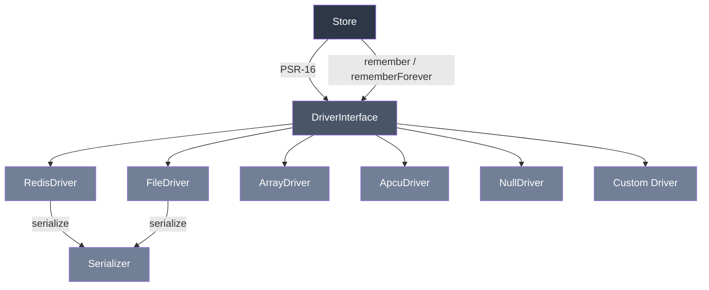

# phpdot/cache

PSR-16 cache with pluggable drivers — Redis, File, Array, APCu, Null — and a `remember()`
pattern. Standalone.

## Table of Contents

- [Requirements](#requirements)
- [Installation](#installation)
- [Usage](#usage)
- [Drivers](#drivers)
- [PSR-16 Compliance](#psr-16-compliance)
- [Notes](#notes)
- [Architecture](#architecture)
- [Testing](#testing)
- [License](#license)

## Requirements

| Requirement | Constraint |
|---|---|
| PHP | `>= 8.5` |
| `psr/simple-cache` | `^3.0` |
| ext-redis | for `RedisDriver` |
| ext-apcu | for `ApcuDriver` |
| ext-igbinary | optional — faster serialization |

## Installation

```bash
composer require phpdot/cache
```

## Usage

### Basic

```php
use PHPdot\Cache\Store;
use PHPdot\Cache\Driver\RedisDriver;

$cache = new Store(new RedisDriver($redis, prefix: 'app:'));

$cache->set('user:1', $userData, 3600);
$user = $cache->get('user:1');
$cache->delete('user:1');
$cache->has('user:1'); // false
```

### Remember pattern

```php
$user = $cache->remember('user:1', 3600, function () use ($db) {
    return $db->table('users')->find(1);
});
// First call: queries DB, caches result
// Subsequent calls: returns from cache

$config = $cache->rememberForever('app:config', fn() => loadConfig());
```

### Swap backends

```php
$cache = new Store(new RedisDriver($redis, prefix: 'app:'));
$cache = new Store(new FileDriver('/var/cache/app'));
$cache = new Store(new ArrayDriver());
$cache = new Store(new ApcuDriver(prefix: 'app:'));
$cache = new Store(new NullDriver());
// Same API, different backend
```

### Batch operations

```php
$cache->setMultiple([
    'user:1' => $user1,
    'user:2' => $user2,
], ttl: 3600);

$users = $cache->getMultiple(['user:1', 'user:2', 'user:3'], default: null);
$cache->deleteMultiple(['user:1', 'user:2']);
```

### LRU eviction (ArrayDriver)

```php
$cache = new Store(new ArrayDriver(maxItems: 1000));
// Evicts least recently used entry when full
```

### Custom driver

```php
use PHPdot\Cache\DriverInterface;

final class MongoDriver implements DriverInterface
{
    // Implement 8 methods: get, set, delete, clear, has,
    // getMultiple, setMultiple, deleteMultiple
}

$cache = new Store(new MongoDriver($collection));
```

## Drivers

| Driver | Backend | Serialization | Shared | Use case |
|--------|---------|---------------|--------|----------|
| `RedisDriver` | ext-redis | igbinary/serialize | Yes | Production, distributed |
| `FileDriver` | Filesystem | igbinary/serialize | Yes (disk) | Single server, no Redis |
| `ArrayDriver` | PHP array | None | No (per-worker) | Testing, short-lived |
| `ApcuDriver` | ext-apcu | None (SHM) | Yes (per-server) | Single server, fast reads |
| `NullDriver` | None | None | N/A | Testing, disabled cache |

## PSR-16 Compliance

Store implements `Psr\SimpleCache\CacheInterface`:
- Key validation: rejects `{}()/\@:` characters and empty strings
- TTL normalization: accepts `int`, `DateInterval`, or `null`
- Negative TTL treated as expired
- Throws `PHPdot\Cache\Exception\InvalidArgumentException` for invalid keys

## Notes

**`remember()` and null values:** PSR-16 cannot distinguish between "key not found" and "key stores null". If a `remember()` callback returns `null`, the callback will run on every call. Use `false` or a sentinel value instead of `null` for cacheable "empty" results.

## Architecture



## Testing

The package is standalone-testable:

```bash
composer install
composer test        # PHPUnit (driver tests skip when ext-redis/ext-apcu are absent)
composer analyse     # PHPStan, level max + strict rules
composer cs-check    # PHP-CS-Fixer
composer check       # All three
```

## License

MIT.

**This repository is a read-only mirror**, generated by CI from
[phpdot/monorepo](https://github.com/phpdot/monorepo). [Pull requests](https://github.com/phpdot/monorepo/pulls)
and [issues](https://github.com/phpdot/monorepo/issues) belong in the monorepo.
