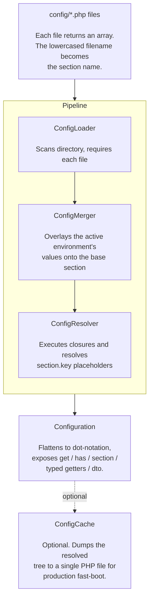

# phpdot/config

Configuration management for PHP: load, merge, resolve, cache. Zero dependencies, pure PHP.

## Table of Contents

- [Requirements](#requirements)
- [Installation](#installation)
- [Usage](#usage)
  - [Quick Start](#quick-start)
  - [Config Files](#config-files)
  - [Environment Overrides](#environment-overrides)
  - [Placeholders](#placeholders)
  - [Dynamic Values](#dynamic-values)
  - [DTO Hydration](#dto-hydration)
  - [Caching](#caching)
  - [Full API](#full-api)
- [Architecture](#architecture)
- [Testing](#testing)
- [License](#license)

## Requirements

| Requirement | Constraint |
|---|---|
| PHP | `>= 8.5` |
| Composer dependencies | none — pure PHP |

## Installation

```bash
composer require phpdot/config
```

## Usage

### Quick Start

```php
use PHPdot\Config\Configuration;

$config = new Configuration(path: __DIR__ . '/config');

$config->get('database.host');                // 'localhost'
$config->get('database.port');                // 3306
$config->get('database.missing', 'default');  // 'default'
```

### Config Files

Each file in the config directory returns an array. The lowercased filename (without `.php`) becomes the section name — `Database.php` and `database.php` both yield section `database`.

```php
// config/database.php
return [
    'host' => 'localhost',
    'port' => 3306,
    'name' => 'myapp',
    'username' => 'root',
    'password' => '',
];
```

Access with dot notation:

```php
$config->get('database.host');              // 'localhost'
$config->get('database.port');              // 3306
$config->get('database.options.timeout');   // nested values work too
```

---

### Environment Overrides

Config files can include environment-specific overrides as top-level keys:

```php
// config/database.php
return [
    'host' => 'localhost',
    'port' => 3306,
    'debug' => true,

    'staging' => [
        'host' => 'staging-db.internal',
    ],

    'production' => [
        'host' => 'prod-db.internal',
        'port' => 5432,
        'debug' => false,
    ],
];
```

```php
$config = new Configuration(
    path: __DIR__ . '/config',
    environment: 'production',
    environments: ['development', 'staging', 'production'],
);

$config->get('database.host');   // 'prod-db.internal' (overridden)
$config->get('database.port');   // 5432 (overridden)
$config->get('database.debug');  // false (overridden)
$config->get('database.name');   // 'myapp' (inherited from base)
```

Values not overridden are inherited from base. Environment keys are removed from the result.

---

### Placeholders

Reference values from other sections with `{section.key}` syntax:

```php
// config/app.php
return [
    'name' => 'MyApp',
    'url' => 'https://myapp.com',
];

// config/mail.php
return [
    'from_name' => '{app.name}',
    'footer' => 'Sent from {app.name}',
];

// config/services.php
return [
    'api_base' => '{app.url}/api/v1',
    'webhook' => '{services.api_base}/webhooks',  // chained
];
```

```php
$config->get('mail.from_name');     // 'MyApp'
$config->get('services.webhook');   // 'https://myapp.com/api/v1/webhooks'
```

Unresolvable placeholders are left as-is. No errors thrown.

---

### Dynamic Values

Closures are executed once during resolution:

```php
return [
    'secret' => fn() => bin2hex(random_bytes(32)),
    'boot_time' => fn() => date('Y-m-d H:i:s'),
];
```

---

### DTO Hydration

Auto-hydrate any class from a config section:

```php
readonly class DatabaseConfig
{
    public function __construct(
        public string $host,
        public int $port,
        public string $name,
        public string $username,
        public string $password = '',
        public bool $debug = false,
    ) {}
}

$db = $config->dto('database', DatabaseConfig::class);
$db->host;    // 'prod-db.internal'
$db->port;    // 5432 (int, auto-cast)
$db->debug;   // false (bool, auto-cast)
```

No base class needed. No interface needed. Config keys matched to constructor parameter names. Types auto-cast for scalars. Parameters with defaults are optional. Cached per section+class.

### Nested DTOs

When a constructor parameter is typed as a class and the matching value is an array, the array is recursively hydrated into that class. One section can drive multiple typed sub-DTOs:

```php
readonly class CookieConfig
{
    public function __construct(
        public bool $secure = true,
        public bool $httpOnly = true,
        public string $sameSite = 'Lax',
    ) {}
}

readonly class HttpConfig
{
    /**
     * @param list<string> $trustedProxies
     */
    public function __construct(
        public array $trustedProxies = [],
        public int $trustedHeaders = 0,
        public CookieConfig $cookie = new CookieConfig(),
    ) {}
}
```

```php
// config/http.php
return [
    'trustedProxies' => ['10.0.0.0/8'],
    'trustedHeaders' => 31,
    'cookie' => [
        'secure'   => true,
        'sameSite' => 'Strict',
    ],
];
```

```php
$http = $config->dto('http', HttpConfig::class);
$http->cookie->secure;     // true
$http->cookie->sameSite;   // 'Strict'
$http->cookie->httpOnly;   // true (default — key absent in config file)
```

Recursion is unbounded — multi-level nesting works the same way. Missing inner keys throw `InvalidArgumentException` (unless the parameter has a default).

---

### Caching

Skip parsing in production:

```php
// Production — cached
$config = new Configuration(
    path: __DIR__ . '/config',
    environment: 'production',
    environments: ['development', 'staging', 'production'],
    cachePath: __DIR__ . '/storage/cache/config.php',
);

// First request: loads, merges, resolves, writes cache
// Subsequent requests: single require from cache (opcache-friendly)
```

```php
// CLI: clear cache on deploy
ConfigCache::clear(__DIR__ . '/storage/cache/config.php');
```

---

### Full API

```php
// Generic getter
$config->get('key', $default);                    // mixed value or default
$config->has('key');                              // bool

// Typed getters — coerce to the requested type, fall back to default if mismatched
$config->string('database.host', 'localhost');    // string
$config->integer('database.port', 3306);          // int (parses numeric strings)
$config->float('rate.threshold', 1.0);            // float
$config->boolean('database.debug', false);        // bool — accepts true/false/1/0/yes/no/on/off
$config->array('cache.servers', []);              // array

// Aggregate access
$config->section('database');                     // full nested array for the section
$config->sections();                              // ['app', 'cache', 'database', ...]
$config->search('database');                      // all database.* keys
$config->search('database', stripPrefix: true);   // same, prefix removed
$config->all();                                   // all flattened key-value pairs

// DTO hydration (single + nested)
$config->dto('database', DbConfig::class);        // hydrate a typed DTO

// Lifecycle
$config->reload();                                // re-run pipeline (clears any cache)
$config->getEnvironment();                        // current environment name
$config->getPath();                               // config directory path
```

---

## Architecture



---

## Testing

The package is standalone-testable:

```bash
composer install
composer test        # PHPUnit
composer analyse     # PHPStan, level max + strict rules
composer cs-check    # PHP-CS-Fixer
composer check       # All three
```

## License

MIT.

**This repository is a read-only mirror**, generated by CI from
[phpdot/monorepo](https://github.com/phpdot/monorepo). [Pull requests](https://github.com/phpdot/monorepo/pulls)
and [issues](https://github.com/phpdot/monorepo/issues) belong in the monorepo.
