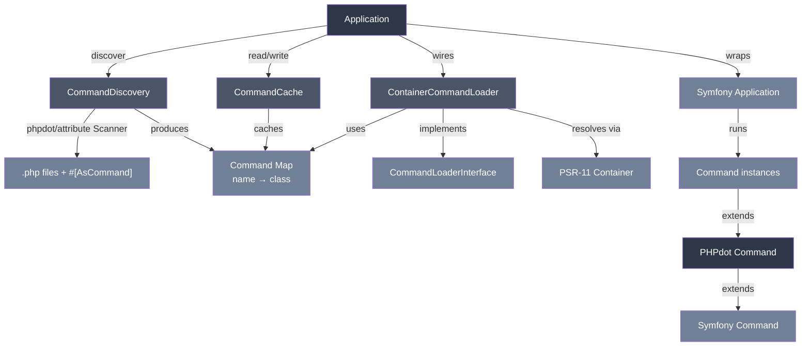

# phpdot/console

CLI application framework wrapping symfony/console — DI integration, attribute-driven command
discovery, and output helpers. Standalone.

## Table of Contents

- [Requirements](#requirements)
- [Installation](#installation)
- [Usage](#usage)
- [Discovery](#discovery)
- [Architecture](#architecture)
- [Testing](#testing)
- [License](#license)

## Requirements

| Requirement | Constraint |
|---|---|
| PHP | `>= 8.5` |
| `symfony/console` | `^8.0` |
| `psr/container` | `^2.0` |
| `phpdot/attribute` | `^0.1` |

`phpdot/container` is a dev-only suggestion — it exposes `#[Config('console')]` to a phpdot
framework boot. Standalone consumers do not need it; the attribute is inert until reflected.

## Installation

```bash
composer require phpdot/console
```
## Usage

### Standalone

```php
use PHPdot\Console\Application;
use PHPdot\Console\ConsoleConfig;

$app = new Application(new ConsoleConfig(name: 'MyApp', version: '1.0.0'));
$app->add(new GreetCommand());
$app->run();
```

### With discovery

```php
use PHPdot\Console\Application;
use PHPdot\Console\ConsoleConfig;

$app = new Application(
    new ConsoleConfig(
        name: 'MyApp',
        version: '1.0.0',
        cachePath: __DIR__ . '/var/cache/commands.php',
    ),
);

$app->discover([__DIR__ . '/src/Command']);
$app->run();
```

`cachePath` makes `Application` build its own `CommandCache` automatically. Pass an explicit `CommandCache` instance via the third constructor argument when you need a custom one.

### With DI container

```php
use PHPdot\Console\Application;
use PHPdot\Console\ConsoleConfig;

$container = /* any PSR-11 container */;

$app = new Application(
    config: new ConsoleConfig(
        name: 'MyApp',
        version: '1.0.0',
        cachePath: __DIR__ . '/var/cache/commands.php',
    ),
    container: $container,
);

$app->discover([__DIR__ . '/src/Command']);
$app->run();
```

### Auto-binding via phpdot/config

`ConsoleConfig` carries `#[Config('console')]`, so `phpdot/config` hydrates it from `config/console.php`:

```php
// config/console.php
return [
    'name'      => 'MyApp',
    'version'   => '1.0.0',
    'cachePath' => __DIR__ . '/../var/cache/commands.php',
];
```

A future console provider will resolve the DTO from `Configuration::dto()` and inject it into `Application` automatically. Until then, construct the DTO yourself.

### Modifying discovered commands

Apps frequently want to alias, rename, or relabel commands shipped by other packages — for shortcuts, brand consistency, or collision resolution. Three methods on `Application`:

```php
$app->discover([__DIR__ . '/vendor/phpdot']);

// Add an alternate name. Both `container:list` and `c:l` work.
$app->alias('container:list', 'c:l');

// Replace the canonical name. The old name no longer resolves.
$app->rename('legacy:run', 'run');

// Change description / help text without touching the name.
$app->override('container:list', description: 'Show every entry in the live container');
```

Rules:
- `alias()` is additive — never breaks the original name. Throws if the new name is already taken by a different command.
- `rename()` replaces the name. Throws if the new name is already taken.
- `override()` mutates non-name metadata only (description, help). Use `rename()` for the name.
- All three are chainable.

### Defining commands

```php
use Symfony\Component\Console\Attribute\AsCommand;
use Symfony\Component\Console\Input\InputArgument;
use Symfony\Component\Console\Input\InputInterface;
use Symfony\Component\Console\Output\OutputInterface;
use PHPdot\Console\Command;

#[AsCommand(name: 'users:import', description: 'Import users from CSV')]
final class ImportUsersCommand extends Command
{
    public function __construct(
        private readonly UserRepository $users,
    ) {
        parent::__construct();
    }

    protected function configure(): void
    {
        $this->addArgument('file', InputArgument::REQUIRED, 'CSV file path');
    }

    protected function execute(InputInterface $input, OutputInterface $output): int
    {
        $file = $input->getArgument('file');
        $rows = $this->parser->parse($file);

        $this->info($output, "Importing from {$file}...");

        $this->withProgress($output, $rows, function (array $row) {
            $this->users->create($row);
        });

        $this->success($output, 'Import complete.');
        return self::SUCCESS;
    }
}
```

### Output helpers

```php
$this->info($output, 'Processing...');
$this->error($output, 'Something failed');
$this->success($output, 'Done');
$this->warning($output, 'Careful');
$this->comment($output, 'Note');
```

### Table

```php
$this->table($output, [
    ['name' => 'Alice', 'email' => 'alice@example.com'],
    ['name' => 'Bob', 'email' => 'bob@example.com'],
]);
// Headers auto-detected from first row keys
```

### Progress

```php
$this->withProgress($output, $items, function (mixed $item) {
    // process each item
});
```

### Interactive input

```php
$name = $this->ask($input, $output, 'What is your name?');
$confirmed = $this->confirm($input, $output, 'Continue?', true);
$color = $this->choice($input, $output, 'Pick a color', ['red', 'blue', 'green']);
$password = $this->secret($input, $output, 'Enter password');
```

### Programmatic execution

```php
$exitCode = $app->call('cache:clear');
$exitCode = $app->call('migrate', ['--force' => true]);
```

## Discovery

`CommandDiscovery` scans directories for classes with `#[AsCommand]` that extend `Symfony\Component\Console\Command\Command`. Class discovery is delegated to [`phpdot/attribute`](https://github.com/phpdot/attribute), which handles tokenization, namespace resolution, and attribute reading.

Skips: interfaces, traits, enums, abstract classes, classes without `#[AsCommand]`, and classes that don't extend Symfony's `Command`.

### Cache format

```php
// var/cache/commands.php
return [
    'cache:clear' => 'App\\Command\\CacheClearCommand',
    'users:import' => 'App\\Command\\ImportUsersCommand',
];
```

## Architecture



## Testing

The package is standalone-testable:

```bash
composer install
composer test        # PHPUnit
composer analyse     # PHPStan, level max + strict rules
composer cs-check    # PHP-CS-Fixer
composer check       # All three
```

## License

MIT.

**This repository is a read-only mirror**, generated by CI from
[phpdot/monorepo](https://github.com/phpdot/monorepo). [Pull requests](https://github.com/phpdot/monorepo/pulls)
and [issues](https://github.com/phpdot/monorepo/issues) belong in the monorepo.
