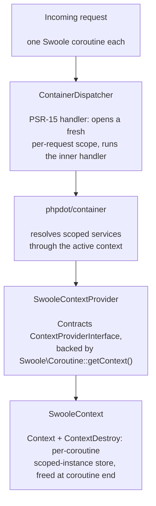

# phpdot/container-swoole

Swoole adapter for [phpdot/container](https://github.com/phpdot/container).

Each Swoole coroutine gets its own isolated service scope via `Coroutine::getContext()`. When the coroutine exits, Swoole destroys the context automatically — no manual cleanup required.

## Table of Contents

- [Requirements](#requirements)
- [Installation](#installation)
- [Usage](#usage)
- [How It Works](#how-it-works)
- [Server Example](#server-example)
- [Request dispatching](#request-dispatching)
- [Architecture](#architecture)
- [Testing](#testing)
- [License](#license)

## Requirements

| Requirement | Constraint |
|---|---|
| PHP | `>= 8.5` |
| ext-swoole | `>= 6.2` |
| `phpdot/container` | `^0.1` |
| `phpdot/contracts` | `^0.1` |
| `psr/container` | `^1.1 \|\| ^2.0` |
| `psr/http-message` | `^2.0` |
| `psr/http-server-handler` | `^1.0` |

## Installation

```bash
composer require phpdot/container-swoole
```

## Usage

```php
use PHPdot\Container\ContainerBuilder;
use PHPdot\Container\Swoole\SwooleContextProvider;
use function PHPdot\Container\singleton;
use function PHPdot\Container\scoped;

$container = (new ContainerBuilder())
    ->withContextProvider(new SwooleContextProvider())
    ->addDefinitions([
        // Shared across all coroutines
        Router::class  => singleton(),
        Redis::class   => singleton(),

        // Isolated per coroutine — fresh for each request
        Session::class       => scoped(),
        SignalManager::class => scoped(),
    ])
    ->build();
```

## How It Works

```
┌──────────────────────────────────────────────────────────┐
│ Swoole Worker                                            │
│                                                          │
│  Singletons (shared)                                     │
│  ┌────────────────────────────────────────────────────┐  │
│  │  Router       Redis       Config      LogBridge    │  │
│  └────────────────────────────────────────────────────┘  │
│                                                          │
│  Coroutine 1              Coroutine 2                    │
│  ┌──────────────────┐    ┌──────────────────┐           │
│  │ Session (User A)  │    │ Session (User B)  │           │
│  │ Signal (trace-1)  │    │ Signal (trace-2)  │           │
│  └──────────────────┘    └──────────────────┘           │
│    auto-destroyed           auto-destroyed               │
│    on coroutine exit        on coroutine exit             │
└──────────────────────────────────────────────────────────┘
```

**Singleton** services resolve once and are shared across all coroutines in the worker.

**Scoped** services resolve once per coroutine and are stored in `Swoole\Coroutine::getContext()`. When the coroutine finishes, Swoole's runtime destroys the context and all scoped instances are garbage collected.

**Outside a coroutine** (CLI bootstrap, `onStart` callback), the provider falls back to an in-memory `ArrayContext`.

## Server Example

```php
use Swoole\Http\Server;
use PHPdot\Container\ContainerBuilder;
use PHPdot\Container\Swoole\SwooleContextProvider;
use function PHPdot\Container\singleton;
use function PHPdot\Container\scoped;

$container = (new ContainerBuilder())
    ->withContextProvider(new SwooleContextProvider())
    ->addDefinitions([
        Config::class  => singleton(),
        Session::class => scoped(fn($c) => Session::fromRequest($c->get(Request::class))),
    ])
    ->build();

$server = new Server('0.0.0.0', 8080);

$server->on('request', function ($req, $res) use ($container) {
    // Each request runs in its own coroutine.
    // Scoped services are fresh. Singletons are shared.
    $session = $container->get(Session::class);

    $res->end('Hello ' . $session->user());
    // Coroutine ends here — scoped instances destroyed automatically.
});

$server->start();
```

## Request dispatching

`ContainerDispatcher` is a PSR-15 handler that resolves your real handler from the container **on every request** — inside the worker, after the fork. Serve it instead of the handler itself so the request path loads lazily (which keeps it hot-reloadable) and scoped services isolate per coroutine:

```php
use PHPdot\Container\Swoole\ContainerDispatcher;

// $container built as above; App\Handler is your PSR-15 entry point.
$dispatcher = new ContainerDispatcher($container, App\Handler::class);

// Hand $dispatcher to your PSR-15 server (e.g. phpdot/server-swoole's serve()).
// On each request it calls $container->get(App\Handler::class) — resolving,
// and loading, in the worker.
```

If the configured id doesn't resolve to a `Psr\Http\Server\RequestHandlerInterface`, it throws — a fast failure for a misconfigured handler id.

## Architecture



## Testing

The package is standalone-testable (requires ext-swoole):

```bash
composer install
composer test        # PHPUnit
composer analyse     # PHPStan, level max + strict rules
composer cs-check    # PHP-CS-Fixer
composer check       # All three
```

## License

MIT.

**This repository is a read-only mirror**, generated by CI from
[phpdot/monorepo](https://github.com/phpdot/monorepo). [Pull requests](https://github.com/phpdot/monorepo/pulls)
and [issues](https://github.com/phpdot/monorepo/issues) belong in the monorepo.
