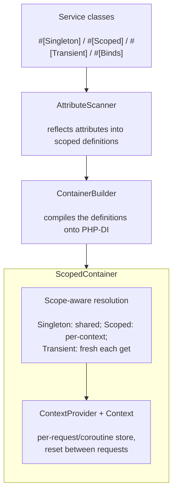

# phpdot/container

Server-agnostic service scoping for PHP-DI.

Adds lifecycle management (Singleton, Scoped, Transient) on top of [PHP-DI](https://github.com/php-di/php-di) without replacing its resolution engine. Full autowiring, compilation, and all native features preserved.

## Table of Contents

- [Requirements](#requirements)
- [Installation](#installation)
- [Usage](#usage)
  - [The Problem](#the-problem)
  - [Quick Start](#quick-start)
  - [Three Scopes](#three-scopes)
  - [Context Providers](#context-providers)
  - [Registration Methods](#registration-methods)
  - [Scope Validation](#scope-validation)
  - [Context Lifecycle](#context-lifecycle)
  - [Introspection](#introspection)
  - [Full Builder API](#full-builder-api)
  - [PHP-DI Compatibility](#php-di-compatibility)
  - [Default Scope](#default-scope)
- [Architecture](#architecture)
- [Testing](#testing)
- [License](#license)

## Requirements

| Requirement | Constraint |
|---|---|
| PHP | `>= 8.5` |
| `php-di/php-di` | `^7.0` |
| `phpdot/attribute` | `^0.1` |
| `phpdot/contracts` | `^0.1` |
| `psr/container` | `^2.0` |
| `symfony/console` | `^8.0` |

## Installation

```bash
composer require phpdot/container
```

## Usage

### The Problem

### Traditional PHP-FPM

Every request spawns a fresh process. Everything is created from scratch and destroyed after the response. No sharing, no leaks.

```
Request 1                    Request 2                    Request 3
┌──────────────────┐        ┌──────────────────┐        ┌──────────────────┐
│ Process 1        │        │ Process 2        │        │ Process 3        │
│                  │        │                  │        │                  │
│  Router (new)    │        │  Router (new)    │        │  Router (new)    │
│  Config (new)    │        │  Config (new)    │        │  Config (new)    │
│  Request (new)   │        │  Request (new)   │        │  Request (new)   │
│  Session (new)   │        │  Session (new)   │        │  Session (new)   │
│  DB conn (new)   │        │  DB conn (new)   │        │  DB conn (new)   │
│                  │        │                  │        │                  │
│  Response → die  │        │  Response → die  │        │  Response → die  │
└──────────────────┘        └──────────────────┘        └──────────────────┘
     Born → Die                  Born → Die                  Born → Die
```

Simple. Safe. But slow — every request pays the full bootstrap cost (autoloader, config parsing, DB connection).

### Persistent Runtimes (Swoole, RoadRunner, FrankenPHP)

One process handles many requests. Services created once, reused across requests. Fast — but dangerous.

```
┌──────────────────────────────────────────────────────────────┐
│ Worker Process (lives forever)                               │
│                                                              │
│  ┌─────────────── Shared (Singletons) ───────────────────┐  │
│  │  Router        Config        Redis Pool     LogBridge  │  │
│  └────────────────────────────────────────────────────────┘  │
│                                                              │
│  Request 1 (coroutine)    Request 2 (coroutine)    ...       │
│  ┌────────────────────┐  ┌────────────────────┐             │
│  │  Request  (own)    │  │  Request  (own)    │             │
│  │  Session  (own)    │  │  Session  (own)    │  concurrent │
│  │  Signal   (own)    │  │  Signal   (own)    │             │
│  │  Auth     (own)    │  │  Auth     (own)    │             │
│  └────────────────────┘  └────────────────────┘             │
│        ↑ isolated              ↑ isolated                    │
│                                                              │
│  ⚠️  Problem: PHP-DI caches EVERYTHING as singletons.       │
│      Request from coroutine 1 leaks into coroutine 2!       │
└──────────────────────────────────────────────────────────────┘
```

### The Danger Without Scoping

```php
// PHP-DI default behavior: get() caches as singleton
$container->get(Session::class);  // Request 1: creates Session for User A
$container->get(Session::class);  // Request 2: returns User A's session! 💥

// User B sees User A's data. Security breach.
```

### The Solution: Three Scopes

```
┌──────────────────────────────────────────────────────────────┐
│ Worker Process                                               │
│                                                              │
│  ┌─── Singleton (process lifetime) ──────────────────────┐  │
│  │  Router        Config        Redis        LogBridge    │  │
│  └────────────────────────────────────────────────────────┘  │
│                                                              │
│  ┌─── Scoped (per request) ──┐  ┌─── Scoped (per request)┐  │
│  │  Request   → User A       │  │  Request   → User B    │  │
│  │  Session   → User A       │  │  Session   → User B    │  │
│  │  Signal    → trace-abc    │  │  Signal    → trace-xyz  │  │
│  │  Auth      → User A       │  │  Auth      → User B    │  │
│  └───────────────────────────┘  └─────────────────────────┘  │
│        ✅ isolated                    ✅ isolated             │
│                                                              │
│  Transient: MailMessage — always new, never cached           │
└──────────────────────────────────────────────────────────────┘
```

This library adds these three scopes to PHP-DI. One library, any runtime.

### Quick Start

```php
use PHPdot\Container\ContainerBuilder;
use function PHPdot\Container\singleton;
use function PHPdot\Container\scoped;
use function PHPdot\Container\transient;

$container = (new ContainerBuilder())
    ->addDefinitions([
        // Singleton — cached forever (same as PHP-DI default)
        Router::class => singleton(),
        Redis::class  => singleton(fn() => new Redis($config)),

        // Scoped — cached per request/context, fresh across requests
        SignalManager::class => scoped(fn($c) => new SignalManager($c->get(LogBridge::class))),
        Session::class       => scoped(fn($c) => Session::fromCookie($c->get(Request::class))),

        // Transient — always a new instance
        MailMessage::class => transient(),

        // Raw PHP-DI definitions work unchanged
        'config.name' => \DI\value('MyApp'),
    ])
    ->build();
```

### Three Scopes

| Scope | Lifetime | Shared? | Use For |
|-------|----------|---------|---------|
| **Singleton** | Entire process | All requests | Stateless services: Router, Config, Redis pools |
| **Scoped** | One request/context | Within request only | Per-request state: Session, Auth, SignalManager |
| **Transient** | None | Never | Throwaway objects: MailMessage, DTO builders |

### How They Behave

```php
// Singleton — same instance forever
$a = $container->get(Router::class);
$b = $container->get(Router::class);
assert($a === $b); // true, even across requests

// Scoped — same within a request, different across requests
$req1User = $container->get(AuthUser::class); // request 1
$req1Same = $container->get(AuthUser::class); // same request
assert($req1User === $req1Same); // true

// ... new request starts (context switches) ...
$req2User = $container->get(AuthUser::class); // request 2
assert($req1User !== $req2User); // true — fresh instance

// Transient — always new
$a = $container->get(MailMessage::class);
$b = $container->get(MailMessage::class);
assert($a !== $b); // true
```

### Context Providers

The library needs to know what "current request" means. A context provider answers that question for each runtime:

```php
use PHPdot\Container\ContainerBuilder;

// FPM (default) — one process = one context
$builder = new ContainerBuilder();
// No provider needed, uses ArrayContextProvider automatically

// Swoole — one coroutine = one context
$builder->withContextProvider(new SwooleContextProvider());

// Custom runtime
$builder->withContextProvider(new CallbackContextProvider(
    fn() => $myRuntime->getCurrentContext()
));
```

### Built-in Providers

| Provider | Runtime | How It Works |
|----------|---------|--------------|
| `ArrayContextProvider` | FPM / CLI | Single context — the process is the context |
| `CallbackContextProvider` | Custom | Your closure returns the current context |
| `TestContextProvider` | PHPUnit | Simulate context switching in tests |

### Adapter Packages

The Swoole provider (`SwooleContextProvider`, one coroutine = one context) lives in the
`phpdot/container-swoole` package.

### Registration Methods

### Helper Functions (recommended)

```php
use function PHPdot\Container\singleton;
use function PHPdot\Container\scoped;
use function PHPdot\Container\transient;

$builder->addDefinitions([
    // Class → autowired
    Router::class => singleton(),

    // Interface → implementation
    CacheInterface::class => singleton(RedisCache::class),

    // Factory closure
    LoggerInterface::class => scoped(function (ContainerInterface $c) {
        return new FileLogger($c->get('config.log_path'));
    }),

    // Always new
    MailMessage::class => transient(),
]);
```

### PHP Attributes

```php
use PHPdot\Container\Attribute\Singleton;
use PHPdot\Container\Attribute\Scoped;
use PHPdot\Container\Attribute\Transient;

#[Singleton]
class Router { }

#[Scoped]
class AuthenticatedUser { }

#[Transient]
class MailMessage { }
```

Scan for attributes:

```php
$builder->scanAttributesIn(__DIR__ . '/src');
```

### Loading Definitions from a File

`addDefinitionsFromFile()` loads a PHP file that returns an array of definitions and merges it into the builder. Throws if the file is missing or doesn't return an array — silent no-ops hide bugs.

```php
$builder->addDefinitionsFromFile(__DIR__ . '/config/services.php');
```

The file looks like any normal definitions file:

```php
<?php

use function PHPdot\Container\singleton;

return [
    Router::class => singleton(),
    CacheInterface::class => singleton(RedisCache::class),
];
```

For loading files generated by `phpdot/package` (or any vendor file), pair this with `vendor()`:

```php
use function PHPdot\Container\vendor;

$builder->addDefinitionsFromFile(vendor('phpdot/definitions.php'));
```

`vendor()` resolves the absolute Composer vendor directory using `\Composer\Autoload\ClassLoader::getRegisteredLoaders()` — no path arithmetic, no `__DIR__` guessing. Pass a relative segment to get the joined path; pass nothing for the vendor dir itself.

```php
vendor();                          // /app/vendor
vendor('phpdot/definitions.php');  // /app/vendor/phpdot/definitions.php
vendor('/phpdot/definitions.php'); // same — leading slash stripped
```

### Raw PHP-DI Definitions

Existing PHP-DI definitions work unchanged:

```php
$builder->addDefinitions([
    'config.db.host' => \DI\env('DB_HOST', 'localhost'),
    SomeService::class => \DI\autowire()->constructorParameter('name', 'value'),
    DecoratedService::class => \DI\decorate(function ($previous) {
        return new CachingDecorator($previous);
    }),
]);
```

### Scope Validation

The builder validates dependencies at build time. A Singleton cannot depend on a Scoped service — that would hold a stale reference:

```php
#[Singleton]
class UserCache {
    public function __construct(
        private AuthUser $user, // Scoped — this is a bug!
    ) {}
}
```

Build-time error:

```
ScopeMismatchException:
  Service "UserCache" is registered as singleton
  but depends on "AuthUser" which is scoped.

  Solutions:
  - Change UserCache to scoped
  - Inject DI\FactoryInterface and resolve at call-time
```

### Escaping Scope Rules

When a Singleton legitimately needs scoped data, inject the factory:

```php
#[Singleton]
class RateLimiter {
    public function __construct(
        private \DI\FactoryInterface $factory,
    ) {}

    public function check(): bool {
        // Resolved fresh from the current context
        $user = $this->factory->make(AuthUser::class);
        return $this->isAllowed($user);
    }
}
```

### Context Lifecycle

Reset the context between requests:

```php
$resetter = $container->get(ContextResetter::class);

// After each request
$resetter->reset(); // clears all scoped instances
```

### Server Integration

```php
// FPM
$app->handle($request);
$container->get(ContextResetter::class)->reset();

// Swoole
$server->on('request', function ($req, $res) use ($container) {
    $app->handle($req);
    $container->get(ContextResetter::class)->reset();
});
```

### Introspection

The container exposes its registered state at runtime — useful for debug pages, CLI tools, and tests:

```php
$container = (new ContainerBuilder())
    ->addDefinitions([...])
    ->build();

// List every registered service ID — sorted alphabetically:
foreach ($container->entries() as $id) {
    echo $id . "\n";
}

// Describe one entry:
$info = $container->describe(Router::class);
// [
//     'id'             => 'PHPdot\\Routing\\Router',
//     'scope'          => 'SINGLETON',
//     'implementation' => 'PHPdot\\Routing\\RouterRT\\RouterRT',  // override target
// ]
```

`entries()` includes everything: Scoped/Transient/Singleton registrations plus PHP-DI built-ins (PSR-17 bindings, `ContainerInterface` self, etc.).

`describe($id)` returns:
- `id`: the registered ID
- `scope`: `'SINGLETON'`, `'SCOPED'`, or `'TRANSIENT'`
- `implementation`: the aliased concrete class (when explicitly set), or `null` when resolution is by autowire / factory

For full PHP-DI debug output of a singleton (factory shape, dependencies), use the escape hatch:

```php
echo $container->phpdi()->debugEntry(SomeService::class);
```

### CLI commands

`phpdot/container` ships two standard `Symfony\Component\Console\Command` classes,
declared with `#[AsCommand]`: `container:list` (every entry with scope and implementation)
and `container:show <id>` (one entry in detail). Both take the container in their
constructor; register them with any Symfony Console application:

```php
use PHPdot\Container\Cli\Command\ListCommand;
use PHPdot\Container\Cli\Command\ShowCommand;

$app = new Symfony\Component\Console\Application();
$app->add(new ListCommand($container));
$app->add(new ShowCommand($container));
$app->run();
```

### Full Builder API

```php
$container = (new ContainerBuilder())

    // Context provider (default: ArrayContextProvider for FPM)
    ->withContextProvider(new CallbackContextProvider(fn () => $runtime->currentContext()))

    // Definitions from a file (uses require under the hood)
    ->addDefinitionsFromFile(__DIR__ . '/config/services.php')

    // Or any vendor-installed definitions file
    ->addDefinitionsFromFile(vendor('phpdot/definitions.php'))

    // Attribute scanning
    ->scanAttributesIn(__DIR__ . '/src')

    // Scope validation (enabled by default)
    ->withScopeValidation(true)

    // PHP-DI compilation for production
    ->enableCompilation(__DIR__ . '/var/cache')

    // PHP-DI proxy generation
    ->enableProxies(__DIR__ . '/var/proxies')

    // Raw PHP-DI builder access
    ->configurePHPDI(function (\DI\ContainerBuilder $phpdi) {
        $phpdi->useAutowiring(true);
    })

    // Build
    ->build();
```

### PHP-DI Compatibility

All PHP-DI features work unchanged:

- Autowiring (constructor injection via type hints)
- `DI\autowire()`, `DI\create()`, `DI\factory()`, `DI\value()`, `DI\get()`
- `DI\env()`, `DI\string()`, `DI\decorate()`
- `$container->call()` for controller dispatch
- Lazy injection via `DI\autowire()->lazy()`
- Compiled containers for production

### Default Scope

Unregistered classes default to **`Scoped`** — `ScopedContainer::get()` resolves any existing class via the active context if it has no explicit registration. There is no builder knob to change this; the default is hardcoded so the safe behavior (one instance per coroutine, no cross-coroutine state leak) is impossible to accidentally turn off.

Opt into `Singleton` explicitly with `#[Singleton]` on the class, `->add(X::class)->singleton()` in code, or `singleton(...)` in a definition file. Same for `Transient`.

Under FPM, Scoped behaves identically to Singleton (one process = one context). Zero performance penalty for the safe default.

## Architecture



## Testing

```php
use PHPdot\Container\Testing\TestContextProvider;

$provider = new TestContextProvider();
$container = (new ContainerBuilder())
    ->withContextProvider($provider)
    ->addDefinitions([...])
    ->build();

// Request 1
$user1 = $container->get(AuthUser::class);

// Simulate new request
$provider->newContext();
$user2 = $container->get(AuthUser::class);

assert($user1 !== $user2); // scoped — different per context

// Singleton stays the same
$router1 = $container->get(Router::class);
$provider->newContext();
$router2 = $container->get(Router::class);
assert($router1 === $router2);
```

The package is standalone-testable:

```bash
composer install
composer test        # PHPUnit
composer analyse     # PHPStan, level max + strict rules
composer cs-check    # PHP-CS-Fixer
composer check       # All three
```

## License

MIT.

**This repository is a read-only mirror**, generated by CI from
[phpdot/monorepo](https://github.com/phpdot/monorepo). [Pull requests](https://github.com/phpdot/monorepo/pulls)
and [issues](https://github.com/phpdot/monorepo/issues) belong in the monorepo.
