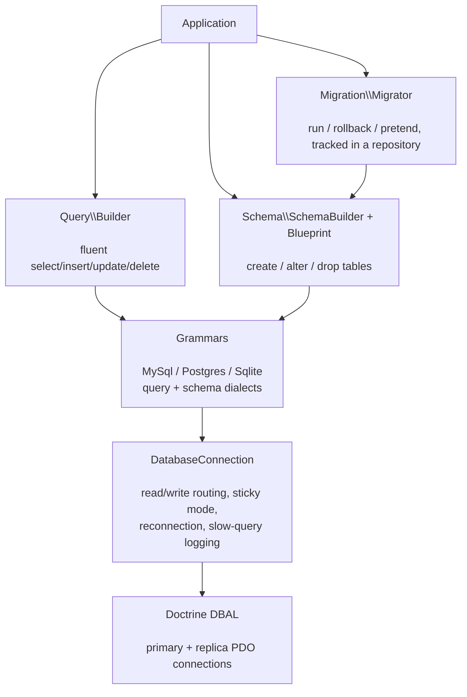

# phpdot/database

A database toolkit for PHP built on [Doctrine DBAL](https://www.doctrine-project.org/projects/dbal.html):
a fluent query builder, a schema builder with migrations, typed per-driver connection configs, and
production concerns — read/write splitting, sticky routing, automatic reconnection, and slow-query
logging — handled behind one `DatabaseConnection`. MySQL, PostgreSQL, and SQLite are supported through
driver-specific grammars.

## Table of Contents

- [Requirements](#requirements)
- [Installation](#installation)
- [Usage](#usage)
- [Architecture](#architecture)
- [Testing](#testing)
- [License](#license)

## Requirements

| Requirement | Constraint |
|---|---|
| PHP | `>= 8.5` |
| `doctrine/dbal` | `^4.4` |
| `phpdot/contracts` | `^0.1` |
| `psr/log` | `^3.0` |

Bring the PDO driver for your engine (`pdo_mysql`, `pdo_pgsql`, or `pdo_sqlite`). `phpdot/container` is a
dev-only suggestion — the `#[Config('database')]` attribute on `DatabaseConfig` is inert until a phpdot
application reflects it, so standalone consumers do not need it.

## Installation

```bash
composer require phpdot/database
```

## Usage

### Connecting

Each engine has its own typed config carrying only the keys that engine uses:

```php
use PHPdot\Database\DatabaseConnection;
use PHPdot\Database\Connection\MySql\MySqlConfig;
use PHPdot\Database\Connection\Sqlite\SqliteConfig;

$db = new DatabaseConnection(new MySqlConfig(
    database: 'myapp',
    host: '127.0.0.1',
    username: 'root',
));

$memory = new DatabaseConnection(new SqliteConfig(database: ':memory:'));
```

### Query builder

```php
$active = $db->table('users')
    ->where('active', true)
    ->whereIn('role', ['admin', 'editor'])
    ->orderBy('created_at', 'desc')
    ->limit(20)
    ->get();

$db->table('users')->insert(['name' => 'Alice', 'email' => 'alice@example.com']);
$db->table('users')->where('id', 1)->update(['active' => false]);
$count = $db->table('orders')->where('status', 'paid')->count();

$page = $db->table('posts')->where('published', true)->paginate(perPage: 15, page: 2);
```

### Schema and migrations

A migration returns an anonymous class extending `Migration`:

```php
use PHPdot\Database\Migration\Migration;
use PHPdot\Database\Schema\Blueprint;
use PHPdot\Database\Schema\SchemaBuilder;

return new class extends Migration {
    public function up(SchemaBuilder $schema): void
    {
        $schema->create('users', function (Blueprint $table) {
            $table->id();
            $table->string('name');
            $table->string('email')->unique();
            $table->timestamps();
        });
    }

    public function down(SchemaBuilder $schema): void
    {
        $schema->dropIfExists('users');
    }
};
```

```php
use PHPdot\Database\Migration\MigrationRepository;
use PHPdot\Database\Migration\Migrator;

$migrator = new Migrator($db, new MigrationRepository($db));
$migrator->run(__DIR__ . '/migrations');
$migrator->rollback(__DIR__ . '/migrations');
$migrator->pretend(__DIR__ . '/migrations');  // dry run, returns the SQL
```

### Transactions

```php
$db->transaction(function ($conn) {
    $conn->table('accounts')->where('id', 1)->decrement('balance', 100);
    $conn->table('accounts')->where('id', 2)->increment('balance', 100);
});

// Top-level transactions can retry on deadlock:
$db->transaction(fn ($conn) => /* ... */, maxRetries: 3);
```

### Read/write splitting

```php
use PHPdot\Database\Connection\ConnectionOptions;

$db = new DatabaseConnection(new MySqlConfig(
    database: 'myapp',
    host: 'primary.db.internal',
    options: new ConnectionOptions(
        read: [
            ['host' => 'replica-1.db.internal'],
            ['host' => 'replica-2.db.internal'],
        ],
        sticky: true,
    ),
));
```

SELECTs go to a random replica; writes go to the primary. With `sticky` mode, reads switch to the
primary for the rest of the request once a write has happened. Replica entries inherit every key they
don't override from the primary block.

## Architecture

`DatabaseConnection` owns a Doctrine DBAL connection (or a primary plus replicas) and routes each query
to the right one. The query and schema builders are engine-agnostic; a per-driver grammar compiles their
fluent calls into the SQL dialect for the target engine.



Connection configs are typed per driver (`MySqlConfig`, `PostgresConfig`, `SqliteConfig`);
`ConnectionFactory` builds the right one from a config block and fails fast, naming the connection and
offending key, when a block is misconfigured.

## Testing

```bash
composer install
composer test        # PHPUnit
composer analyse     # PHPStan, level max + strict rules
composer cs-check    # PHP-CS-Fixer
composer check       # All three
```

The unit suite and the SQLite integration suite (in-memory) run with no external services. The
PostgreSQL and MySQL integration suites connect to a real server and **skip automatically when one is
not reachable** — point them at a server via the `PG_*` environment variables (PostgreSQL) or a local
MySQL on `localhost:3306` to run them.

## License

MIT.

**This repository is a read-only mirror**, generated by CI from
[phpdot/monorepo](https://github.com/phpdot/monorepo). [Pull requests](https://github.com/phpdot/monorepo/pulls)
and [issues](https://github.com/phpdot/monorepo/issues) belong in the monorepo.
