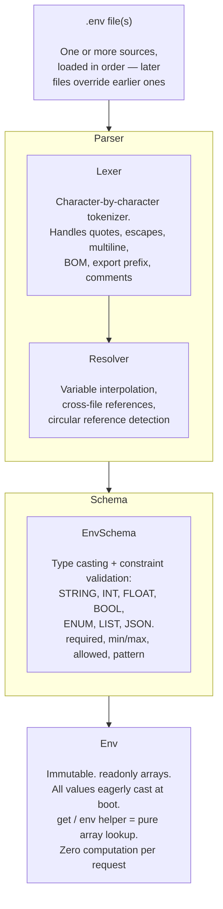

# phpdot/env

Typed, schema-validated, immutable `.env` configuration for modern PHP. Every variable is
declared in a schema, cast to its real type once at boot, and read back as a pure array
lookup — no parsing, no casting, no I/O per request.

## Table of Contents

- [Requirements](#requirements)
- [Installation](#installation)
- [Usage](#usage)
  - [Quick Start](#quick-start)
  - [Schema](#schema)
  - [Multi-File Loading](#multi-file-loading)
  - [.env Syntax](#env-syntax)
  - [Safe Loading](#safe-loading)
  - [Instance API](#instance-api)
  - [Sensitive Values](#sensitive-values)
  - [Config Caching](#config-caching)
  - [EnvEditor (CLI Only)](#enveditor-cli-only)
  - [Parsing a String](#parsing-a-string)
  - [Swoole Safety](#swoole-safety)
- [Architecture](#architecture)
- [Testing](#testing)
- [License](#license)

## Requirements

| Requirement | Constraint |
|---|---|
| PHP | `>= 8.5` |
| Composer dependencies | none — pure PHP |
| PHP extensions | none beyond the standard library |

## Installation

```bash
composer require phpdot/env
```

## Usage

### Quick Start

Two access patterns are supported — pick whichever fits your bootstrap.

**Instance-based:**

```php
use PHPdot\Env\Env;

$env = Env::create(
    schema: __DIR__ . '/env.schema.php',
    paths: __DIR__ . '/.env',
);

$env->get('APP_PORT');    // int(8080)
$env->get('APP_DEBUG');   // bool(false)
$env->get('APP_ENV');     // AppEnv::PRODUCTION
$env->get('DB_HOST');     // string("localhost")
$env->get('ORIGINS');     // ['http://localhost', 'https://example.com']
```

**Global facade (recommended for app bootstrap):**

```php
use PHPdot\Env\Env;

// Once, at the top of your bootstrap
Env::init(
    schema: __DIR__ . '/env.schema.php',
    paths: __DIR__ . '/.env',
);

// Anywhere in your app — pure array lookup
env('APP_PORT');                // int(8080)
env('APP_DEBUG', false);        // bool — default returned if key missing or no Env initialized
env('APP_ENV');                 // AppEnv::PRODUCTION
```

`Env::init()` is a thin wrapper over `safeCreate()` — missing `.env` files are silently
skipped, schema defaults are used. The global `env()` helper (defined in `src/functions.php`)
reads from the singleton.

### Schema

The schema is the source of truth. Every env var must be declared.

```php
// env.schema.php
use PHPdot\Env\Enum\EnvType;
use PHPdot\Env\Enum\AppEnv;

return [
    'APP_ENV' => [
        'enum'     => AppEnv::class,
        'required' => true,
        'default'  => AppEnv::DEVELOPMENT,
    ],
    'APP_DEBUG' => [
        'type'    => EnvType::BOOL,
        'default' => false,
    ],
    'APP_PORT' => [
        'type'    => EnvType::INT,
        'default' => 8080,
        'min'     => 1,
        'max'     => 65535,
    ],
    'APP_KEY' => [
        'type'      => EnvType::STRING,
        'required'  => true,
        'not_empty' => true,
        'sensitive' => true,
    ],
    'ALLOWED_ORIGINS' => [
        'type'    => EnvType::LIST,
        'default' => [],
    ],
    'FEATURE_CONFIG' => [
        'type'    => EnvType::JSON,
        'default' => [],
    ],
    'LOG_LEVEL' => [
        'default' => 'info',
        'allowed' => ['debug', 'info', 'warning', 'error'],
    ],
];
```

**Type system:**

| Type | PHP return | Example |
|------|-----------|---------|
| `STRING` | `string` | `APP_NAME=MyApp` → `"MyApp"` |
| `INT` | `int` | `PORT=8080` → `8080` |
| `FLOAT` | `float` | `RATE=1.5` → `1.5` |
| `BOOL` | `bool` | `DEBUG=true` → `true` |
| `ENUM` | `BackedEnum` | `ENV=production` → `AppEnv::PRODUCTION` |
| `LIST` | `list<string>` | `IPS=a,b,c` → `["a","b","c"]` |
| `JSON` | `mixed` | `CFG={"a":1}` → `["a" => 1]` |

Bool recognizes (case-insensitive): `true/false`, `1/0`, `yes/no`, `on/off`.

**Constraints:**

| Constraint | Applies to | Example |
|-----------|-----------|---------|
| `required` | All | Key must exist or have default |
| `not_empty` | All | `''` after trim fails |
| `min` | INT, FLOAT | `'min' => 1` |
| `max` | INT, FLOAT | `'max' => 65535` |
| `allowed` | STRING | `'allowed' => ['debug', 'info']` |
| `pattern` | STRING | `'pattern' => '/^https?:\/\//'` |
| `sensitive` | All | Masked in `allMasked()` |

### Multi-File Loading

Files load in order. Later files override earlier ones.

```php
$env = Env::create(
    schema: __DIR__ . '/env.schema.php',
    paths: [
        __DIR__ . '/.env',        // base
        __DIR__ . '/.env.local',  // overrides (gitignored)
    ],
);
```

Cross-file interpolation works:

```
# .env
BASE_URL=https://example.com

# .env.local
API_URL=${BASE_URL}/api    → https://example.com/api
```

### .env Syntax

**Values:**

```bash
SIMPLE=value
DOUBLE="value with spaces"
SINGLE='literal ${no-interpolation}'
EMPTY=
```

**Escapes (double-quoted only):**

```bash
NEWLINE="hello\nworld"
TAB="col1\tcol2"
BACKSLASH="back\\slash"
QUOTE="say\"hi\""
DOLLAR="cost\$5"
```

**Comments:**

```bash
# Full line comment
KEY=value # inline comment
HASH=color#fff           # no space before # = part of value
QUOTED="value # kept"    # inside quotes = part of value
```

**Multiline:**

```bash
RSA_KEY="-----BEGIN RSA KEY-----
MIIBogIBAAJBALRiMLAH
-----END RSA KEY-----"
```

**Interpolation:**

```bash
BASE=/app
DATA=${BASE}/data        # /app/data
LOGS=$BASE/logs          # /app/logs
NESTED=${DATA}/cache     # /app/data/cache
LITERAL='${BASE}/raw'   # ${BASE}/raw (no interpolation)
```

**Export prefix:**

```bash
export FOO=bar           # FOO=bar (export stripped)
```

### Safe Loading

For Docker/k8s where `.env` may not exist:

```php
$env = Env::safeCreate(
    schema: __DIR__ . '/env.schema.php',
    paths: __DIR__ . '/.env',
);
```

Missing files are silently skipped. Schema defaults are used.

### Instance API

| Method | Returns | Purpose |
|---|---|---|
| `$env->get($key)` | `mixed` (typed) | Throws `SchemaException` on unknown key |
| `$env->has($key)` | `bool` | True if explicitly set in a `.env` file (not just defaulted) |
| `$env->all()` | `array<string, mixed>` | All typed values, including defaults |
| `$env->allMasked()` | `array<string, mixed>` | Same, but `sensitive` keys replaced with `***` |
| `$env->getRaw($key)` | `string\|null` | Raw string before type cast |
| `$env->getSchema()` | `EnvSchema` | The compiled schema |
| `$env->getLoadedFiles()` | `list<string>` | Paths of `.env` files actually parsed |
| `$env->compile($path)` | `void` | Write a cache file for fast worker boot |

Static constructors: `Env::create()`, `Env::safeCreate()`, `Env::createForTesting()`,
`Env::createFromCache()`. The global facade: `Env::init()`, `Env::env($key, $default)`,
`Env::getInstance()`, `Env::resetInstance()` (testing). String parsing without schema:
`Env::parseString()`.

For test setups, build an instance without file I/O:

```php
$env = Env::createForTesting(
    schema: [
        'DB_HOST' => ['required' => true],
        'DB_PORT' => ['type' => EnvType::INT, 'default' => 5432],
    ],
    values: ['DB_HOST' => 'localhost'],
);

$env->get('DB_HOST');  // 'localhost'
$env->get('DB_PORT');  // 5432
```

### Sensitive Values

```php
$env->get('API_KEY');     // "actual-secret-key"
$env->allMasked();        // ['API_KEY' => '***', 'DB_HOST' => 'localhost', ...]
```

`allMasked()` is safe for logging and error reports.

### Config Caching

For production — skip parsing on every worker boot:

```php
// Deploy script (run once)
$env = Env::create(schema: ..., paths: ...);
$env->compile(__DIR__ . '/cache/env.php');

// Application boot (every worker)
$env = Env::createFromCache(
    schema: __DIR__ . '/env.schema.php',
    cachePath: __DIR__ . '/cache/env.php',
);
```

Opcache caches the compiled file. Zero disk I/O, zero parsing per worker.

### EnvEditor (CLI Only)

Write tool for setup wizards and deployment scripts.

```php
use PHPdot\Env\EnvEditor;
use PHPdot\Env\Schema\EnvSchema;
use PHPdot\Env\Enum\AppEnv;

$editor = new EnvEditor(__DIR__ . '/.env', new EnvSchema($schema));

$editor->set('DB_HOST', 'new-host.example.com');
$editor->set('APP_ENV', AppEnv::STAGING);
$editor->remove('LOG_LEVEL');
$editor->save();
```

Also available: `hasKey($key)` to probe the file, `reset()` to discard unsaved changes.
Preserves comments, blank lines, and key order.

### Parsing a String

```php
$values = Env::parseString("FOO=bar\nBAZ=\"\${FOO}/qux\"");
// ['FOO' => 'bar', 'BAZ' => 'bar/qux']
```

### Swoole Safety

`Env` is immutable — `readonly` arrays, zero mutation methods. Two safe patterns:

```php
// Static facade — call Env::init() once per worker boot (recommended)
Env::init(
    schema: __DIR__ . '/env.schema.php',
    paths: __DIR__ . '/.env',
);
// Anywhere afterwards: env('APP_KEY') — shared by every coroutine, no per-request cost.

// Or register as a DI singleton if you prefer instance access
Env::class => singleton(fn() => Env::create(
    schema: __DIR__ . '/env.schema.php',
    paths: __DIR__ . '/.env',
)),
```

## Architecture



## Testing

The package is standalone-testable:

```bash
composer install
composer test        # PHPUnit
composer analyse     # PHPStan, level max + strict rules
composer cs-check    # PHP-CS-Fixer
composer check       # All three
```

## License

MIT.

**This repository is a read-only mirror**, generated by CI from
[phpdot/monorepo](https://github.com/phpdot/monorepo). [Pull requests](https://github.com/phpdot/monorepo/pulls)
and [issues](https://github.com/phpdot/monorepo/issues) belong in the monorepo.
