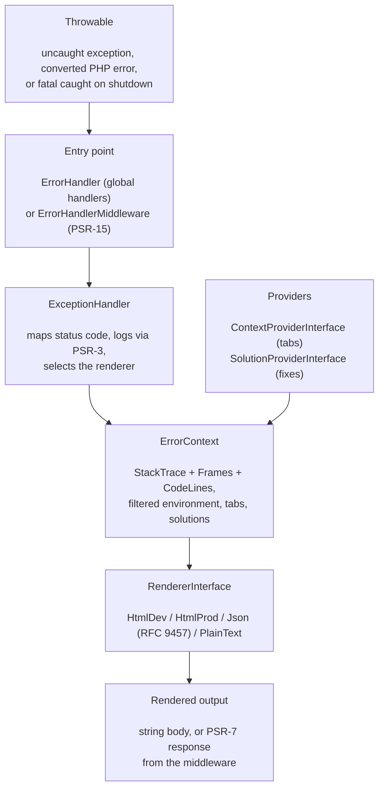

# phpdot/error-handler

A modern error handler for PHP: an HTML debug page in development, clean pages in
production, RFC 9457 (`application/problem+json`) responses for JSON clients, and a
PSR-15 middleware for framework pipelines. Renderers, solution providers, and context
providers are all pluggable, so the same handler adapts from a one-line global setup to a
fully wired request pipeline.

## Table of Contents

- [Requirements](#requirements)
- [Installation](#installation)
- [Usage](#usage)
- [Architecture](#architecture)
- [Testing](#testing)
- [License](#license)

## Requirements

| Requirement | Constraint |
|---|---|
| PHP | `>= 8.5` |
| `psr/http-factory` | `^1.0` |
| `psr/http-message` | `^2.0` |
| `psr/http-server-middleware` | `^1.0` |
| `psr/log` | `^3.0` |

The package depends only on PSR interfaces — bring any PSR-7/PSR-17 implementation (for
example [phpdot/http](https://github.com/phpdot/http)) and any PSR-3 logger.

## Installation

```bash
composer require phpdot/error-handler
```

## Usage

### Global handler

One line registers `set_exception_handler`, `set_error_handler`, and a shutdown handler.
Uncaught exceptions render a debug page, PHP warnings and notices become exceptions, and
fatal errors are caught on shutdown:

```php
use PHPdot\ErrorHandler\ErrorHandler;

ErrorHandler::register('development');
```

Switch to production for clean pages that expose no internals:

```php
ErrorHandler::register('production')
    ->setLogger($logger);
```

### PSR-15 middleware

Wrap the whole application pipeline. The middleware catches any `Throwable`, renders it via
the `ExceptionHandler`, and returns a PSR-7 response with the correct status code and a
`Content-Type` of `application/problem+json` or `text/html` depending on the request:

```php
use PHPdot\ErrorHandler\Middleware\ErrorHandlerMiddleware;

$middleware = new ErrorHandlerMiddleware(
    handler: $exceptionHandler,
    responseFactory: $responseFactory,  // PSR-17
    streamFactory: $streamFactory,      // PSR-17
);

$app->pipe($middleware);
```

### The exception handler directly

`ExceptionHandler` is the core. Call `handle()` to turn a throwable into a rendered string,
choosing the renderer from the environment and the request's `Accept` header:

```php
use PHPdot\ErrorHandler\ExceptionHandler;
use PHPdot\ErrorHandler\Renderer\HtmlDevRenderer;
use PHPdot\ErrorHandler\Renderer\HtmlProdRenderer;
use PHPdot\ErrorHandler\Renderer\JsonRenderer;

$handler = new ExceptionHandler(
    environment: 'development',
    devRenderer: new HtmlDevRenderer(),
    prodRenderer: new HtmlProdRenderer(),
    jsonRenderer: new JsonRenderer(),
);

$body = $handler->handle($exception, $request);
```

Status codes are derived from the exception: a `getStatusCode()` method is honoured, and
`InvalidArgumentException`, `DomainException`, and the rest map to sensible 4xx/5xx codes.

### Solution providers

A solution provider suggests a fix for a known error. Solutions appear on the debug page and
in the JSON `solutions` array. A provider that throws is caught silently — collection never
crashes the handler:

```php
use PHPdot\ErrorHandler\Contract\SolutionProviderInterface;
use PHPdot\ErrorHandler\Solution\Solution;
use PHPdot\ErrorHandler\Solution\SolutionLink;

final class ClassNotFoundSolution implements SolutionProviderInterface
{
    public function canSolve(\Throwable $exception): bool
    {
        return $exception instanceof \Error
            && str_contains($exception->getMessage(), 'not found');
    }

    public function getSolutions(\Throwable $exception): array
    {
        return [
            new Solution(
                title: 'Class not found',
                description: "Check the namespace and run 'composer dump-autoload'.",
                links: [
                    new SolutionLink('Composer Autoloading', 'https://getcomposer.org/doc/01-basic-usage.md#autoloading'),
                ],
            ),
        ];
    }
}

ErrorHandler::register('development')
    ->addSolutionProvider(new ClassNotFoundSolution());
```

### Context providers

A context provider adds a named tab of data to the debug page. Like solution providers, a
throwing provider is caught silently:

```php
use PHPdot\ErrorHandler\Contract\ContextProviderInterface;
use Psr\Http\Message\ServerRequestInterface;

final class RouteContextProvider implements ContextProviderInterface
{
    public function getLabel(): string
    {
        return 'Route';
    }

    public function collect(\Throwable $exception, ?ServerRequestInterface $request): array
    {
        return [
            'method' => $request?->getMethod() ?? 'N/A',
            'path' => $request?->getUri()->getPath() ?? 'N/A',
        ];
    }
}
```

Environment variables collected for the debug page are filtered: any key matching a sensitive
name (password, secret, token, key, and similar) is masked. Extend the list with
`setSensitiveKeys()`.

## Architecture

A throwable enters through the global handler or the PSR-15 middleware. `ExceptionHandler`
assembles an `ErrorContext` — parsed stack trace, filtered environment, provider tabs, and
suggested solutions — then hands it to the renderer chosen for the environment and request.



Renderers implement `RendererInterface`, so a custom renderer is a drop-in replacement. The
two HTML renderers load a plain PHP template from `templates/`; point their constructor at a
different path to fully restyle the page.

## Testing

The package is standalone-testable:

```bash
composer install
composer test        # PHPUnit
composer analyse     # PHPStan, level max + strict rules
composer cs-check    # PHP-CS-Fixer
composer check       # All three
```

## License

MIT.

**This repository is a read-only mirror**, generated by CI from
[phpdot/monorepo](https://github.com/phpdot/monorepo). [Pull requests](https://github.com/phpdot/monorepo/pulls)
and [issues](https://github.com/phpdot/monorepo/issues) belong in the monorepo.
