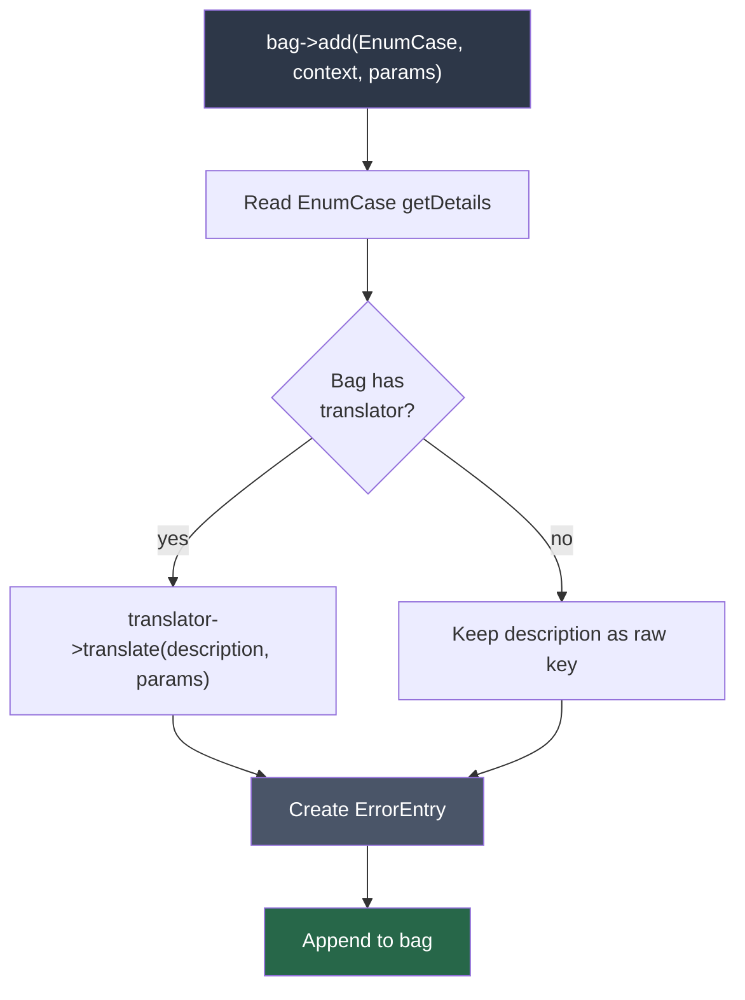
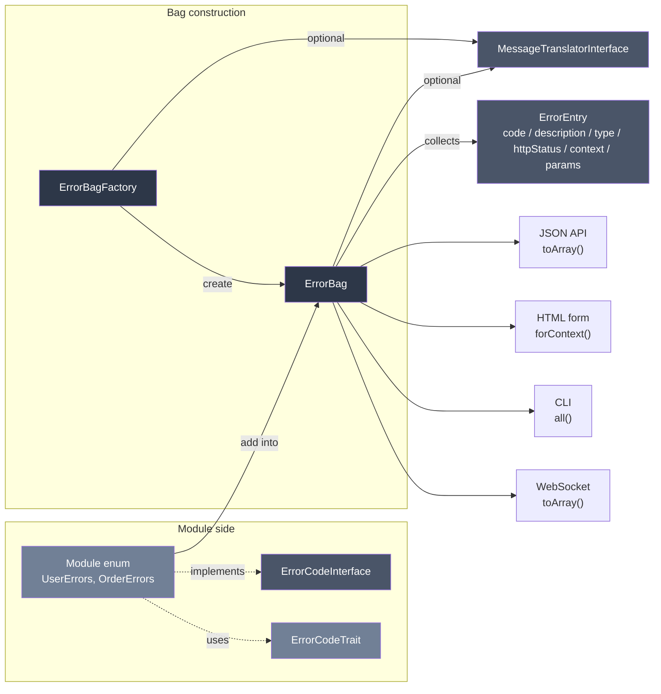

# phpdot/error

Structured error codes with context, translatable messages, and uniform output across every channel. Optional translator integration via `phpdot/contracts`.

---

## Table of Contents

- [Requirements](#requirements)
- [Installation](#installation)
- [Usage](#usage)
  - [Quick Start](#quick-start)
  - [How It Works](#how-it-works)
  - [Defining Error Codes](#defining-error-codes)
  - [ErrorEntry (The DTO)](#errorentry-the-dto)
  - [ErrorBag (The Collector)](#errorbag-the-collector)
  - [ErrorBagFactory](#errorbagfactory)
  - [ErrorType (9 Categories)](#errortype-9-categories)
  - [HttpStatus (Typed Enum)](#httpstatus-typed-enum)
  - [Context](#context)
  - [Translation (i18n)](#translation-i18n)
  - [Output Formats](#output-formats)
  - [Real-World Usage](#real-world-usage)
  - [API Reference](#api-reference)
- [Architecture](#architecture)
- [Testing](#testing)
- [License](#license)

## Requirements

| Requirement | Constraint |
|---|---|
| PHP | `>= 8.5` |
| `phpdot/contracts` | `^0.1` |

## Installation

```bash
composer require phpdot/error
```

## Usage

### Quick Start

**1. Define errors for your module:**

```php
enum UserErrors: string implements ErrorCodeInterface
{
    use ErrorCodeTrait;

    case NOT_FOUND     = '00010001';
    case EMAIL_TAKEN   = '00010002';
    case INVALID_EMAIL = '00010003';
    case WEAK_PASSWORD = '00010004';

    public function getDetails(): array
    {
        return match ($this) {
            self::NOT_FOUND => [
                'message'     => 'User not found',
                'description' => 'errors.user.not_found',
                'type'        => ErrorType::NOT_FOUND,
                'httpStatus'  => HttpStatus::NOT_FOUND->value,
            ],
            self::EMAIL_TAKEN => [
                'message'     => 'Email is already taken',
                'description' => 'errors.user.email_taken',
                'type'        => ErrorType::CONFLICT,
                'httpStatus'  => HttpStatus::CONFLICT->value,
            ],
            // ...
        };
    }
}
```

**2. Collect errors:**

```php
$errors = new ErrorBag();           // raw mode — descriptions stay as keys
// or
$errors = new ErrorBag($translator); // descriptions are translated at add() time

if (!filter_var($email, FILTER_VALIDATE_EMAIL)) {
    $errors->add(UserErrors::INVALID_EMAIL, 'email');
}

if (strlen($password) < 8) {
    $errors->add(UserErrors::WEAK_PASSWORD, 'password', ['min' => 8]);
}

if ($errors->hasErrors()) {
    return $errors; // same structure for JSON, HTML, WebSocket, CLI
}
```

**3. Same output everywhere:**

```json
{
    "errors": [
        {
            "code": "00010003",
            "message": "Invalid email address",
            "description": "errors.user.invalid_email",
            "type": "validation",
            "httpStatus": 422,
            "context": "email",
            "params": []
        }
    ]
}
```

---
### How It Works

### Add flow



### Two ways to construct a bag

- **Direct**: `new ErrorBag()` for a raw bag, or `new ErrorBag($translator)` to build one that translates `description` keys at `add()` time.
- **Through `ErrorBagFactory`**: inject the factory once, call `create()` for each fresh bag. The factory carries the (optional) translator, so every bag it produces is pre-wired. Designed for DI auto-wiring — services that depend on the factory never import `MessageTranslatorInterface` themselves.

### Package Structure

```
src/
├── ErrorCodeInterface.php   # Interface for module error enums
├── ErrorCodeTrait.php       # Default implementation via getDetails()
├── ErrorEntry.php           # Readonly DTO — single error
├── ErrorBag.php             # Collector — add, filter, merge, serialize
├── ErrorBagFactory.php      # Produces fresh bags pre-wired with translator
├── ErrorType.php            # 9 error categories
└── HttpStatus.php           # HTTP status codes enum
```

7 files. Single optional dependency on `phpdot/contracts` for the cross-package translator interface.

---

### Defining Error Codes

### ErrorCodeInterface

Every module defines a backed string enum implementing this interface:

```php
interface ErrorCodeInterface
{
    public function getCode(): string;
    public function getMessage(): string;
    public function getDescription(): string;
    public function getType(): ErrorType;
    public function getHttpStatus(): int;
    public function getDetails(): array;
}
```

### ErrorCodeTrait

Provides the default implementation. The trait reads from `getDetails()` — you only implement one method:

```php
trait ErrorCodeTrait
{
    public function getCode(): string       { return $this->value; }
    public function getMessage(): string    { return $this->getDetails()['message']; }
    public function getDescription(): string { return $this->getDetails()['description']; }
    public function getType(): ErrorType    { return $this->getDetails()['type']; }
    public function getHttpStatus(): int    { return $this->getDetails()['httpStatus']; }
}
```

### Module Error Enums

Each module owns its errors. No central error file.

```php
// User module
enum UserErrors: string implements ErrorCodeInterface
{
    use ErrorCodeTrait;

    case NOT_FOUND     = '00010001';
    case EMAIL_TAKEN   = '00010002';
    case INVALID_EMAIL = '00010003';
    case WEAK_PASSWORD = '00010004';
    case LOCKED        = '00010005';

    public function getDetails(): array
    {
        return match ($this) {
            self::NOT_FOUND => [
                'message'     => 'User not found',
                'description' => 'errors.user.not_found',
                'type'        => ErrorType::NOT_FOUND,
                'httpStatus'  => HttpStatus::NOT_FOUND->value,
            ],
            self::EMAIL_TAKEN => [
                'message'     => 'Email is already taken',
                'description' => 'errors.user.email_taken',
                'type'        => ErrorType::CONFLICT,
                'httpStatus'  => HttpStatus::CONFLICT->value,
            ],
            self::INVALID_EMAIL => [
                'message'     => 'Invalid email address',
                'description' => 'errors.user.invalid_email',
                'type'        => ErrorType::VALIDATION,
                'httpStatus'  => HttpStatus::UNPROCESSABLE_ENTITY->value,
            ],
            self::WEAK_PASSWORD => [
                'message'     => 'Password must be at least 8 characters',
                'description' => 'errors.user.weak_password',
                'type'        => ErrorType::VALIDATION,
                'httpStatus'  => HttpStatus::UNPROCESSABLE_ENTITY->value,
            ],
            self::LOCKED => [
                'message'     => 'Account is locked',
                'description' => 'errors.user.account_locked',
                'type'        => ErrorType::AUTHORIZATION,
                'httpStatus'  => HttpStatus::FORBIDDEN->value,
            ],
        };
    }
}

// Order module — separate file, separate team, no conflicts
enum OrderErrors: string implements ErrorCodeInterface
{
    use ErrorCodeTrait;

    case NOT_FOUND       = '00020001';
    case ALREADY_SHIPPED = '00020002';
    case PAYMENT_FAILED  = '00020003';

    public function getDetails(): array { /* ... */ }
}
```

### Error Code Convention

```
Format: MMMMNNNN (8 digits)
        ^^^^              = module ID (0001-9999)
            ^^^^          = error number within module (0001-9999)

Assignments:
    0001 = User / Auth
    0002 = Order
    0003 = Product
    0004 = Payment
    0005 = Event
    ...
```

---

### ErrorEntry (The DTO)

Pure data. No translation, no escaping. Immutable.

```php
final readonly class ErrorEntry
{
    public string $code;         // '00010003'
    public string $message;      // 'Invalid email address' (English fallback)
    public string $description;  // 'errors.user.invalid_email' (i18n key)
    public ErrorType $type;      // ErrorType::VALIDATION
    public int $httpStatus;      // 422
    public ?string $context;     // 'email' (field, param, header, service, path)
    public array $params;        // ['min' => 8] (ICU interpolation params)
}

$entry->toArray(); // serializable array
```

---

### ErrorBag (The Collector)

### Adding Errors

```php
$bag = new ErrorBag();

// From module enum
$bag->add(UserErrors::INVALID_EMAIL, 'email');
$bag->add(UserErrors::WEAK_PASSWORD, 'password', ['min' => 8]);

// Raw entry
$bag->addEntry(new ErrorEntry('CUSTOM', 'msg', 'desc', ErrorType::SERVER, 500));

// Chainable
$bag->add(UserErrors::INVALID_EMAIL, 'email')
    ->add(UserErrors::WEAK_PASSWORD, 'password');
```

### Checking Errors

```php
$bag->hasErrors();                          // bool
$bag->hasError(UserErrors::EMAIL_TAKEN);    // check specific code
$bag->count();                              // int
$bag->first();                              // ?ErrorEntry
$bag->all();                                // list<ErrorEntry>
$bag->codes();                              // list<string> — unique codes
```

### Filtering Errors

```php
// By context (field, param, header, etc.)
$bag->forContext('email');        // list<ErrorEntry>
$bag->forContext('password');     // list<ErrorEntry>
$bag->forContext('Authorization'); // list<ErrorEntry>

// By error type
$bag->ofType(ErrorType::VALIDATION);     // list<ErrorEntry>
$bag->ofType(ErrorType::NOT_FOUND);      // list<ErrorEntry>
$bag->ofType(ErrorType::AUTHENTICATION); // list<ErrorEntry>
```

### Merging Bags

Combine errors from sub-operations:

```php
$userErrors = $userService->validate($data);
$orderErrors = $orderService->validate($data);

$combined = new ErrorBag();
$combined->merge($userErrors)->merge($orderErrors);
```

### HTTP Status

Derived from the first error. If empty, returns 500.

```php
$bag->getHttpStatus(); // 422 (from first error)
```

### Serialization

```php
$bag->toArray();
// [
//     ['code' => '00010003', 'message' => '...', 'description' => '...', 'type' => 'validation', 'httpStatus' => 422, 'context' => 'email', 'params' => []],
//     ['code' => '00010004', 'message' => '...', 'description' => '...', 'type' => 'validation', 'httpStatus' => 422, 'context' => 'password', 'params' => ['min' => 8]],
// ]

json_encode(['errors' => $bag->toArray()]);
```

Clear and reset:

```php
$bag->clear(); // remove all errors, returns self
```

---

### ErrorBagFactory

Produces fresh `ErrorBag` instances pre-wired with an optional translator. Inject the factory once, call `create()` whenever you need a new bag — translator threading happens automatically.

```php
use PHPdot\Error\ErrorBagFactory;

// No translator — produces raw bags
$factory = new ErrorBagFactory();
$bag = $factory->create();
$bag->add(UserErrors::EMAIL_TAKEN, 'email');
$bag->first()->description; // 'errors.user.email_taken' (raw key)

// With translator — every bag carries it
$factory = new ErrorBagFactory($translator);
$bag = $factory->create();
$bag->add(UserErrors::EMAIL_TAKEN, 'email', ['email' => 'omar@phpdot.com']);
$bag->first()->description; // 'The email omar@phpdot.com is already registered.'
```

Each `create()` call returns a new, independent bag — no shared state between calls.

### Auto-wired usage

When using `phpdot/container`, services that need to produce errors inject the factory directly. The translator is wired into the factory through the container and passed to every bag the factory produces — without the service ever importing `MessageTranslatorInterface`:

```php
final class UserService
{
    public function __construct(
        private readonly ErrorBagFactory $bags,
    ) {}

    public function register(string $email): User|ErrorBag
    {
        $bag = $this->bags->create();

        if (!filter_var($email, FILTER_VALIDATE_EMAIL)) {
            $bag->add(UserErrors::INVALID_EMAIL, 'email');
        }

        return $bag->hasErrors() ? $bag : $this->users->create($email);
    }
}
```

The factory is `#[Scoped]` so each execution unit (request, coroutine) gets its own instance with its own per-request translator.

---

### ErrorType (9 Categories)

```php
enum ErrorType: string
{
    case VALIDATION     = 'validation';      // input is wrong
    case AUTHENTICATION = 'authentication';  // who are you?
    case AUTHORIZATION  = 'authorization';   // you can't do this
    case NOT_FOUND      = 'not_found';       // doesn't exist
    case CONFLICT       = 'conflict';        // duplicate, version mismatch
    case RATE_LIMIT     = 'rate_limit';      // too many requests
    case TIMEOUT        = 'timeout';         // took too long
    case UNAVAILABLE    = 'unavailable';     // service down
    case SERVER         = 'server';          // unexpected internal error
}
```

The frontend uses the type to decide presentation (red badge for server, yellow for validation, etc.). The error code gives the specific problem.

---

### HttpStatus (Typed Enum)

IDE autocompletion and compile-time safety for HTTP status codes:

```php
enum HttpStatus: int
{
    case OK                    = 200;
    case CREATED               = 201;
    case NO_CONTENT            = 204;
    case BAD_REQUEST           = 400;
    case UNAUTHORIZED          = 401;
    case FORBIDDEN             = 403;
    case NOT_FOUND             = 404;
    case CONFLICT              = 409;
    case UNPROCESSABLE_ENTITY  = 422;
    case TOO_MANY_REQUESTS     = 429;
    case INTERNAL_SERVER_ERROR = 500;
    case SERVICE_UNAVAILABLE   = 503;
    // ... 25 codes total
}

// In error enums
'httpStatus' => HttpStatus::NOT_FOUND->value, // 404
```

---

### Context

Context is **what the error relates to**. Not just form fields.

```php
$errors->add(UserErrors::INVALID_EMAIL, 'email');              // form field
$errors->add(UserErrors::NOT_FOUND, 'user_id');                // route parameter
$errors->add(AuthErrors::INVALID_TOKEN, 'Authorization');       // HTTP header
$errors->add(PaymentErrors::GATEWAY_DOWN, 'stripe');            // service name
$errors->add(OrderErrors::INVALID_ADDRESS, 'address.city');     // nested path
$errors->add(SystemErrors::MAINTENANCE);                        // no context — global
```

Filter by context to show errors next to the right element:

```php
$errors->forContext('email');          // errors for the email field
$errors->forContext('Authorization');  // errors for the auth header
```

---

### Translation (i18n)

### How Translation Works

The error package stores translation keys, not translated text. Translation happens at render time.

```
Error created → description = 'errors.user.email_taken'
                              (this is a translation key, not text)
                                    │
    ┌───────────────────────────────┤
    │                               │
    ▼                               ▼
JSON API                    HTML (server-rendered)
returns the key →           $i18n->trans($error->description)
frontend translates         → "البريد الإلكتروني مستخدم"
```

### ICU Params

Dynamic values for translation interpolation. Works with any ICU-compatible i18n library — [phpdot/i18n](https://github.com/phpdot/i18n) is one option, but not required.

```php
$errors->add(ProductErrors::INSUFFICIENT_STOCK, 'quantity', [
    'available' => 5,
    'requested' => 10,
]);

// Translation files:
// en: 'errors.product.insufficient_stock' → 'Only {available} items in stock, you requested {requested}'
// ar: 'errors.product.insufficient_stock' → 'يتوفر {available} عناصر فقط، طلبت {requested}'
```

### Frontend Translation

The frontend receives the error code and description key, translates in its own i18n system:

```javascript
response.errors.forEach(error => {
    const translated = i18n.t(error.description, error.params);
    showError(error.context, translated);
});
```

### Server-Side Translation

With any translation library:

```php
foreach ($bag->all() as $error) {
    $translated = $i18n->trans($error->description, $error->params);
    // Show next to the form field identified by $error->context
}
```

### Auto-Translation via `MessageTranslatorInterface`

`ErrorBag` accepts an optional `PHPdot\Contracts\I18n\MessageTranslatorInterface` in its constructor. When wired, every `add()` call replaces the entry's `description` field with the translator's output for the original key + ICU params:

```php
use PHPdot\Error\ErrorBag;

$bag = new ErrorBag($translator);   // any class implementing MessageTranslatorInterface
$bag->add(UserErrors::EMAIL_TAKEN, 'email', ['email' => 'omar@phpdot.com']);

$bag->first()->message;       // 'Email is already taken' (always — enum's English string)
$bag->first()->description;   // 'The email omar@phpdot.com is already registered.'
                              // (translated; was the raw key without translator)
```

The `message` field is **never** touched by the bag — it always carries the enum's English string (developer-facing documentation). The `description` field is the runtime-variable one: the raw translation key when no translator is wired, or the translated string when one is.

The bag does not second-guess the translator. Whatever the translator returns — including a `[key]` sentinel for missing keys — goes straight into `description`. Fallback policy is the translator's responsibility, not the bag's.

```php
$bag = new ErrorBag();              // no translator
$bag->add(UserErrors::EMAIL_TAKEN);  // description stays as 'errors.user.email_taken'

$bag = new ErrorBag($translator);    // translator wired
$bag->add(UserErrors::EMAIL_TAKEN);  // description becomes the translated string
```

`MessageTranslatorInterface` ships in `phpdot/contracts`. `phpdot/i18n`'s `Translator` already implements it, but any compatible translator works.

---

### Output Formats

### JSON API

```json
{
    "errors": [
        {
            "code": "00010003",
            "message": "Invalid email address",
            "description": "errors.user.invalid_email",
            "type": "validation",
            "httpStatus": 422,
            "context": "email",
            "params": []
        },
        {
            "code": "00010004",
            "message": "Password must be at least 8 characters",
            "description": "errors.user.weak_password",
            "type": "validation",
            "httpStatus": 422,
            "context": "password",
            "params": {"min": 8}
        }
    ]
}
```

### HTML Forms

```php
foreach ($bag->forContext('email') as $error) {
    echo '<span class="error">' . $i18n->trans($error->description, $error->params) . '</span>';
}
```

### CLI

```
[00010003] Invalid email address (context: email)
[00010004] Password must be at least 8 characters (context: password)
```

### WebSocket

Same `$bag->toArray()` serialized as JSON. Identical structure to the API.

---

### Real-World Usage

### Service Validation

```php
final class UserService
{
    public function register(string $email, string $password): User|ErrorBag
    {
        $errors = new ErrorBag();

        if (!filter_var($email, FILTER_VALIDATE_EMAIL)) {
            $errors->add(UserErrors::INVALID_EMAIL, 'email');
        }

        if (strlen($password) < 8) {
            $errors->add(UserErrors::WEAK_PASSWORD, 'password', ['min' => 8]);
        }

        if ($errors->hasErrors()) {
            return $errors;
        }

        if ($this->users->emailExists($email)) {
            $errors->add(UserErrors::EMAIL_TAKEN, 'email');
            return $errors;
        }

        return $this->users->create($email, $password);
    }
}
```

### Cross-Module Merge

```php
$userErrors = $userService->validate($data);
$addressErrors = $addressService->validate($data['address']);

$errors = new ErrorBag();
$errors->merge($userErrors)->merge($addressErrors);

if ($errors->hasErrors()) {
    return response()->json(['errors' => $errors->toArray()], $errors->getHttpStatus());
}
```

### Frontend Grouping

```php
$grouped = [];
foreach ($bag->all() as $error) {
    $key = $error->context ?? '_global';
    $grouped[$key][] = $error->toArray();
}
// $grouped['email'] → [{code: '00010003', ...}, {code: '00010002', ...}]
// $grouped['password'] → [{code: '00010004', ...}]
// $grouped['_global'] → [{code: '00060001', ...}]
```

---

### API Reference

### ErrorCodeInterface API

```
interface ErrorCodeInterface

getCode(): string
getMessage(): string
getDescription(): string
getType(): ErrorType
getHttpStatus(): int
getDetails(): array{message: string, description: string, type: ErrorType, httpStatus: int}
```

### ErrorCodeTrait API

```
trait ErrorCodeTrait

getCode(): string            // returns $this->value
getMessage(): string         // returns getDetails()['message']
getDescription(): string     // returns getDetails()['description']
getType(): ErrorType         // returns getDetails()['type']
getHttpStatus(): int         // returns getDetails()['httpStatus']
```

### ErrorEntry API

```
final readonly class ErrorEntry

__construct(
    public string    $code,
    public string    $message,
    public string    $description,
    public ErrorType $type,
    public int       $httpStatus,
    public ?string   $context = null,
    public array<string, mixed> $params = [],
)

toArray(): array{code, message, description, type, httpStatus, context, params}
```

### ErrorBag API

```
final class ErrorBag

__construct(?MessageTranslatorInterface $translator = null)
add(ErrorCodeInterface $error, ?string $context = null, array $params = []): self
addEntry(ErrorEntry $entry): self
hasErrors(): bool
hasError(ErrorCodeInterface $error): bool
all(): list<ErrorEntry>
first(): ?ErrorEntry
forContext(string $context): list<ErrorEntry>
ofType(ErrorType $type): list<ErrorEntry>
count(): int
merge(self $other): self
clear(): self
getHttpStatus(): int
codes(): list<string>
toArray(): list<array{code, message, description, type, httpStatus, context, params}>
```

### ErrorType API

```
enum ErrorType: string

VALIDATION     = 'validation'
AUTHENTICATION = 'authentication'
AUTHORIZATION  = 'authorization'
NOT_FOUND      = 'not_found'
CONFLICT       = 'conflict'
RATE_LIMIT     = 'rate_limit'
TIMEOUT        = 'timeout'
UNAVAILABLE    = 'unavailable'
SERVER         = 'server'
```

### HttpStatus API

```
enum HttpStatus: int
```

| Case | Value |
|------|-------|
| `OK` | 200 |
| `CREATED` | 201 |
| `ACCEPTED` | 202 |
| `NO_CONTENT` | 204 |
| `MOVED_PERMANENTLY` | 301 |
| `FOUND` | 302 |
| `NOT_MODIFIED` | 304 |
| `TEMPORARY_REDIRECT` | 307 |
| `PERMANENT_REDIRECT` | 308 |
| `BAD_REQUEST` | 400 |
| `UNAUTHORIZED` | 401 |
| `FORBIDDEN` | 403 |
| `NOT_FOUND` | 404 |
| `METHOD_NOT_ALLOWED` | 405 |
| `CONFLICT` | 409 |
| `GONE` | 410 |
| `PAYLOAD_TOO_LARGE` | 413 |
| `UNSUPPORTED_MEDIA` | 415 |
| `UNPROCESSABLE_ENTITY` | 422 |
| `TOO_MANY_REQUESTS` | 429 |
| `INTERNAL_SERVER_ERROR` | 500 |
| `BAD_GATEWAY` | 502 |
| `SERVICE_UNAVAILABLE` | 503 |
| `GATEWAY_TIMEOUT` | 504 |

---

## Architecture



One error. One code. One structure. Every channel. Every language.

## Testing

The package is standalone-testable:

```bash
composer install
composer test        # PHPUnit
composer analyse     # PHPStan, level max + strict rules
composer cs-check    # PHP-CS-Fixer
composer check       # all three
```


## License

MIT.

**This repository is a read-only mirror**, generated by CI from
[phpdot/monorepo](https://github.com/phpdot/monorepo). [Pull requests](https://github.com/phpdot/monorepo/pulls)
and [issues](https://github.com/phpdot/monorepo/issues) belong in the monorepo.
