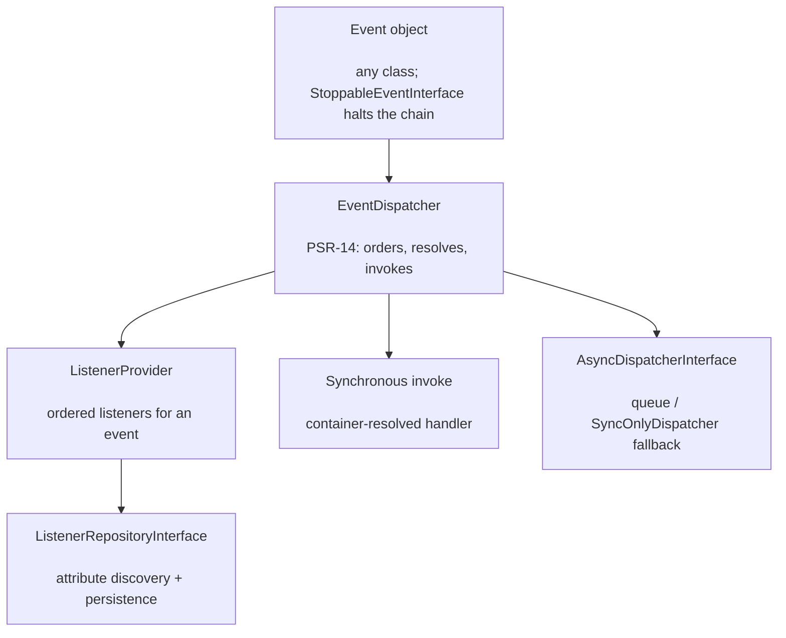

# phpdot/event

A PSR-14 event dispatcher where the `#[Listener]` attribute *is* the registration — no central config,
no service providers. Listeners are ordered, can run synchronously or be queued for async dispatch, and
the listener set is resolved through a repository so it can be persisted and toggled at runtime.

## Table of Contents

- [Requirements](#requirements)
- [Installation](#installation)
- [Usage](#usage)
- [Architecture](#architecture)
- [Testing](#testing)
- [License](#license)

## Requirements

| Requirement | Constraint |
|---|---|
| PHP | `>= 8.5` |
| `psr/container` | `^2.0` |
| `psr/event-dispatcher` | `^1.0` |
| `psr/log` | `^3.0` |

## Installation

```bash
composer require phpdot/event
```

## Usage

### Events and listeners

An event is any class. A handler declares what it handles with `#[Listener]` — the attribute is the
registration:

```php
use PHPdot\Event\Attribute\Listener;

final readonly class UserRegistered
{
    public function __construct(public int $userId, public string $email) {}
}

#[Listener(UserRegistered::class, order: 1)]
final class SendWelcomeEmail
{
    public function __construct(private MailerInterface $mailer) {}

    public function __invoke(UserRegistered $event): void
    {
        $this->mailer->send($event->email, 'Welcome!');
    }
}
```

### Dispatching

```php
use PHPdot\Event\EventDispatcher;
use PHPdot\Event\ListenerProvider;

$provider = new ListenerProvider();
$provider->addListener(UserRegistered::class, SendWelcomeEmail::class, order: 1);

$dispatcher = new EventDispatcher($provider, $container, $asyncDispatcher, $logger);
$dispatcher->dispatch(new UserRegistered(userId: 1, email: 'omar@example.com'));
```

Listeners run in `order` (lowest first). An event implementing `StoppableEventInterface` halts the chain
once propagation is stopped, per PSR-14.

### Async listeners

A listener marked `#[Listener(..., async: true)]` is handed to the injected `AsyncDispatcherInterface`
instead of running inline. `SyncOnlyDispatcher` is the built-in fallback that resolves and runs the
handler synchronously; a Swoole or queue-backed implementation can dispatch it off the request path.

## Architecture

`EventDispatcher` asks the `ListenerProvider` for the ordered listeners of an event, resolves each
handler class through the container, and either invokes it synchronously or hands it to the async
dispatcher. The listener set itself comes from a repository, so it can be discovered from attributes,
persisted, and toggled without touching code.



## Testing

```bash
composer install
composer test        # PHPUnit
composer analyse     # PHPStan, level max + strict rules
composer cs-check    # PHP-CS-Fixer
composer check       # All three
```

## License

MIT.

**This repository is a read-only mirror**, generated by CI from
[phpdot/monorepo](https://github.com/phpdot/monorepo). [Pull requests](https://github.com/phpdot/monorepo/pulls)
and [issues](https://github.com/phpdot/monorepo/issues) belong in the monorepo.
