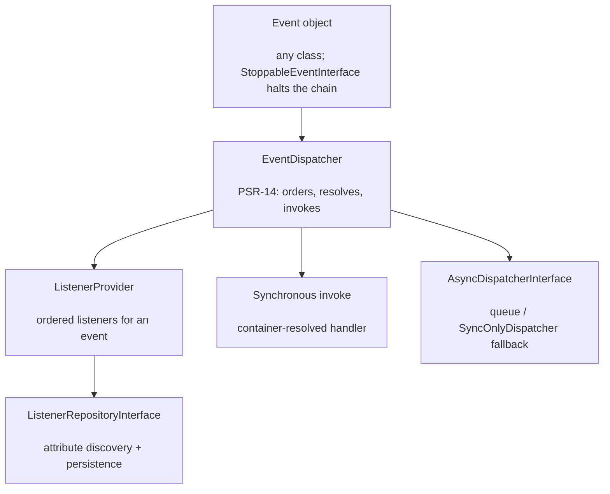

# phpdot/event

A PSR-14 event dispatcher where the `#[Listener]` attribute *is* the registration — no central config,
no service providers. Listeners are ordered, can run synchronously or be queued for async dispatch, and
the listener set is resolved through a repository so it can be persisted and toggled at runtime.

## Table of Contents

- [Requirements](#requirements)
- [Installation](#installation)
- [Usage](#usage)
- [Architecture](#architecture)
- [Testing](#testing)
- [License](#license)

## Requirements

| Requirement | Constraint |
|---|---|
| PHP | `>= 8.5` |
| `phpdot/attribute` | `^0.3` |
| `phpdot/console` | `^0.3` |
| `phpdot/contracts` | `^0.3` |
| `psr/container` | `^2.0` |
| `psr/event-dispatcher` | `^1.0` |
| `symfony/console` | `^8.0` |

## Installation

```bash
composer require phpdot/event
```

## Usage

### Events and listeners

An event is any class. A handler declares what it handles with `#[Listener]` — the attribute is the
registration:

```php
use PHPdot\Event\Attribute\Listener;

final readonly class UserRegistered
{
    public function __construct(public int $userId, public string $email) {}
}

#[Listener(UserRegistered::class, order: 1)]
final class SendWelcomeEmail
{
    public function __construct(private MailerInterface $mailer) {}

    public function __invoke(UserRegistered $event): void
    {
        $this->mailer->send($event->email, 'Welcome!');
    }
}
```

### Discovery and wiring

The attribute is the whole registration — `AttributeListenerDiscovery` scans with
`phpdot/attribute` and answers the entries boot loads. Nothing else re-states the binding:

```php
use PHPdot\Event\Discovery\AttributeListenerDiscovery;
use PHPdot\Event\ListenerProvider;

$discovery = new AttributeListenerDiscovery([$appPath . '/Listeners', $srcPath]);
$provider = new ListenerProvider($container);
$provider->load($discovery->discover());
```

Every service carries `#[Singleton]`/`#[Binds]` — in a phpdot application the PSR-14 interfaces
resolve from the container; `event:list` prints the discovered surface (event, listener, order,
mode) with `--event <name>` to filter.

Fail-loud at boot: a declared event that is not a class, or a priority outside 0-10, is a
`ListenerException` naming the listener — never a silent listener that never fires.

### Dispatching

```php
$dispatcher->dispatch(new UserRegistered(userId: 1, email: 'omar@example.com'));
```

Dispatch runs two phases: every sync listener first, in `order` (lowest first), with
`StoppableEventInterface` semantics honored per PSR-14 — then every async listener is handed to
the `AsyncDispatcherInterface` in order. Propagation stop halts everything after it, async
listeners included; an async listener ordered before the stopper still publishes. Every dispatch
carries a span (`event.dispatch` on the `event` channel) with one `event.listener` event per
listener — observability through `phpdot/contracts`, per the v0.3.0 doctrine.

### Async listeners

A listener marked `#[Listener(..., async: true)]` is handed to the injected
`AsyncDispatcherInterface` instead of running inline. `SyncOnlyDispatcher` is the shipped
fallback: **publish means run, immediately, inline after the sync phase** — priority is ignored
(there is no queue to order) and a handler failure is a `ListenerException` (it ran — never
disguised as a queue failure). Bind a queue backend when timing matters — whichever broker the
application installed; the dispatcher publishes, the application's worker
consumes.

## Architecture

`EventDispatcher` asks the `ListenerProvider` for the ordered listeners of an event, resolves each
handler class through the container, and either invokes it synchronously or hands it to the async
dispatcher. The listener set itself comes from a repository, so it can be discovered from attributes,
persisted, and toggled without touching code.


```mermaid
graph TD
    EVENT["Event object<br/><br/>any class; StoppableEventInterface halts the chain"]
    DISPATCHER["EventDispatcher<br/><br/>PSR-14: orders, resolves, invokes"]
    PROVIDER["ListenerProvider<br/><br/>ordered listeners for an event"]
    REPO["ListenerRepositoryInterface<br/><br/>attribute discovery + persistence"]
    SYNC["Synchronous invoke<br/><br/>container-resolved handler"]
    ASYNC["AsyncDispatcherInterface<br/><br/>queue / SyncOnlyDispatcher fallback"]

    EVENT --> DISPATCHER
    DISPATCHER --> PROVIDER
    PROVIDER --> REPO
    DISPATCHER --> SYNC
    DISPATCHER --> ASYNC
```

## Testing

```bash
composer install
composer test        # PHPUnit
composer analyse     # PHPStan, level max + strict rules
composer cs-check    # PHP-CS-Fixer
composer check       # All three
```

## License

MIT.

**This repository is a read-only mirror**, generated by CI from
[phpdot/monorepo](https://github.com/phpdot/monorepo). [Pull requests](https://github.com/phpdot/monorepo/pulls)
and [issues](https://github.com/phpdot/monorepo/issues) belong in the monorepo.
