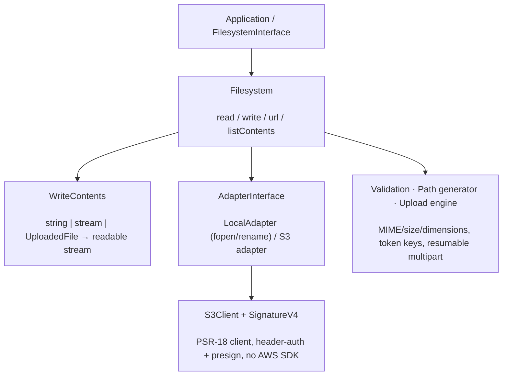

# phpdot/filesystem

Coroutine-safe, PSR-native file storage. One `FilesystemInterface` spans local disk and S3-compatible
backends (AWS S3, Cloudflare R2, MinIO, DigitalOcean Spaces) through a hand-rolled PSR-18 + Signature V4
client — no AWS SDK. Bodies flow as PSR-7 streams with bounded memory, uploads are resumable, validation
is built in, and the server (not the browser) picks where bytes land.

## Table of Contents

- [Requirements](#requirements)
- [Installation](#installation)
- [Usage](#usage)
- [Architecture](#architecture)
- [Testing](#testing)
- [License](#license)

## Requirements

| Requirement | Constraint |
|---|---|
| PHP | `>= 8.5` |
| `ext-fileinfo` | `*` |
| `ext-hash` | `*` |
| `league/mime-type-detection` | `^1.15` |
| `psr/event-dispatcher` | `^1.0` |
| `psr/http-client` | `^1.0` |
| `psr/http-factory` | `^1.0` |
| `psr/http-message` | `^2.0` |
| `psr/http-server-handler` | `^1.0` |

Bring any PSR-17/PSR-18 implementation. `phpdot/console` and `phpdot/container` are dev-only suggestions
(the CLI commands and binding attributes are inert without them).

## Installation

```bash
composer require phpdot/filesystem
```

## Usage

```php
use Nyholm\Psr7\Factory\Psr17Factory;
use PHPdot\Filesystem\Adapter\LocalAdapter;
use PHPdot\Filesystem\Filesystem;
use PHPdot\Filesystem\FilesystemConfig;
use PHPdot\Filesystem\Write\WriteContents;

$psr17      = new Psr17Factory();
$adapter    = new LocalAdapter(new FilesystemConfig(root: '/var/storage'), $psr17);
$filesystem = new Filesystem($adapter, new WriteContents($psr17));

$filesystem->write('invoices/2026.pdf', $pdfBytes);   // string | PSR-7 stream | UploadedFile
$pdf = $filesystem->read('invoices/2026.pdf');
$url = $filesystem->url('invoices/2026.pdf');          // public or presigned, by visibility

foreach ($filesystem->listContents('invoices', deep: true) as $entry) {
    echo $entry->path(), PHP_EOL;
}
```

You talk to one interface; swap the backend by swapping one binding. In a PHPdot application the container
auto-binds `FilesystemInterface`, so the wiring above disappears.

Beyond read/write/list, the package adds a collect-all **validation** pipeline (MIME, size, extension,
image dimensions over a bounded prefix), a token **path generator** (`{date}/{uuid}/{hash}`…) so the
server picks the key, an optional **managed-files** layer that persists a `FileRecord` per file with
soft-delete and quarantine, and a tus-compatible **resumable upload** endpoint plus CLI uploader.

## Architecture

`Filesystem` is the operator — it drives an `AdapterInterface` (`LocalAdapter` native fopen/rename, or the
`S3` adapter over a PSR-18 + SigV4 client with no AWS SDK) and a `WriteContents` pipeline that collapses a
string, stream, or uploaded file into one readable stream. Validation, path generation, and the resumable
upload engine sit alongside, and I/O goes non-blocking automatically under Swoole without any
`ext-swoole` dependency.



## Testing

```bash
composer install
composer test        # PHPUnit
composer analyse     # PHPStan, level max + strict rules
composer cs-check    # PHP-CS-Fixer
composer check       # All three
```

The unit suite (including the S3 client, signing vectors, and adapters against an in-memory HTTP client)
runs with no external services. The S3 integration suite connects to a real bucket and **skips unless AWS
credentials and `PHPDOT_S3_TEST_BUCKET` are set**.

## License

MIT.

**This repository is a read-only mirror**, generated by CI from
[phpdot/monorepo](https://github.com/phpdot/monorepo). [Pull requests](https://github.com/phpdot/monorepo/pulls)
and [issues](https://github.com/phpdot/monorepo/issues) belong in the monorepo.
