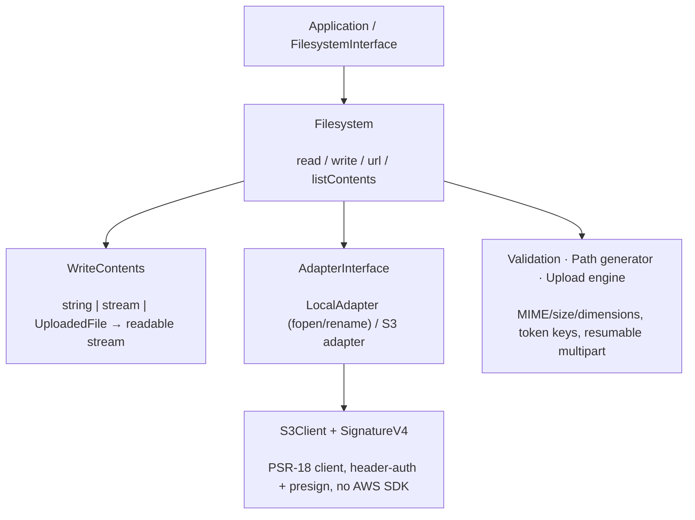

# phpdot/filesystem

Coroutine-safe, PSR-native file storage. One `FilesystemInterface` spans local disk and S3-compatible
backends (AWS S3, Cloudflare R2, MinIO, DigitalOcean Spaces) through a hand-rolled PSR-18 + Signature V4
client — no AWS SDK. Bodies flow as PSR-7 streams with bounded memory, uploads are resumable, validation
is built in, and the server (not the browser) picks where bytes land.

## Table of Contents

- [Requirements](#requirements)
- [Installation](#installation)
- [Usage](#usage)
- [Architecture](#architecture)
- [Testing](#testing)
- [License](#license)

## Requirements

| Requirement | Constraint |
|---|---|
| PHP | `>= 8.5` |
| `ext-fileinfo` | `*` |
| `ext-hash` | `*` |
| `league/mime-type-detection` | `^1.16` |
| `phpdot/console` | `^0.4` |
| `psr/event-dispatcher` | `^1.0` |
| `psr/http-client` | `^1.0` |
| `psr/http-factory` | `^1.0` |
| `psr/http-message` | `^2.0` |
| `psr/http-server-handler` | `^1.0` |
| `symfony/console` | `^8.0` |

Bring any PSR-17/PSR-18 implementation. `phpdot/container` is a dev-only suggestion
(the binding attributes are inert without it).

## Installation

```bash
composer require phpdot/filesystem
```

## Usage

### Presigned direct uploads (S3 / R2 / MinIO)

Let the client PUT straight to the bucket — PHP only mints the grant:

```php
$grant = $fs->presignedUpload('avatars/42.png', new DateTimeImmutable('+10 minutes'), 'image/png', null, $expectedBytes);

// hand $grant->toArray() to your endpoint; the client then does:
//   PUT $grant['url']  with headers: $grant['headers'], body: the file
```

The content type is pinned into the signature when given — a client sending any other
type is rejected by the bucket (`403 SignatureDoesNotMatch`), so the stored type stays a
server decision. Pass `null` only when nothing from the bucket is served to a browser.
A declared size is pinned the same way: `Content-Length` joins the signature and the
bucket refuses a body of any other length. Without one the grant accepts any size;
verify on completion against the storage's own truth:

```php
$fs->fileExists('avatars/42.png') && $fs->fileSize('avatars/42.png') === $expected;
```

Upload progress moves client-side with this lane — XHR/fetch progress events — while the
through-PHP lanes (streamed writes, resumable chunks) keep the server-side progress bar.

**Large files (the resumable direct lane)** — one grant per multipart part; a dropped part
retries alone instead of restarting the upload:

```php
$session = $manager->create('videos/clip.mp4', $totalBytes);   // server mints uploadId + session

$grant = $fs->presignedPartUpload('videos/clip.mp4', $session->uploadId, $n, new DateTimeImmutable('+10 minutes'), 'video/mp4', null, $partBytes);
// client PUTs part $n directly; every part but the last must clear the storage minimum (5 MiB on S3)

$manager->complete($session->id);   // built from the bucket's own part list — the client holds no ETags
```

The single-PUT 5 GB ceiling does not apply, and a part grant pins its declared size exactly
like a whole-object grant does. `complete()` refuses any upload whose stored bytes differ
from the declaration in either direction and aborts it (`UploadSizeMismatch`).

**Checksums without downloads (SHA-256).** Every upload path carries the digest as
`x-amz-checksum-sha256` — server writes hash the stream they hold, grants sign the digest you
pass (`presignedUpload(..., $sha256Base64)`; the client computes it with SubtleCrypto and the
server mints the grant around it). S3 verifies the value against the bytes it receives (a lying
digest is a 400) and stores it, so the object's checksum comes back by HEAD — never by
downloading the file:

```php
$fs->checksum('avatars/42.png', 'sha256');   // HeadObject with x-amz-checksum-mode: ENABLED
```

For multipart, the create call decides: pass `['checksum_algorithm' => 'SHA256']` (through
`UploadManager::create()`'s `$config`, or any `createMultipart()` config) and the bucket
tracks every part's digest into a stored composite — the finished object's checksum comes
back by HEAD as `"<sha256-of-concatenated-part-digests>-<partCount>"` on both S3 and MinIO.
Without the directive, a multipart complete stores nothing object-level on MinIO, and on
AWS only the automatically computed CRC64NVME. `storedChecksum($path)` reads whatever the
storage actually holds — `"sha256:<hex>"`, `"sha256:<hex>-N"`, or `"crc64nvme:<base64>"`
(AWS stamps every object with CRC64NVME, so even legacy ones answer) — from one HEAD,
never by downloading. Objects whose storage holds nothing still fall back to streaming
the object once through `checksum()`.

On R2, part digests must be CRC64NVME — R2 refuses SHA-256 part headers outright (501)
but verifies CRC64NVME against the bytes at the door and stores the finished object's
CRC64, so `storedChecksum()` answers there too:

```php
$grant = $fs->presignedPartUpload($path, $uploadId, $n, $expires, null, Crc64Nvme::base64Digest($chunk), 'CRC64NVME', $chunkSize);
```

`Crc64Nvme` is the package's own implementation (big-endian base64 wire form); a browser
client mirrors it with a small table-driven routine — `crypto.subtle` has SHA-256 natively
but no CRC.

**CORS**: the bucket must accept the browser's origin and PUT method (AWS: a CORS
configuration allowing `PUT` with the `Content-Type` header; R2 and MinIO equivalent).


```php
use Nyholm\Psr7\Factory\Psr17Factory;
use PHPdot\Filesystem\Adapter\LocalAdapter;
use PHPdot\Filesystem\Filesystem;
use PHPdot\Filesystem\FilesystemConfig;
use PHPdot\Filesystem\Write\WriteContents;

$psr17      = new Psr17Factory();
$adapter    = new LocalAdapter(new FilesystemConfig(root: '/var/storage'), $psr17);
$filesystem = new Filesystem($adapter, new WriteContents($psr17));

$filesystem->write('invoices/2026.pdf', $pdfBytes);   // string | PSR-7 stream | UploadedFile
$pdf = $filesystem->read('invoices/2026.pdf');
$url = $filesystem->url('invoices/2026.pdf');          // public or presigned, by visibility

foreach ($filesystem->listContents('invoices', deep: true) as $entry) {
    echo $entry->path(), PHP_EOL;
}
```

You talk to one interface; swap the backend by swapping one binding. In a PHPdot application the container
auto-binds `FilesystemInterface`, so the wiring above disappears.

Beyond read/write/list, the package adds a collect-all **validation** pipeline (MIME, size, extension,
image dimensions over a bounded prefix), a token **path generator** (`{date}/{uuid}/{hash}`…) so the
server picks the key, an optional **managed-files** layer that persists a `FileRecord` per file with
soft-delete and quarantine, and a tus-compatible **resumable upload** endpoint plus CLI uploader.

## Architecture

`Filesystem` is the operator — it drives an `AdapterInterface` (`LocalAdapter` native fopen/rename, or the
`S3` adapter over a PSR-18 + SigV4 client with no AWS SDK) and a `WriteContents` pipeline that collapses a
string, stream, or uploaded file into one readable stream. Validation, path generation, and the resumable
upload engine sit alongside, and I/O goes non-blocking automatically under Swoole without any
`ext-swoole` dependency.


```mermaid
graph TD
    APP["Application / FilesystemInterface"]
    FS["Filesystem<br/><br/>read / write / url / listContents"]
    WRITE["WriteContents<br/><br/>string | stream | UploadedFile → readable stream"]
    ADAPTER["AdapterInterface<br/><br/>LocalAdapter (fopen/rename) / S3 adapter"]
    S3["S3Client + SignatureV4<br/><br/>PSR-18 client, header-auth + presign, no AWS SDK"]
    EXTRAS["Validation · Path generator · Upload engine<br/><br/>MIME/size/dimensions, token keys, resumable multipart"]

    APP --> FS
    FS --> WRITE
    FS --> ADAPTER
    ADAPTER --> S3
    FS --> EXTRAS
```

## Testing

```bash
composer install
composer test        # PHPUnit
composer analyse     # PHPStan, level max + strict rules
composer cs-check    # PHP-CS-Fixer
composer check       # All three
```

The unit suite (including the S3 client, signing vectors, and adapters against an in-memory HTTP client)
runs with no external services. The S3 integration suite connects to a real bucket and **skips unless AWS
credentials and `PHPDOT_S3_TEST_BUCKET` are set**.

## License

MIT.

**This repository is a read-only mirror**, generated by CI from
[phpdot/monorepo](https://github.com/phpdot/monorepo). [Pull requests](https://github.com/phpdot/monorepo/pulls)
and [issues](https://github.com/phpdot/monorepo/issues) belong in the monorepo.
