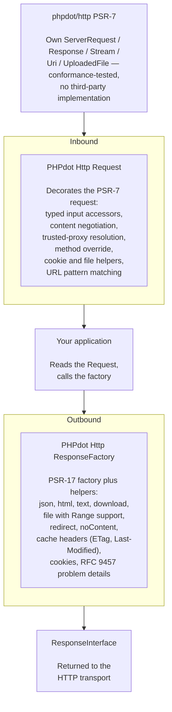

# phpdot/http

Advanced HTTP library for PHP. **Self-contained PSR-7/17** — its own message
implementation, no third-party dependency. Framework-agnostic, coroutine-safe, and
interchangeable with any PSR-7/PSR-17 consumer (Slim, Mezzio, …).

## Table of Contents

- [Requirements](#requirements)
- [Installation](#installation)
- [What It Is](#what-it-is)
- [PSR compliance](#psr-compliance)
- [Usage](#usage)
  - [Request](#request)
  - [ResponseFactory](#responsefactory)
  - [Cookie](#cookie)
  - [HTTP Exceptions](#http-exceptions)
  - [IpUtils](#iputils)
  - [StatusText](#statustext)
  - [Framework Integration](#framework-integration)
  - [Usage with Frameworks](#usage-with-frameworks)
- [Architecture](#architecture)
- [Testing](#testing)
- [License](#license)

## Requirements

| Requirement | Constraint |
|---|---|
| PHP | `>= 8.5` |
| `psr/http-message` | `^2.0` |
| `psr/http-factory` | `^1.0` |
| `league/mime-type-detection` | `^1.16` |

PSR interfaces plus a MIME database — **no third-party PSR-7 implementation**.

## Installation

```bash
composer require phpdot/http
```

## What It Is

A **self-contained PSR-7/17 implementation** with a rich, typed API on top:

- **PSR-7 messages** — own `ServerRequest`, `Response`, `Stream`, `Uri`, `UploadedFile`, conformance-tested with the official `php-http/psr7-integration-tests` suite
- **PSR-17 factories** — `ResponseFactory` implements all five factory interfaces
- **Request** — ergonomic decorator over `ServerRequestInterface`: typed input, content negotiation, trusted proxies, method override
- **ResponseFactory helpers** — JSON, HTML, file downloads (content-based MIME + Range), redirects, cache headers, RFC 9457 problem details, streaming & SSE
- **Cookie** — immutable value object per RFC 6265
- **HTTP Exceptions** — typed exceptions with RFC 9457 Problem Details
- **IpUtils / StatusText** — IPv4/IPv6 subnet checking; complete RFC 9110 status mapping
- **Coroutine-safe** — immutable value objects, zero static state; the singleton factory is safe to share across Swoole coroutines

## PSR compliance

Every message class implements its `Psr\Http\Message\*Interface`, and
`ResponseFactory` implements all five PSR-17 factory interfaces. The package
passes the official `php-http/psr7-integration-tests` compliance suite (vendored
under `tests/Psr7/` for PHPUnit 13), so it is a drop-in PSR-7/PSR-17
implementation for Slim, Mezzio, or any PSR-consuming framework.
## Usage

### Request

Wraps any `ServerRequestInterface`. Implements `ServerRequestInterface` itself — drop-in compatible.

```php
use PHPdot\Http\Message\Request;

$request = new Request($psrRequest);
```

### Input — Typed Accessors

```php
$request->query('page', 1);              // query string with default
$request->input('email');                 // parsed body
$request->all();                          // merged query + body (body wins)

$request->only(['email', 'name']);        // pick specific keys
$request->except(['password']);           // exclude keys

$request->has('email');                   // exists and not empty
$request->hasAny(['email', 'phone']);     // at least one exists
$request->filled('name');                 // exists, not empty, not null
$request->missing('token');              // not present at all
```

### Typed — Safe, Never Throws

```php
$request->string('name', '');            // string, default on failure
$request->integer('page', 1);            // int via filter_var
$request->float('price', 0.0);          // float via filter_var
$request->boolean('active', false);      // "true","1","on","yes" → true
$request->array('tags', []);             // array or default
$request->date('created_at');            // DateTimeImmutable or null
$request->enum('color', Color::class);   // BackedEnum or null
```

### Method Override

For HTML forms that only support GET/POST:

```php
$request->method();                       // intended method (_method or X-HTTP-Method-Override)
$request->realMethod();                   // actual HTTP method
$request->isGet();                        // check intended method
$request->isPost();
$request->isPut();
$request->isDelete();
```

### Headers

```php
$request->header('Accept');               // first value or null
$request->headers('Accept');              // all values as array
$request->bearerToken();                  // "Bearer <token>" → token
$request->basicCredentials();             // ['username' => ..., 'password' => ...]
$request->userAgent();
$request->contentType();                  // without parameters
$request->contentLength();
```

### Content Negotiation

```php
$request->accepts('application/json');                   // bool
$request->wantsJson();                                    // Accept contains json
$request->preferredType(['text/html', 'application/json']); // best match or null
$request->preferredLanguage(['en', 'ar', 'fr']);            // best match or null
```

### Client & Connection

```php
$request->ip();                           // trusted-proxy-aware
$request->ips();                          // full X-Forwarded-For chain
$request->scheme();                       // trusted-proxy-aware
$request->host();                         // trusted-proxy-aware
$request->port();                         // trusted-proxy-aware
$request->isSecure();                     // trusted-proxy-aware
$request->isXhr();                        // XMLHttpRequest
$request->isJson();                       // Content-Type contains json
$request->isPrefetch();                   // Purpose/Sec-Purpose: prefetch
```

### Trusted Proxies

Configure via `HttpConfig` and pass it into the `Request` constructor:

```php
$config = new HttpConfig(
    trustedProxies: ['10.0.0.0/8', '172.16.0.0/12'],
    trustedHeaders: Request::HEADER_X_FORWARDED_ALL,
);

$request = new Request($psr7, $config);
```

Inside a phpdot/container application, `HttpConfig` is hydrated from `config/http.php` and `ResponseFactory` (and any other DI consumers) get it injected automatically. The boundary code that builds `Request` from raw input passes the same `HttpConfig` to its constructor.

After configuration, `ip()`, `scheme()`, `host()`, `port()`, `isSecure()` automatically read from forwarded headers when the request comes through a trusted proxy.

Header constants:

```php
Request::HEADER_X_FORWARDED_FOR   // 0b00001
Request::HEADER_X_FORWARDED_HOST  // 0b00010
Request::HEADER_X_FORWARDED_PORT  // 0b00100
Request::HEADER_X_FORWARDED_PROTO // 0b01000
Request::HEADER_FORWARDED         // 0b10000 (RFC 7239)
Request::HEADER_X_FORWARDED_ALL   // 0b01111
```

### URL

```php
$request->path();                         // /users/42
$request->url();                          // https://example.com/users/42
$request->fullUrl();                      // https://example.com/users/42?page=2
$request->segment(1);                     // "users" (1-indexed)
$request->segments();                     // ["users", "42"]
$request->is('api/*');                    // wildcard pattern matching
$request->is('admin/**');                 // ** matches multiple segments
```

### Route Parameters

```php
$request->route('id');                    // reads from getAttribute('id')
```

### Files & Cookies

```php
$request->file('avatar');                 // UploadedFileInterface or null
$request->hasFile('avatar');              // exists AND no upload error
$request->allFiles();                     // all uploaded files

$request->cookie('session_id');           // cookie value or null
$request->cookies();                      // all cookies
$request->hasCookie('session_id');        // bool
```

### Escape Hatch

```php
$request->psr();                          // inner ServerRequestInterface
```

---

### ResponseFactory

Implements all five PSR-17 factory interfaces and builds phpdot/http's own PSR-7 responses — plus a rich set of helpers.

```php
use PHPdot\Http\Factory\ResponseFactory;

$factory = new ResponseFactory();   // self-contained (optionally: new ResponseFactory($httpConfig))
```

### Basic Responses

```php
$factory->json(['status' => 'ok']);                    // 200, application/json
$factory->json(['user' => $user], 201);                // custom status
$factory->json($data, 200, JSON_PRETTY_PRINT);         // custom options

$factory->html('<h1>Hello</h1>');                      // 200, text/html; charset=UTF-8
$factory->text('plain text');                           // 200, text/plain; charset=UTF-8
$factory->xml('<root/>');                               // 200, application/xml; charset=UTF-8

$factory->redirect('/login');                           // 302 redirect
$factory->redirect('/new-url', 301);                    // permanent redirect

$factory->noContent();                                  // 204
$factory->raw(202);                                     // empty response with status
```

### File Responses

```php
// Force download — UTF-8 filename support (RFC 5987)
$factory->download('/path/to/تقرير.pdf');
// Content-Disposition: attachment; filename="-.pdf"; filename*=UTF-8''%D8%AA%D9%82%D8%B1%D9%8A%D8%B1.pdf

// Inline with Range support (RFC 7233)
$factory->file('/path/to/video.mp4', $request->psr());
// No Range    → 200, full content, Accept-Ranges: bytes
// Range       → 206, partial content, Content-Range header
// Bad Range   → 416, Range Not Satisfiable
```

### Cache Helpers

```php
$response = $factory->withCache($response, maxAge: 3600, public: true, immutable: true);
// Cache-Control: public, max-age=3600, immutable

$response = $factory->withEtag($response, md5($content));
// ETag: "abc123"

$response = $factory->withEtag($response, md5($content), weak: true);
// ETag: W/"abc123"

$response = $factory->withLastModified($response, $date);
// Last-Modified: Thu, 01 Jan 2026 00:00:00 GMT

if ($factory->isNotModified($request->psr(), $response)) {
    return $factory->notModified();  // 304
}
```

### Cookies

`ResponseFactory::cookie()` produces a Cookie pre-populated with defaults from the injected `HttpConfig`'s `cookie` block (configured via `config/http.php`). Override individual fields with the Cookie's `with*()` chain.

```php
// Session cookie — defaults applied (secure, httpOnly, sameSite from CookieConfig)
$cookie = $factory->cookie('session', $token);

// Long-lived cookie — explicit max-age
$cookie = $factory->cookie('remember', $token)
    ->withMaxAge(86400 * 30);

// Override defaults per-cookie when needed
$cookie = $factory->cookie('csrf', $csrfToken)
    ->withSameSite('Strict');

$response = $factory->withCookie($response, $cookie);
$response = $factory->withoutCookie($response, 'old_session');
```

Defaults come from `config/http.php`:

```php
return [
    'cookie' => [
        'secure'      => true,
        'httpOnly'    => true,
        'sameSite'    => 'Lax',
        'path'        => '/',
        'domain'      => '',
        'partitioned' => false,
    ],
];
```

### Problem Details (RFC 9457)

```php
$factory->problem(
    status: 422,
    detail: 'Email is already taken',
    extensions: ['field' => 'email'],
);
// Content-Type: application/problem+json
// {"type":"about:blank","title":"Unprocessable Content","status":422,"detail":"Email is already taken","field":"email"}
```

### Streaming & Server-Sent Events

`StreamedResponse` produces its body incrementally at send time instead of buffering it — for large/generated output and SSE. It's a full PSR-7 response; the server transport (`server-swoole`) detects `StreamedResponseInterface` and pumps chunks over a long-lived connection.

```php
use PHPdot\Http\Response\SseWriter;

// Generic streaming — $write returns false once the client disconnects
return $factory->stream(function (callable $write): void {
    foreach ($rows as $row) {
        $write(json_encode($row) . "\n");
    }
});

// Server-Sent Events — proxy-safe headers set automatically
return $factory->sse(function (SseWriter $sse) use ($request): void {
    $lastId = $request->getHeaderLine('Last-Event-ID');   // resume support
    while ($sse->send(data: json_encode($event), event: 'update', id: (string) $event->id)) {
        $sse->comment();                                   // heartbeat — survives proxy idle timeouts
        \Swoole\Coroutine::sleep(1);
    }
});
```

SSE responses set `Content-Type: text/event-stream`, `Cache-Control: no-cache, no-transform` (stops Cloudflare / CDNs buffering or gzipping the stream), `Connection: keep-alive`, and `X-Accel-Buffering: no`.

---

### Cookie

Pure immutable value object. Builds and parses Set-Cookie headers per RFC 6265.

```php
use PHPdot\Http\Cookie\Cookie;

// Direct construction — uses safe defaults: secure=true, httpOnly=true, sameSite=Lax, path='/'
$cookie = new Cookie('session', 'abc123');

// All attributes explicit
$cookie = new Cookie(
    name:     'session',
    value:    'abc123',
    path:     '/',
    domain:   '.example.com',
    secure:   true,
    httpOnly: true,
    sameSite: 'Strict',
);

// Builder chain on top
$cookie = (new Cookie('session', 'abc123'))
    ->withDomain('.example.com')
    ->withSameSite('Strict')
    ->withMaxAge(86400);

// Serialize
$header = $cookie->toHeaderString();
// session=abc123; Path=/; Domain=.example.com; Max-Age=86400; Secure; HttpOnly; SameSite=Strict

// Parse
$parsed = Cookie::fromHeaderString($header);

// Inspect
$cookie->getName();        // "session"
$cookie->getValue();       // "abc123"
$cookie->isSecure();       // true
$cookie->isHttpOnly();     // true
$cookie->isExpired();      // false
```

For app-wide defaults from `config/http.php`, prefer `ResponseFactory::cookie()` (above).

### Validation

- SameSite=None requires Secure
- Partitioned requires Secure
- Cookie names validated per RFC 6265

---

### HTTP Exceptions

All extend `HttpException`. All support RFC 9457 Problem Details.

```php
use PHPdot\Http\Exception\NotFoundException;
use PHPdot\Http\Exception\UnprocessableEntityException;
use PHPdot\Http\Exception\TooManyRequestsException;
use PHPdot\Http\Exception\MethodNotAllowedException;

throw new NotFoundException('User not found');

throw new UnprocessableEntityException(
    errors: ['email' => 'Already taken', 'name' => 'Required'],
    message: 'Validation failed',
);

throw new TooManyRequestsException(
    retryAfter: 60,
    message: 'Rate limit exceeded',
);

throw new MethodNotAllowedException(
    allowedMethods: ['GET', 'POST'],
);
```

### Problem Details

```php
$exception->toProblemDetails();
// [
//     'type' => 'about:blank',
//     'title' => 'Not Found',
//     'status' => 404,
//     'detail' => 'User not found',
// ]
```

### Available Exceptions

| Class | Status |
|-------|--------|
| `BadRequestException` | 400 |
| `UnauthorizedException` | 401 |
| `ForbiddenException` | 403 |
| `NotFoundException` | 404 |
| `MethodNotAllowedException` | 405 |
| `RequestTimeoutException` | 408 |
| `ConflictException` | 409 |
| `PayloadTooLargeException` | 413 |
| `UnsupportedMediaTypeException` | 415 |
| `UnprocessableEntityException` | 422 |
| `TooManyRequestsException` | 429 |
| `ServerErrorException` | 500 |
| `BadGatewayException` | 502 |
| `ServiceUnavailableException` | 503 |
| `GatewayTimeoutException` | 504 |

---

### IpUtils

Standalone IPv4/IPv6 utility.

```php
use PHPdot\Http\Support\IpUtils;

IpUtils::inRange('10.0.0.5', '10.0.0.0/8');          // true
IpUtils::inRange('::1', '::1/128');                    // true
IpUtils::matches('10.0.0.5', ['10.0.0.0/8', '172.16.0.0/12']); // true
IpUtils::isPrivate('10.0.0.1');                        // true (RFC 1918)
IpUtils::isPrivate('8.8.8.8');                         // false
IpUtils::isIPv4('192.168.1.1');                        // true
IpUtils::isIPv6('::1');                                // true
```

---

### StatusText

Complete RFC 9110 mapping.

```php
use PHPdot\Http\Support\StatusText;

StatusText::get(200);  // "OK"
StatusText::get(404);  // "Not Found"
StatusText::get(418);  // "I'm a Teapot"
StatusText::get(999);  // ""
```

---

### Framework Integration

### `HttpConfig` — auto-bound DTO

`HttpConfig` is tagged `#[Config('http')]`, so when used inside the phpdot framework (with `phpdot/package` + `phpdot/config`), it's hydrated automatically from `config/http.php`. It carries two concerns: trusted-proxy settings (consumed by `Request`) and a nested `CookieConfig` (consumed by `Cookie`):

```php
// config/http.php
use PHPdot\Http\Message\Request;

return [
    'trustedProxies' => [],
    'trustedHeaders' => 0,
    'cookie' => [
        'secure'      => true,
        'httpOnly'    => true,
        'sameSite'    => 'Lax',
        'path'        => '/',
        'domain'      => '',
        'partitioned' => false,
    ],

    'development' => [
        'cookie' => ['secure' => false],
    ],
    'staging' => [],
    'production' => [],
];
```

| Field | Type | Default |
|---|---|---|
| `trustedProxies` | `list<string>` (IPs or CIDR ranges) | `[]` |
| `trustedHeaders` | `int` (bitmask of `Request::HEADER_*` constants) | `0` |
| `cookie` | `CookieConfig` (nested DTO) | sensible defaults — see below |

`HttpConfig::cookie` is a nested typed DTO; `phpdot/config` v1.1+ recursively hydrates it from the `cookie` sub-array.

**Configure trusted proxies for any deployment behind a proxy / load balancer / CDN.** Without it, `Request::ip()`, `Request::isSecure()`, `Request::host()`, etc. silently return wrong values.

### `CookieConfig` — baseline cookie defaults

Every `ResponseFactory::cookie()` call reads its defaults from the injected `HttpConfig`'s nested `CookieConfig`. Apps configure once in `config/http.php`; per-cookie deviations use Cookie's `with*()` chain as usual.

| Field | Type | Default |
|---|---|---|
| `secure` | `bool` | `true` |
| `httpOnly` | `bool` | `true` |
| `sameSite` | `'Strict' \| 'Lax' \| 'None'` | `'Lax'` |
| `path` | `string` | `'/'` |
| `domain` | `string` | `''` |
| `partitioned` | `bool` | `false` |

Per-environment override is the natural place to flip `secure` for HTTP development:

```php
// config/http.php
'cookie' => ['secure' => true, /* prod-safe defaults */],
'development' => ['cookie' => ['secure' => false]],
```

### CloudFlare example

```php
// config/http.php
use PHPdot\Http\Message\Request;

return [
    'trustedProxies' => [
        // CloudFlare IPv4 (https://www.cloudflare.com/ips-v4)
        '173.245.48.0/20', '103.21.244.0/22', '103.22.200.0/22', '103.31.4.0/22',
        '141.101.64.0/18', '108.162.192.0/18', '190.93.240.0/20', '188.114.96.0/20',
        '197.234.240.0/22', '198.41.128.0/17', '162.158.0.0/15', '104.16.0.0/13',
        '104.24.0.0/14', '172.64.0.0/13', '131.0.72.0/22',
        // CloudFlare IPv6 (https://www.cloudflare.com/ips-v6)
        '2400:cb00::/32', '2606:4700::/32', '2803:f800::/32', '2405:b500::/32',
        '2405:8100::/32', '2a06:98c0::/29', '2c0f:f248::/32',
    ],
    'trustedHeaders' => Request::HEADER_X_FORWARDED_ALL,
    'cookie' => [
        'secure'   => true,
        'sameSite' => 'Lax',
        'domain'   => '.example.com',
    ],
];
```

CloudFlare populates `X-Forwarded-For`, so `HEADER_X_FORWARDED_ALL` is the right bitmask. CIDR ranges occasionally change — refresh quarterly or fetch from CloudFlare's API at deploy time.

### Bootstrap pattern

`HttpConfig` flows entirely through DI — no boot hook to call. The container resolves `HttpConfig` from `config/http.php`, injects it into `ResponseFactory` (so `cookie()` reads its defaults) and into the boundary code that builds `Request` instances (so `ip()`, `scheme()`, etc. respect trusted proxies). Zero static state, no `apply()` step.

```php
// Worker boot
$container = (new ContainerBuilder())
    ->addDefinitionsFromFile(vendor('phpdot/definitions.php'))
    ->build();

// Per request — boundary code
$psr7    = (new ServerRequestCreator(...))->fromGlobals();
$request = new Request($psr7, $container->get(HttpConfig::class));

// Or get HttpConfig injected into RequestFactory / your dispatcher
```

### `ResponseFactory` — auto-bound to all 5 PSR-17 interfaces

`ResponseFactory` is tagged `#[Singleton]` plus `#[Binds(...)]` for each of the PSR-17 factory interfaces it implements:

```
Psr\Http\Message\ResponseFactoryInterface       → ResponseFactory
Psr\Http\Message\ServerRequestFactoryInterface  → ResponseFactory
Psr\Http\Message\StreamFactoryInterface         → ResponseFactory
Psr\Http\Message\UriFactoryInterface            → ResponseFactory
Psr\Http\Message\UploadedFileFactoryInterface   → ResponseFactory
```

So injecting any of those interfaces in your controllers / services resolves to `ResponseFactory` automatically. No manual binding needed.

### Standalone usage (without phpdot framework)

The lifecycle attributes are inert at runtime — `phpdot/container` is a `require-dev` dependency only. Without DI, just instantiate `ResponseFactory` and `Request` directly. Both accept an optional `HttpConfig` parameter and default to safe values when omitted:

```php
$config = new HttpConfig(
    trustedProxies: ['10.0.0.0/8'],
    trustedHeaders: Request::HEADER_X_FORWARDED_ALL,
);

$factory = new ResponseFactory($config);
$request = new Request($psr7, $config);

// Or, with no config at all — sensible defaults are baked into HttpConfig and CookieConfig
$factory = new ResponseFactory();
$request = new Request($psr7);
```

The auto-binding only activates when the framework's manifest scanner reads the attributes.

---

### Usage with Frameworks

### With phpdot/routing

```php
$router->get('/users/{id:int}', function (ServerRequestInterface $serverRequest, int $id) use ($factory): ResponseInterface {
    $request = new Request($serverRequest);

    if ($request->wantsJson()) {
        return $factory->json(['id' => $id, 'name' => 'Omar']);
    }

    return $factory->html("<h1>User {$id}</h1>");
});
```

### With Slim

```php
$app->get('/users/{id}', function ($request, $response, $args) use ($factory) {
    $req = new Request($request);
    return $factory->json(['id' => $req->integer('id')]);
});
```

### With Any PSR-15 Middleware

```php
final class ApiErrorHandler implements MiddlewareInterface
{
    public function __construct(private ResponseFactory $factory) {}

    public function process(ServerRequestInterface $request, RequestHandlerInterface $handler): ResponseInterface
    {
        try {
            return $handler->handle($request);
        } catch (HttpException $e) {
            return $this->factory->problem(
                status: $e->getStatusCode(),
                detail: $e->getDetail(),
                extensions: $e->getExtensions(),
            );
        }
    }
}
```

---

## Architecture



---

## Testing

The package is standalone-testable:

```bash
composer install
composer test        # PHPUnit (unit + PSR-7 conformance suite)
composer analyse     # PHPStan, level max + strict rules
composer cs-check    # PHP-CS-Fixer
composer check       # All three
```

## License

MIT.

**This repository is a read-only mirror**, generated by CI from
[phpdot/monorepo](https://github.com/phpdot/monorepo). [Pull requests](https://github.com/phpdot/monorepo/pulls)
and [issues](https://github.com/phpdot/monorepo/issues) belong in the monorepo.
