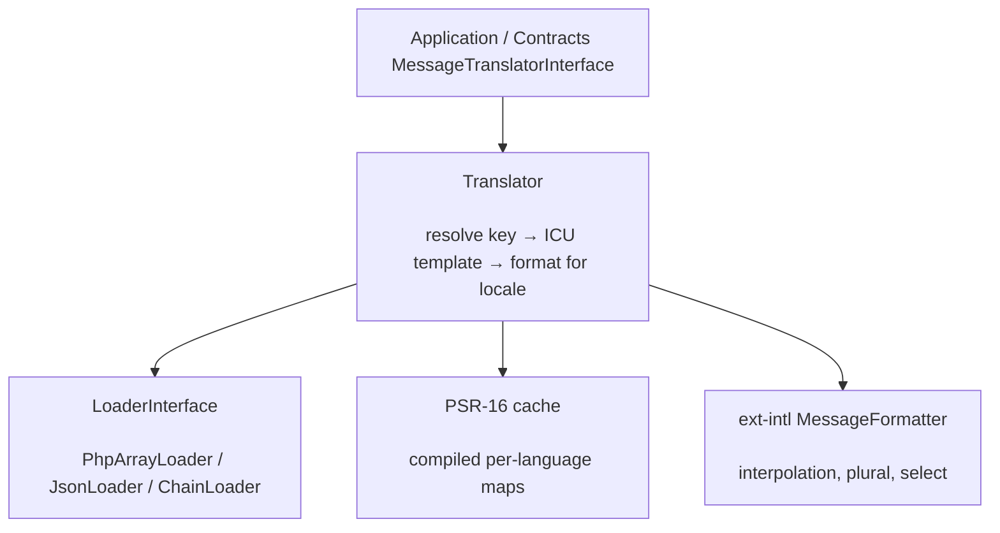

# phpdot/i18n

Internationalization built on ICU MessageFormat (via `ext-intl`): one syntax for interpolation,
pluralization, and selection. Translations load through pluggable loaders (PHP arrays, JSON, or a chain),
compiled maps are cached through any PSR-16 cache, and the translator implements the
`PHPdot\Contracts\I18n\MessageTranslatorInterface` so the rest of the ecosystem depends only on the
contract.

## Table of Contents

- [Requirements](#requirements)
- [Installation](#installation)
- [Usage](#usage)
- [Architecture](#architecture)
- [Testing](#testing)
- [License](#license)

## Requirements

| Requirement | Constraint |
|---|---|
| PHP | `>= 8.5` |
| `ext-intl` | `*` |
| `phpdot/contracts` | `^0.1` |
| `psr/simple-cache` | `^3.0` |

`phpdot/container` is a dev-only suggestion — the `#[Config('i18n')]` / binding attributes are inert
until a phpdot application reflects them.

## Installation

```bash
composer require phpdot/i18n
```

## Usage

```php
use PHPdot\I18n\I18nConfig;
use PHPdot\I18n\Translator;
use PHPdot\I18n\Loader\PhpArrayLoader;

$config = new I18nConfig(
    default: 'en',
    supported: ['en', 'ar', 'fr'],
    path: '/app/lang',
);

$translator = new Translator(
    loader: new PhpArrayLoader($config),
    cache: $cache,   // any PSR-16 implementation
    config: $config,
);

$translator->setLocale('ar_JO');
echo $translator->translate('messages.welcome', ['name' => 'Omar']);
```

### Translation files

Keys are prefixed by filename, so `lang/en/messages.php` gives `messages.welcome`:

```php
// lang/en/messages.php
return [
    'welcome' => 'Welcome, {name}!',
    'items' => '{count, plural, one {# item} other {# items}}',
];
```

`JsonLoader` reads the same shape from `.json` files; `ChainLoader` layers several loaders so later
sources (e.g. database overrides) win. Every template is ICU MessageFormat — interpolation,
`plural`, and `select` all share one syntax — and `ICUValidator` can check a template before it ships.

## Architecture

`Translator` resolves a key to its ICU template through the configured `LoaderInterface`, formats it
with the current locale using `ext-intl`'s MessageFormatter, and caches the compiled per-language map in
a PSR-16 cache. Unknown keys are recorded so missing translations can be audited.



## Testing

```bash
composer install
composer test        # PHPUnit
composer analyse     # PHPStan, level max + strict rules
composer cs-check    # PHP-CS-Fixer
composer check       # All three
```

## License

MIT.

**This repository is a read-only mirror**, generated by CI from
[phpdot/monorepo](https://github.com/phpdot/monorepo). [Pull requests](https://github.com/phpdot/monorepo/pulls)
and [issues](https://github.com/phpdot/monorepo/issues) belong in the monorepo.
