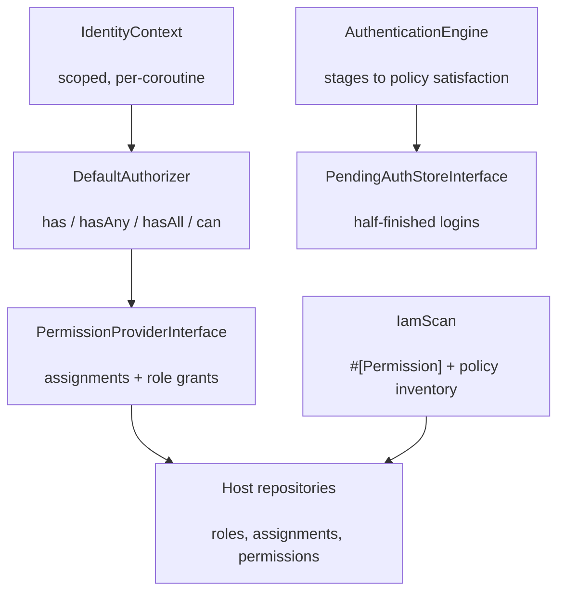

# phpdot/iam

> **This is an experimental package.** The API surface may change in any release without a
> deprecation cycle — pin the constraint and read the release notes before upgrading.

Identity and access management for the PHPdot ecosystem: staged, policy-driven authentication
(password plus any further factors, resumed across requests), typed permission keys declared as
attributes and mirrored into storage, and policy-class authorization over explicit identity and
typed resource objects. No policy engine, no DSL — a permission is membership, a policy is a class
you wrote.

## Table of Contents

- [Requirements](#requirements)
- [Installation](#installation)
- [Usage](#usage)
- [Storage contract](#storage-contract)
- [Architecture](#architecture)
- [Testing](#testing)
- [License](#license)

## Requirements

| Requirement | Constraint |
|---|---|
| PHP | `>= 8.5` |
| `ext-mbstring` | `*` |
| `phpdot/attribute` | `^0.3` |
| `phpdot/console` | `^0.3` |
| `phpdot/contracts` | `^0.3` |
| `psr/clock` | `^1.0` |
| `psr/container` | `^2.0` |
| `symfony/console` | `^8.0` |

`phpdot/container` is a dev-only suggestion for the binding attributes; `phpdot/http` and
`phpdot/session` are suggested for hosts wiring the authorization edge as middleware and running
the session-backed authenticator.

## Installation

```bash
composer require phpdot/iam
```

## Usage

Declare permissions on catalog class constants — the constant's value is the key (single source of
truth), the attribute carries the metadata. App code references the constant, so a mistyped
permission is a static-analysis error, not a silent deny. `iam:permission:sync` finds them and
mirrors them into storage at deploy:

```php
use PHPdot\Iam\Authorization\Attribute\Permission;

final class Permissions
{
    #[Permission(name: 'Edit employees', description: 'Edit employee records')]
    public const string EmployeeEdit = 'hr.employee.edit';

    #[Permission(name: 'Restart the server', root: true)]
    public const string ServerRestart = 'system.server.restart';
}
```

Authorization is two verbs on the scoped `AuthorizerInterface` — possession (`has`, `hasAny`,
`hasAll`) and policy (`can`). Every verb fails closed: an empty permission list answers `false`,
an unknown key is a grant nobody holds, and a context with no identity denies everything.

```php
$authorizer->has('hr.employee.edit');
$authorizer->hasAll(['hr.employee.edit', 'hr.employee.view']);
$authorizer->can(SalaryVisiblePolicy::class, $identity, $employeeResource);
```

Authentication is staged: each stage proves one factor, an `AuthenticationPolicy` decides how many
factors a login needs, and a half-finished login parks in the pending-auth store — namespaced away
from the authenticated session, expiring after a TTL — until the remaining factors arrive or the
attempt fails. Every attempt runs through a `LoginThrottleInterface` seam: a closed throttle
refuses before any stage (and its Argon2id cost) runs; bind a cache- or table-backed limiter, the
default lets everything through.

```php
$engine->attempt(new PasswordCredentials($email, $password)); // → pending, OTP expected
$engine->attempt(new OtpCredentials($code));                  // → authenticated
```

The `iam:*` CLI (over `phpdot/console`) administers the result: `iam:permission:sync`,
`iam:permission:list`, `iam:policy:list`, `iam:role:create`, `iam:role:delete`, `iam:role:grant`,
`iam:role:revoke`, `iam:role:list`, `iam:assign`, `iam:unassign`, `iam:has`, and `iam:why`. Every
command addresses roles and mirrored permissions by id; the list commands take `--q`, `--page`
and `--limit`.

## Storage contract

The package owns the engine; the host owns storage. Four repository contracts, the permission
mirror's read half, and the two catalogs (`PermissionCatalogInterface`, `PolicyCatalogInterface`)
are implemented by the host against its own schema. Reads take a `FilterDTO` (`q`, named filters,
`page`/`perPage`) and answer a `SearchDTO` composing a `Paginator` of entity DTOs — there is no
unfiltered `all()`: a list without a question does not exist. Mutations arrive as `SaveDTO`s and
address roles and mirrored permissions **by id** — a name is unique data a person reads, never an
address. Permission keys stay strings exactly where a key is the currency: the check path
(`has`, `hasAny`, `hasAll`, `can`) and `permissionsOf()`. Terms every adapter must hold:

- **Reserved system roles** — `root` and `guest` always exist, are undeletable, and `root` implies
  every permission. `guest` carries the grants an anonymous actor holds.
- **Permission status** — the closed vocabulary `active` / `orphaned`. A key the scanner no longer
  declares is `orphaned`, granting it is refused, and grant resolution over it answers false:
  un-declaring a permission revokes it.
- **Grants validate against the mirror** — `DefaultRoleManager` reads the mirrored permission row
  by id (existence, root-only flag, life-stage) before persisting an edge; the catalog serves
  checks and sync, not grant validation.
- **Failures fail loudly** — an assignment to a nonexistent identity is a storage error that
  surfaces to the caller, never a silent no-op (`INSERT IGNORE` downgrading a foreign-key
  violation to a warning violates this contract).
- **Identity ids are strings** — the package never narrows them; adapters map to their column type
  without coercing through an integer cast.
- **Deterministic order** — repositories order internally with an id tiebreak so page boundaries
  are stable; the filter carries no sort (ordering joins it the day it is asked for).

## Architecture

`DefaultAuthorizer` is request-scoped over an `IdentityContext`; it resolves an actor's effective
permissions once through the `PermissionProviderInterface` (assignments joined to role grants) and
answers possession questions by membership. `IamScan` walks the declared paths with
`phpdot/attribute` and produces the permission and policy inventory that `iam:permission:sync`
mirrors into storage. The `AuthenticationEngine` runs stages to an `AuthenticationPolicy`'s
satisfaction, parking partial attempts in a `PendingAuthStoreInterface`.



## Testing

```bash
composer install
composer test        # PHPUnit
composer analyse     # PHPStan, level max + strict rules
composer cs-check    # PHP-CS-Fixer
composer check       # All three
```

## License

MIT.

**This repository is a read-only mirror**, generated by CI from
[phpdot/monorepo](https://github.com/phpdot/monorepo). [Pull requests](https://github.com/phpdot/monorepo/pulls)
and [issues](https://github.com/phpdot/monorepo/issues) belong in the monorepo.
