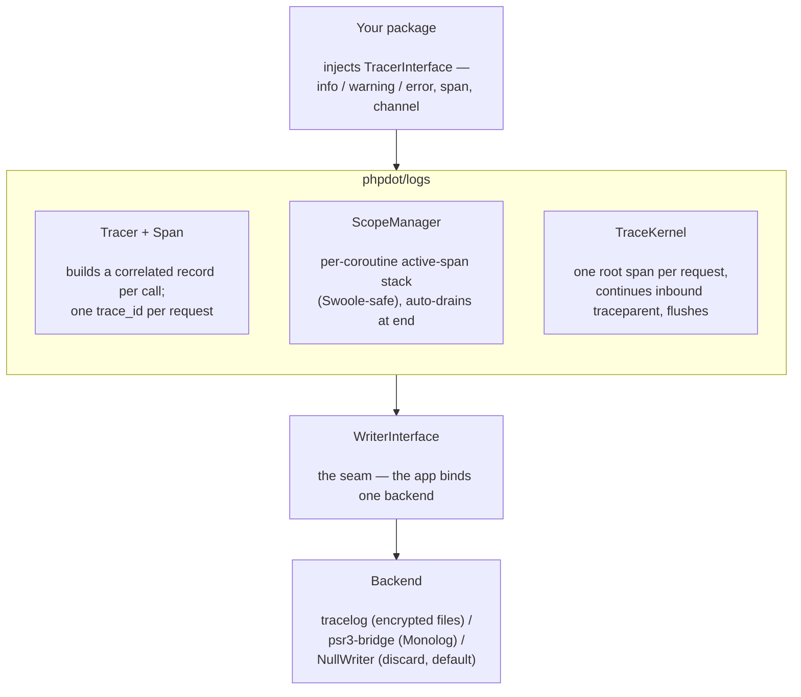

# phpdot/logs

The observability engine for the PHPdot framework — distributed tracing and structured logging behind one interface.

A package holds **one** object — `TracerInterface` — and logs and opens spans against it. It never knows or cares where those records go. The **application** binds a backend (a `Writer`) once, and that single binding decides whether the same code writes rich encrypted files, forwards to Monolog, or is discarded. One `trace_id` per request ties every log line and span together — across packages and across separate channel files.

## Table of Contents

- [Requirements](#requirements)
- [Installation](#installation)
- [Usage](#usage)
  - [Logging](#logging)
  - [Logging an exception](#logging-an-exception)
  - [Spans](#spans)
  - [Channels](#channels)
  - [The request boundary](#the-request-boundary)
  - [Distributed tracing](#distributed-tracing)
  - [Choosing a backend](#choosing-a-backend)
  - [Coroutine safety](#coroutine-safety)
- [Architecture](#architecture)
- [Testing](#testing)
- [License](#license)

## Requirements

| Requirement | Constraint |
|---|---|
| PHP | `>= 8.5` |
| `phpdot/contracts` | `^0.1` |
| `phpdot/container` | `^0.1` |

## Installation

```bash
composer require phpdot/logs
```

The engine ships with a `NullWriter` bound by default, so it works with nothing else installed (records are discarded). Add [phpdot/tracelog](https://github.com/phpdot/tracelog) or [phpdot/psr3-bridge](https://github.com/phpdot/psr3-bridge) and bind it to actually persist them.

## Usage

### Logging

Inject `TracerInterface` and log — anywhere, no setup required:

```php
use PHPdot\Contracts\Logs\TracerInterface;

final class OrderService
{
    public function __construct(private readonly TracerInterface $tracer) {}

    public function place(int $id): void
    {
        $this->tracer->info('order placed', ['id' => $id]);
        $this->tracer->warning('low stock', ['sku' => 'A-1', 'left' => 2]);
    }
}
```

Every line is correlated to the current span's `trace_id` / `span_id`. If no span is active yet, the tracer mints a trace context on first use, so logging works in *any* context — services, jobs, a one-off script.

### Encrypting a single line — `->secure()`

A log method returns a pending handle; call `secure()` on it to mark **that one record** sensitive. A backend that supports encryption (tracelog) then encrypts its message **and** context together, fail-closed — dropped, never written in plaintext, if it cannot be protected:

```php
$tracer->error('Password reset for ' . $email, ['email' => $email])->secure();  // encrypted
$tracer->info('GET /orders', ['status' => 200]);                                 // plaintext
```

The record is written when the statement ends (the handle is released), so `->secure()` takes effect as long as it is on the same line. `trace_id` / `span_id` stay in plaintext so an encrypted line is still correlatable.

### Logging an exception

The global `_e()` helper (autoloaded with this package, like `env()`) encodes a `Throwable`
into the canonical `exception` context shape — `class`, `message`, `code`, `file`, `line` —
so the structure never drifts between packages:

```php
try {
    $dispatcher->send($message);
} catch (\Throwable $e) {
    $tracer->error('Message dispatch failed', ['queue' => $queue, 'exception' => _e($e)]);
}
```

### Spans

A span is a timed unit of work with attributes, events, and a status.

```php
// trace() — preferred: the span is ALWAYS ended, even if the callback throws,
// and the callback's return value is returned straight back.
$rows = $tracer->trace('db.query', 'client', function ($span): array {
    $span->setAttribute('db.statement', 'SELECT * FROM users');
    $span->addEvent('cache.miss', ['key' => 'users']);
    $result = $db->run(...);
    $span->setAttribute('db.rows', count($result));
    return $result;
});

// manual span — you own end(); use when the work doesn't fit a callback
$span = $tracer->span('upload', 'internal');
$span->setAttribute('bytes', $size);
try {
    $this->store($file);
    $span->setStatus('ok');
} finally {
    $span->end();
}
```

Spans nest automatically — a span opened while another is active becomes its child, sharing the trace:

```php
$tracer->trace('http.request', 'server', function () use ($tracer) {
    $tracer->trace('db.query', 'client', fn () => $this->query());   // child of http.request
});
```

```
span kinds:  internal | server | client | producer | consumer
status:      unset    | ok     | error
```

Logging on a span correlates the line to that span's id: `$span->info('processing', ['step' => 2])`.

### Channels

Scope a package to its own stream with `channel()`; a backend routes each channel separately (tracelog writes `{channel}.log`):

```php
$log = $tracer->channel('http');
$log->info('GET /orders', ['status' => 200]);   // channel "http", same request trace_id
```

`channel()` returns a clone — the trace identity is unchanged, so lines on different channels in one request still share one `trace_id`.

### The request boundary

At the server entry point, the kernel opens **one** root span per request — continuing an inbound W3C `traceparent` when present — runs your work, marks the root `error` if it throws, and **flushes on the way out**. Your packages never call it:

```php
$kernel = $container->get(PHPdot\Logs\TraceKernel::class);

$response = $kernel->handle(
    $request->method() . ' ' . $request->path(),   // root span name
    fn () => $dispatcher->handle($request),         // your request body
    $request->header('traceparent'),                // optional: continue a distributed trace
    $request->header('tracestate'),
);
```

There is no `startRequest`/`endRequest`/`close` in your code. The per-coroutine scope also auto-drains at coroutine end as a backstop, so a span left open is still exported. A malformed inbound `traceparent` never breaks the request — the kernel falls back to a fresh root.

The kernel is transport-agnostic — name the root after the unit of work for CLI commands or queue messages, too:

```php
$kernel->handle('orders:reconcile', fn () => $command->run($input, $output));
$kernel->handle('queue:SendInvoice', fn () => $handler->handle($message), $message->header('traceparent'));
```

### Distributed tracing

```php
// inbound — continue an upstream trace (handle() does this for you)
$kernel->handle('GET /orders', $work, $req->header('traceparent'));

// outbound — propagate to a downstream service
$client->request('GET', $url, ['headers' => [
    'traceparent' => $tracer->context()->toTraceparent(),   // 00-<trace>-<span>-01
]]);
```

### Choosing a backend

The app binds `WriterInterface` once — the only line that changes between "rich files", "Monolog", and "off":

- [phpdot/tracelog](https://github.com/phpdot/tracelog) — encrypted, per-channel files
- [phpdot/psr3-bridge](https://github.com/phpdot/psr3-bridge) — any PSR-3 logger (Monolog)
- `NullWriter` (built in, the default) — discard

**No sampling, ever:** if logging is enabled, every log and span is stored — production included.

### Coroutine safety

The tracer and scope manager are process-wide `#[Singleton]`s, but trace identity is **not** on the instance: each coroutine's active-span stack lives in its own context, looked up on every call. Two coroutines get two stacks; neither can see the other's current span. This is what makes one shared tracer safe under Swoole without leaking state between concurrent requests.

## Architecture

- A package depends on **`phpdot/contracts` only** and injects `TracerInterface`.
- The engine (`phpdot/logs`) builds the spans, the per-coroutine scope, and the request kernel.
- The backend is chosen by the app in one line. Packages never change.



## Testing

The package is standalone-testable:

```bash
composer install
composer test        # PHPUnit (368 tests)
composer analyse     # PHPStan, level max + strict rules
composer cs-check    # PHP-CS-Fixer (@PER-CS2.0)
composer check       # all three
```

## License

MIT

**This repository is a read-only mirror**, generated by CI from
[phpdot/monorepo](https://github.com/phpdot/monorepo). [Pull requests](https://github.com/phpdot/monorepo/pulls)
and [issues](https://github.com/phpdot/monorepo/issues) belong in the monorepo.
