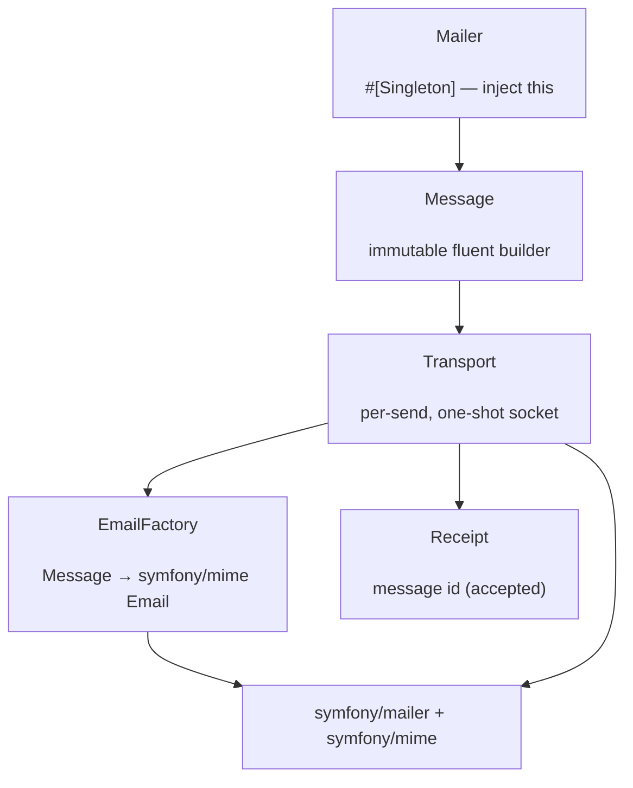

# phpdot/mail

Coroutine-safe transactional email for the PHPdot ecosystem. Compose a message with a fluent, immutable
builder and send it through any transport — SMTP, sendmail, or any Symfony transport — from one injectable
service. Delivery is delegated to the battle-tested [`symfony/mailer`](https://symfony.com/doc/current/mailer.html)
+ `symfony/mime`, fenced entirely behind a single transport boundary; the rest of the package (the builder,
the value objects, the receipt) is plain PHPdot code. A fresh transport is built per send, so concurrent
coroutines never share a socket under Swoole.

## Table of Contents

- [Requirements](#requirements)
- [Installation](#installation)
- [Usage](#usage)
- [Architecture](#architecture)
- [Testing](#testing)
- [License](#license)

## Requirements

| Requirement | Constraint |
|---|---|
| PHP | `>= 8.5` |
| `symfony/mailer` | `^8.0` |
| `symfony/mime` | `^8.0` |

`phpdot/container`, `phpdot/config`, and `phpdot/package` are optional suggestions — install them to
auto-wire the mailer and populate `MailConfig` from `config/mail.php`; the attributes are inert at runtime,
so standalone consumers need none of them.

## Installation

```bash
composer require phpdot/mail
```

## Usage

### Sending

Inject `Mailer`, compose fluently, and send. Each builder step returns a new `Message`, so chaining off the
shared mailer never mutates it:

```php
use PHPdot\Mail\Contract\MailerInterface;

final class Welcome
{
    public function __construct(private readonly MailerInterface $mail) {}

    public function greet(string $email): string
    {
        $receipt = $this->mail
            ->to($email, 'Alice')
            ->subject('Welcome aboard')
            ->html('<h1>Hi Alice</h1>')
            ->text('Hi Alice')
            ->send();

        return $receipt->messageId; // '<a1b2c3@mail.example.com>'
    }
}
```

Every message needs a sender: set `fromEmail` in `MailConfig` so chains can omit `->from()`, or call
`->from('you@example.com', 'You')` explicitly. `cc()`, `bcc()`, `replyTo()`, `attach()`/`attachData()`,
`priority()`, and `header()` round out the builder.

### Composing without sending

`$mail->message()` starts a bare `Message` you can build and pass around; its getters (`recipients()`,
`htmlBody()`, `attachments()`, …) expose the composed state, and a configured base message is a safe
reusable template because every step clones:

```php
$base = $mail->message()->from('no-reply@example.com', 'Acme')->replyTo('support@example.com');
$base->to('alice@example.com')->subject('Hi')->send();
$base->to('bob@example.com')->subject('Hi')->send();   // $base is untouched
```

### Outcomes

`send()` returns a `Receipt` (with the message id) when the transport **accepts** the message, and throws
`TransportException` when it is rejected — every Symfony failure is translated into the package's own
`MailException` hierarchy, so no Symfony type leaks into your code. Accepted is not the same as delivered:
a `Receipt` means the transport took responsibility, not that the mailbox received it.

## Architecture

`Mailer` is the injected `#[Singleton]` façade; its builder methods start a fresh immutable `Message`.
`send()` hands the message to `Transport`, which maps it onto a `symfony/mime` `Email` via `EmailFactory`,
builds a one-shot transport from the `MailConfig` DSN, delivers, and returns a `Receipt`. Symfony lives
only inside `Transport/`; `Mailbox` and `Attachment` are the immutable value objects.



## Testing

```bash
composer install
composer test        # PHPUnit
composer analyse     # PHPStan, level max + strict rules
composer cs-check    # PHP-CS-Fixer
composer check       # All three
```

## License

MIT — see [LICENSE](LICENSE).

This repository is a **read-only mirror**. The canonical source lives in
[phpdot/monorepo](https://github.com/phpdot/monorepo); pull requests and issues are handled there:
[pulls](https://github.com/phpdot/monorepo/pulls) · [issues](https://github.com/phpdot/monorepo/issues).
