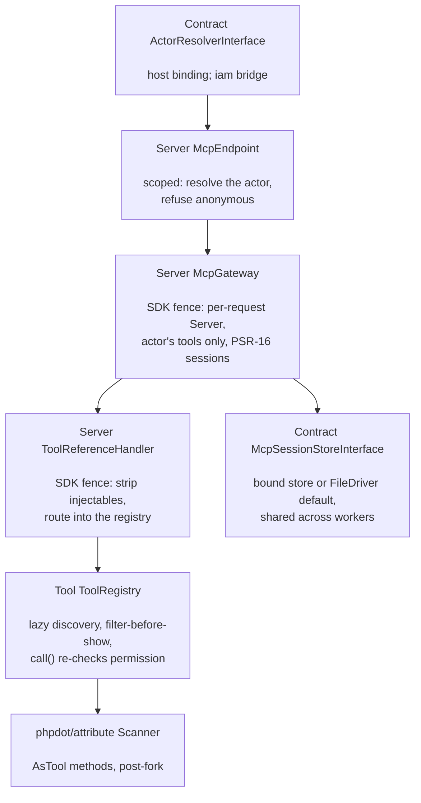

# phpdot/mcp

> **This is an experimental package.** The API surface may change in any release without a
> deprecation cycle — pin the constraint and read the release notes before upgrading.

A Model Context Protocol server for the PHPdot ecosystem — tools discovered by attribute the
way routes are discovered by filename, a tool list that answers only what the calling actor
may run, Streamable HTTP through the official [`mcp/sdk`](https://github.com/php-mcp/sdk), and
sessions held in a store shared across Swoole workers. The whole boundary is PSR-15: the host
mounts one endpoint with its own URL and its own access middleware, and any MCP client —
including the host's own assistant — sees the same door.

## Table of Contents

- [Requirements](#requirements)
- [Installation](#installation)
- [Usage](#usage)
- [The actor contract](#the-actor-contract)
- [Architecture](#architecture)
- [Testing](#testing)
- [License](#license)

## Requirements

| Requirement | Constraint |
|---|---|
| PHP | `>= 8.5` |
| `ext-json` | `*` |
| `mcp/sdk` | `^0.8` |
| `php-http/discovery` | `^1.20` |
| `phpdot/attribute` | `^0.3` |
| `phpdot/cache` | `^0.3` |
| `phpdot/http` | `^0.3` |
| `psr/container` | `^2.0` |
| `psr/http-message` | `^2.0` |
| `psr/http-server-handler` | `^1.0` |
| `psr/simple-cache` | `^3.0` |

`phpdot/container` (dev-only suggestion) autowires the attribute services; `phpdot/iam`
(dev-only suggestion) enables the `IamActorResolver` bridge; `phpdot/server` is the long-running
host this package is proven under — the integration suite boots a real Server with
`SWOOLE_HOOK_ALL` and two workers.

## Installation

```bash
composer require phpdot/mcp
```

## Usage

Declare tools on the methods that already hold the logic — a tool class is a layer over a
service, not a new service:

```php
final class ShipmentTools
{
    public function __construct(private readonly ShipmentService $shipments) {}

    #[AsTool(
        name: 'shipments_search',
        permission: 'shipments.view',
        description: 'Search shipments by tracking code, channel, or date range.',
        readOnly: true,
        idempotent: true,
    )]
    public function search(ToolArguments $arguments): array
    {
        return $this->shipments->search(
            $arguments->string('query'),
            $arguments->list('channels'),
            $arguments->int('page', default: 1, min: 1, max: 100),
        );
    }

    /** @return array<string, mixed> */
    public static function searchSchema(): array
    {
        return [
            'type' => 'object',
            'properties' => [
                'query'    => ['type' => 'string'],
                'channels' => ['type' => 'array', 'items' => ['type' => 'string']],
                'page'     => ['type' => 'integer'],
            ],
        ];
    }
}
```

Every tool states exactly one permission — one that declares none is a boot failure, not a
surprise in production — and the three hints ride MCP's tool annotations to every client,
always set, so the protocol's silent defaults never answer for a tool that did not say so.

Configuration arrives through the `#[Config('mcp')]` DTO, whose stub is generated into the
host's config directory on install:

```php
new McpConfig(
    name: 'dot',                                    // what clients see in initialize
    version: '0.3.0',                               // travels with the host's releases
    discoveryDirs: [$appsPath],                     // where #[AsTool] methods live
    sessionPath: $runtime . '/cache/mcp-sessions',  // default store's location, shared across workers
    sessionTtl: 3600,
);
```

Sessions live in a store shared across workers, and the store is a seam: a cluster binds a
dedicated `McpSessionStoreInterface` (PSR-16, deliberately its own type so the host's shared
cache can never be bound by accident) and needs no path; a single node binds nothing and gets
the FileDriver default over `sessionPath`. The package stores session state only — protocol
lifecycle and the resumable message backlog. Conversations, tool-call history, and audit are
the host's storage and never touch this package.

Mount the endpoint — three verbs, one path, the host's own access middleware. Reaching the
endpoint is not the grant; the tool list is:

```php
$router->post('/mcp', [McpEndpoint::class, 'handle'])->middleware(Access::authenticated());
$router->get('/mcp', [McpEndpoint::class, 'handle'])->middleware(Access::authenticated());
$router->delete('/mcp', [McpEndpoint::class, 'handle'])->middleware(Access::authenticated());
```

## The actor contract

The core knows exactly one thing about identity: an actor can hold a permission key or not.
`ActorResolverInterface` turns a request into that actor — or into nobody, and nobody is
refused. A host binds its own resolver; an iam host binds the bridge:

```php
// DI, one line:
ActorResolverInterface::class => IamActorResolver::class
```

The bridge adapts iam's scoped `AuthorizerInterface` (`can` → `has`) and answers null for an
anonymous authorizer. A resolver that cannot see an actor must answer null, never a
least-privilege guess: the tool list is the grant, and a grant needs someone to hold it.

## Architecture

```
src/
    Server/              the wire: McpEndpoint (PSR-15 entry), McpGateway + 
                         ToolReferenceHandler (the two-file SDK fence), McpConfig
    Tool/                AsTool, ToolRegistry, ToolDescriptor, ToolArguments —
                         discovery and the calling convention
    Contract/            ToolActorInterface, ActorResolverInterface,
                         McpSessionStoreInterface
    Bridge/              IamActor, IamActorResolver (require-dev + suggest)
    Exception/           McpException base; ToolException, GatewayException,
                         ConfigurationException leaves
```

`Server\McpEndpoint` (scoped) resolves the actor and refuses anonymous requests.
`Server\McpGateway` (singleton, stateless) is the SDK fence — the only file besides
`Server\ToolReferenceHandler` importing `Mcp\*`. Each request gets its own SDK `Server`
carrying only that actor's tools: a worker-level server would have to advertise every tool
to everyone, leaking the vocabulary to models that will try what they can name. Tool calls
never run the registered handlers — the reference handler intercepts them, strips the SDK's
own injectables, and routes into `Tool\ToolRegistry::call()`, which re-checks the permission
because the registry never trusts its caller. Sessions live in the bound
`McpSessionStoreInterface` or the FileDriver default — never the host's shared cache, whose
`clear()` would take live sessions with it — and the store must be shared across workers: a
per-worker store loses the session the moment Swoole dispatches to a sibling. Discovery is
lazy and post-fork; its memo is per-worker instance state, never a static, never a
persistent cache.



## Testing

```bash
composer install
composer test        # PHPUnit
composer analyse     # PHPStan, level max + strict rules
composer cs-check    # PHP-CS-Fixer
composer check       # All three
```

## License

MIT.

**This repository is a read-only mirror**, generated by CI from
[phpdot/monorepo](https://github.com/phpdot/monorepo). [Pull requests](https://github.com/phpdot/monorepo/pulls)
and [issues](https://github.com/phpdot/monorepo/issues) belong in the monorepo.
