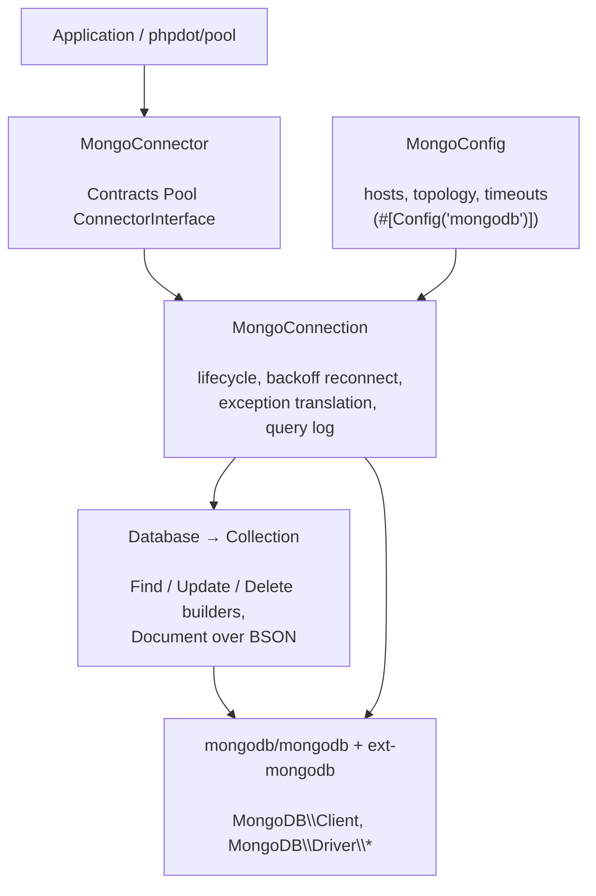

# phpdot/mongodb

A resilient MongoDB client built on the official [`mongodb/mongodb`](https://www.mongodb.com/docs/php-library/current/)
library and `ext-mongodb`. It adds fluent CRUD builders, a `Document` object over raw BSON, a typed
exception hierarchy translated from driver errors, optional query logging, and a connector so
[phpdot/pool](https://github.com/phpdot/pool) can hold and recycle connections.

## Table of Contents

- [Requirements](#requirements)
- [Installation](#installation)
- [Usage](#usage)
- [Architecture](#architecture)
- [Testing](#testing)
- [License](#license)

## Requirements

| Requirement | Constraint |
|---|---|
| PHP | `>= 8.5` |
| `ext-mongodb` | `^2.1` |
| `mongodb/mongodb` | `^2.1` |
| `phpdot/contracts` | `^0.1` |

`phpdot/container` is a dev-only suggestion — the `#[Config('mongodb')]` attribute on `MongoConfig` is
inert until a phpdot application reflects it.

## Installation

```bash
composer require phpdot/mongodb
```

## Usage

### Connecting and CRUD

```php
use PHPdot\MongoDB\MongoConnection;
use PHPdot\MongoDB\Config\MongoConfig;
use PHPdot\MongoDB\Database\Database;

$connection = new MongoConnection(new MongoConfig(
    hosts: 'localhost',
    database: 'myapp',
));
$connection->connect();

$users = (new Database($connection))->collection('users');

$users->insertOne(['name' => 'Omar', 'email' => 'omar@example.com']);

$user = $users->findOne(['email' => 'omar@example.com']);
echo $user->name; // 'Omar' — a Document with field access
```

### Fluent queries

Find, update, and delete each have a fluent builder:

```php
$active = $users->find()
    ->filter(['status' => 'active'])
    ->sort(['created_at' => -1])
    ->limit(10)
    ->execute();

foreach ($active as $doc) {
    echo $doc->name;
}

$users->update()
    ->filter(['status' => 'pending'])
    ->set(['status' => 'active'])
    ->execute();

$users->delete()->filter(['status' => 'banned'])->execute();
```

### Documents

`findOne()` and cursors yield `Document` objects — field access, dot-path reads, type conversions, and
`ArrayAccess`/`JsonSerializable`, over the raw BSON the driver returns.

### Resilience and exceptions

`connect()` retries with exponential backoff up to `maxRetries`. Driver errors are translated into a
typed hierarchy — `AuthenticationException`, `ConnectionException`, `TimeoutException`,
`DuplicateKeyException`, `BulkWriteException`, `ValidationException`, and more — all extending the
package's `MongoException`.

### Pooling

`MongoConnector` adapts a `MongoConnection` to `phpdot/pool`'s `ConnectorInterface`, so a pool can build,
health-check, and recycle connections — one connection per coroutine.

## Architecture

`MongoConnection` owns a `MongoDB\Client` and drives its lifecycle (backoff connect, ping, exception
translation). `Database` and `Collection` expose the fluent API; the query builders compile to the
options the underlying library accepts. `MongoConnector` bridges to `phpdot/pool`.



## Testing

```bash
composer install
composer test        # PHPUnit
composer analyse     # PHPStan, level max + strict rules
composer cs-check    # PHP-CS-Fixer
composer check       # All three
```

The unit suite runs with no server. The integration suite connects to a MongoDB at `127.0.0.1:27017`
and **skips automatically when none is reachable**.

## License

MIT.

**This repository is a read-only mirror**, generated by CI from
[phpdot/monorepo](https://github.com/phpdot/monorepo). [Pull requests](https://github.com/phpdot/monorepo/pulls)
and [issues](https://github.com/phpdot/monorepo/issues) belong in the monorepo.
