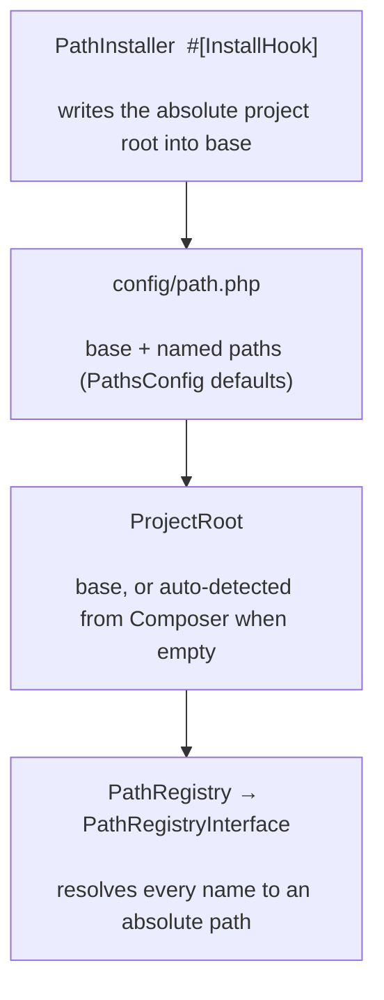

# phpdot/path

Project-root discovery and named path resolution for PHPdot. Paths are declared in `config/path.php`,
resolved to absolute paths at runtime, and reached through the `PathRegistryInterface` contract. The
project root is written in at install time (or auto-detected from Composer), and unmapped names throw
rather than being guessed.

## Table of Contents

- [Requirements](#requirements)
- [Installation](#installation)
- [Usage](#usage)
- [Architecture](#architecture)
- [Testing](#testing)
- [License](#license)

## Requirements

| Requirement | Constraint |
|---|---|
| PHP | `>= 8.5` |
| `phpdot/config` | `^0.1` |
| `phpdot/package` | `^0.1` |

`phpdot/container` is a dev-only suggestion — the `#[Config('path')]` / binding attributes are inert
until a phpdot application reflects them.

## Installation

```bash
composer require phpdot/path
```

## Usage

`PathRegistry` is a container singleton bound to `PathRegistryInterface` — inject the contract and read
absolute paths by their name:

```php
use PHPdot\Path\Contract\PathRegistryInterface;

$path = $container->get(PathRegistryInterface::class);

$path->base();          // /var/www/app
$path->config();        // /var/www/app/config
$path->vendor();        // /var/www/app/vendor
$path->public();        // /var/www/app/public
$path->protected();     // /var/www/app/protected
$path->get('uploads');  // /var/www/app/storage/uploads
$path->has('uploads');  // true
```

Every returned path is absolute. An unmapped name throws `PathNotMapped` — paths are explicit, never
guessed.

## Architecture

At install time `phpdot/package` scaffolds `config/path.php` and the `PathInstaller` install hook writes
the absolute project root into `base`. At runtime `ProjectRoot` resolves the base (auto-detecting from
Composer when `base` is empty) and `PathRegistry` resolves every named path to an absolute path.



## Testing

```bash
composer install
composer test        # PHPUnit
composer analyse     # PHPStan, level max + strict rules
composer cs-check    # PHP-CS-Fixer
composer check       # All three
```

## License

MIT.

**This repository is a read-only mirror**, generated by CI from
[phpdot/monorepo](https://github.com/phpdot/monorepo). [Pull requests](https://github.com/phpdot/monorepo/pulls)
and [issues](https://github.com/phpdot/monorepo/issues) belong in the monorepo.
