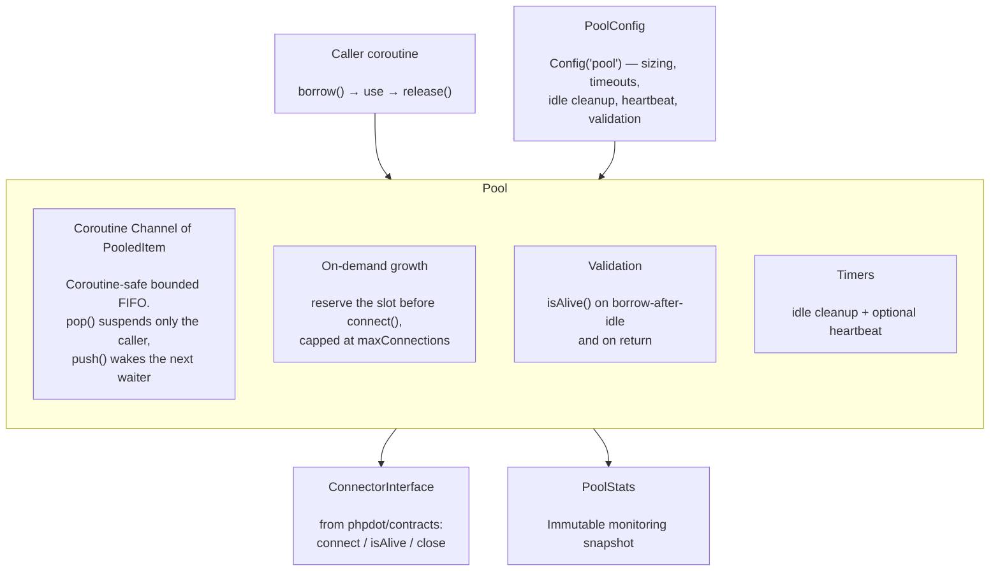

# phpdot/pool

Generic, coroutine-safe connection pool for Swoole. Holds objects of any type behind a
`Swoole\Coroutine\Channel`, so borrowing and releasing are lock-free at the C level. Creates
connections up to a cap, reaps idle ones, optionally heartbeats them, validates on borrow and
return, and prevents leaks and cross-coroutine sharing — created in `onWorkerStart`, closed in
`onWorkerStop`.

## Table of Contents

- [Requirements](#requirements)
- [Installation](#installation)
- [Usage](#usage)
  - [Define a Connector](#define-a-connector)
  - [Create and Initialize](#create-and-initialize)
  - [Borrow and Release](#borrow-and-release)
  - [Discard](#discard)
  - [Configuration](#configuration)
  - [Idle Cleanup](#idle-cleanup)
  - [Heartbeat](#heartbeat)
  - [Validate on Borrow and Return](#validate-on-borrow-and-return)
  - [Stats](#stats)
  - [Shutdown and Draining](#shutdown-and-draining)
  - [Framework Wiring](#framework-wiring)
- [Architecture](#architecture)
- [Testing](#testing)
- [License](#license)

## Requirements

| Requirement | Constraint |
|---|---|
| PHP | `>= 8.5` |
| `ext-swoole` | `>= 6.2` |
| `phpdot/contracts` | `^0.1` |

## Installation

```bash
composer require phpdot/pool
```

## Usage

### Define a Connector

The pool does not know what it pools. A connector — implementing
`PHPdot\Contracts\Pool\ConnectorInterface` (shipped by `phpdot/contracts`) — tells it how to
create, health-check, and close the underlying object.

```php
use PHPdot\Contracts\Pool\ConnectorInterface;

final class RedisConnector implements ConnectorInterface
{
    public function connect(): object
    {
        $redis = new \Redis();
        $redis->connect('127.0.0.1', 6379);

        return $redis;
    }

    public function isAlive(object $connection): bool
    {
        return $connection->ping() === true; // lightweight server round-trip
    }

    public function close(object $connection): void
    {
        $connection->close();
    }
}
```

`isAlive()` should be a single cheap round-trip (e.g. `PING`, `SELECT 1`); only a server-side
check catches connections killed by idle timeouts, firewall drops, or restarts.

### Create and Initialize

`init()` pre-creates `minConnections` and starts the timers. It **must** run inside a Swoole
coroutine (typically `onWorkerStart`).

```php
use PHPdot\Pool\Pool;
use PHPdot\Pool\PoolConfig;

$pool = new Pool(new RedisConnector(), new PoolConfig(minConnections: 4, maxConnections: 20));
$pool->init();
```

### Borrow and Release

Borrow a connection, use it, then return it. On exhaustion `borrow()` waits up to
`borrowTimeout`, growing the pool on demand up to `maxConnections`.

```php
$redis = $pool->borrow();       // object, or throws BorrowTimeoutException / PoolClosedException

try {
    $redis->set('key', 'value');
} finally {
    $pool->release($redis);     // return for reuse; double release is ignored
}
```

- `borrow(): object` — throws `PHPdot\Pool\Exception\BorrowTimeoutException` when none becomes
  available within `borrowTimeout`, or `PHPdot\Pool\Exception\PoolClosedException` after `close()`.
- `release(object $connection): void` — returns the connection to the pool; releasing an unknown
  or already-released connection is silently ignored.

### Discard

Permanently close a connection that must not be reused (a broken one), freeing its slot.

```php
$pool->discard($redis);         // close + free the slot, never re-pool
```

### Configuration

`PoolConfig` is an immutable value object (also discoverable as `#[Config('pool')]`).

```php
use PHPdot\Pool\PoolConfig;

new PoolConfig(
    minConnections: 2,                  // pre-created on init; pool never shrinks below this
    maxConnections: 10,                 // hard cap per worker
    borrowTimeout: 3.0,                 // seconds to wait when exhausted
    maxIdleTime: 300.0,                 // seconds before an idle connection is reaped (0.0 = off)
    idleCheckInterval: 30.0,            // seconds between idle-cleanup runs
    heartbeatInterval: 0.0,             // seconds between heartbeats (0.0 = off)
    validateOnBorrowAfterIdle: 5.0,     // isAlive() on borrow after N idle secs; 0.0 = always; <0 = off
    validateOnReturn: true,             // isAlive() on release; discard dead instead of re-pooling
);
```

Total connections to the backing service = workers x `maxConnections` (e.g. 4 x 10 = 40).

### Idle Cleanup

When `maxIdleTime > 0.0`, a timer every `idleCheckInterval` seconds closes connections idle
longer than `maxIdleTime`, never dropping below `minConnections`. Connections in use are untouched.

### Heartbeat

When `heartbeatInterval > 0.0`, a separate timer calls `isAlive()` on idle connections and closes
dead ones, refilling toward `minConnections`. Off by default — enable it for backends that drop
idle connections aggressively.

### Validate on Borrow and Return

- **On borrow** — when `validateOnBorrowAfterIdle >= 0.0` and a popped connection has been idle at
  least that many seconds, `isAlive()` is called before hand-off; a dead one is closed and the
  borrow loop tries again. `0.0` validates every borrow; a negative value disables it.
- **On return** — when `validateOnReturn` is `true` (default), `release()` calls `isAlive()` and
  discards (rather than re-pools) dead connections, so a connection poisoned mid-use cannot be
  handed straight back out.

### Stats

`stats()` returns an immutable `PoolStats` snapshot for monitoring and health checks.

```php
$s = $pool->stats();
$s->active; $s->idle; $s->total;                     // live counts
$s->borrowCount; $s->releaseCount; $s->discardCount; // lifetime counters
$s->createCount; $s->closeCount; $s->timeoutCount; $s->waitingCount;
```

### Shutdown and Draining

- `close(): void` — full synchronous shutdown: stop timers, drain and close idle connections;
  borrowed connections close on their later release. `isClosed(): bool` reports the state.
- `suspendTimers(): void` — stop the idle/heartbeat timers **without** closing the pool, so
  in-flight `borrow()` calls still complete against live connections. Use it on `onWorkerExit`
  during a graceful drain; the OS closes pooled connections when the worker exits.

### Framework Wiring

```php
$server->on('workerStart', fn () => $pool->init());
$server->on('workerExit',  fn () => $pool->suspendTimers()); // keep serving through the drain
$server->on('workerStop',  fn () => $pool->close());         // full teardown
```

## Architecture



`Pool` is built on `Swoole\Coroutine\Channel`, a coroutine-safe bounded FIFO: `pop()` suspends
only the calling coroutine (never the worker process), `push()` wakes the next waiter, and the
lock is at the C level. Growth reserves the slot (`currentCount++`) before the yielding
`connect()`, so concurrent coroutines cannot overshoot `maxConnections`. The connection type is
supplied entirely through `ConnectorInterface`, which lives in `phpdot/contracts` — this package
depends on the contract, never on a concrete driver.

## Testing

The package is standalone-testable:

```bash
composer install
composer test        # PHPUnit
composer analyse     # PHPStan, level max + strict rules
composer cs-check    # PHP-CS-Fixer
composer check       # all three
```

## License

MIT.

**This repository is a read-only mirror**, generated by CI from
[phpdot/monorepo](https://github.com/phpdot/monorepo). [Pull requests](https://github.com/phpdot/monorepo/pulls)
and [issues](https://github.com/phpdot/monorepo/issues) belong in the monorepo.
