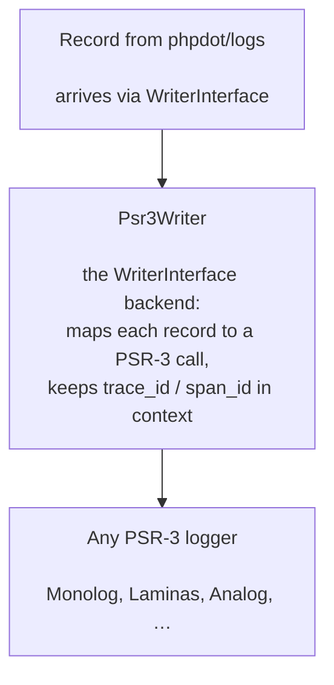

# phpdot/psr3-bridge

A PSR-3 / Monolog writer for the PHPdot observability engine.

`psr-bridge` is a **backend** for [phpdot/logs](https://github.com/phpdot/logs). It implements the engine's `WriterInterface` and forwards every record — a log line or a finished span — to an injected PSR-3 logger (Monolog, or any other). It owns no trace identity and writes no files; it is the adapter that lets the engine speak to the entire PSR-3 ecosystem.

It is a **peer** of [phpdot/tracelog](https://github.com/phpdot/tracelog) (the file backend). An application binds exactly one of them as its `WriterInterface`; the packages that log never know which. Because it depends only on [contracts](https://github.com/phpdot/contracts) and `psr/log` — **never on tracelog** — a Monolog-only app installs `{contracts, logs, psr-bridge}` and never pulls the file writer or its OpenSSL/encryption code.

## Table of Contents

- [Requirements](#requirements)
- [Installation](#installation)
- [Usage](#usage)
  - [Quick start](#quick-start)
  - [How records map](#how-records-map)
  - [Trace correlation](#trace-correlation)
  - [Crash-safety & no sampling](#crash-safety--no-sampling)
  - [Any PSR-3 logger](#any-psr-3-logger)
- [Architecture](#architecture)
- [Testing](#testing)
- [License](#license)

## Requirements

| Requirement | Constraint |
|---|---|
| PHP | `>= 8.5` |
| `phpdot/container` | `^0.1` |
| `phpdot/contracts` | `^0.1` |
| `psr/log` | `^3.0` |

## Installation

```bash
composer require phpdot/psr3-bridge monolog/monolog
```

(`monolog/monolog` is a suggestion, not a hard dependency — any PSR-3 logger works.)

## Usage

### Quick start

Bind `Psr3Writer` as the engine's `WriterInterface`, pointed at any PSR-3 logger:

```php
use PHPdot\Contracts\Logs\WriterInterface;
use PHPdot\Psr3Bridge\Psr3Writer;
use Monolog\Logger;
use Monolog\Handler\StreamHandler;

$container->set(WriterInterface::class, static fn () =>
    new Psr3Writer(
        (new Logger('app'))->pushHandler(new StreamHandler('php://stdout')),
    ),
);
```

Your packages keep logging against `TracerInterface` — only this binding changes. From here, everything the engine emits flows through your Monolog handler stack (Slack, syslog, Elasticsearch, rotating files, …).

### How records map

The engine hands the writer a flat `array<string, mixed>`. `Psr3Writer` translates it to a PSR-3 `log($level, $message, $context)` call:

#### Log records

Forwarded at their own level, with the trace correlation attached to the PSR-3 context:

```php
$tracer->channel('http')->warning('slow upstream', ['ms' => 820]);
```
```
// reaches the PSR-3 logger as:
$logger->log('warning', 'slow upstream', [
    'ms'       => 820,
    'channel'  => 'http',
    'trace_id' => '019f15…',
    'span_id'  => 'c17527…',
]);
```

The engine's level token is validated against the eight PSR-3 levels; an unknown token falls back to `info`.

#### Span records

A finished span becomes **one** line — `span <name>` — at `info`, or `error` when the span's status is `error`, with its metadata in the context:

```
$logger->log('info', 'span db.query', [
    'channel' => 'db', 'trace_id' => '019f15…', 'span_id' => 'a1b2c3…',
    'parent_span_id' => 'c17527…', 'kind' => 'client', 'duration_ms' => 4.2,
    'status' => 'ok', 'status_message' => '', 'attributes' => ['db.rows' => 5], 'events' => [],
]);
```

So even on a backend that has no concept of spans, the full span tree is preserved as correlated log lines you can group by `trace_id`.

### Trace correlation

`channel`, `trace_id`, and `span_id` are always added to the PSR-3 context, so every line a downstream handler sees carries the trace — group by `trace_id` in your log aggregator to reassemble a request.

### Crash-safety & no sampling

- **Never throws:** `write()` wraps the forward in a single `try/catch`. A misbehaving logger (a dead socket, a full disk) is swallowed so logging can never bring down the caller or the coroutine-end span flush. This is the *only* `try/catch` — it is crash-safety, never a drop decision.
- **No sampling:** every record received is forwarded. Sampling/retention is left to your Monolog handlers, not decided here.

### Any PSR-3 logger

Nothing here is Monolog-specific — `Psr3Writer` takes a `Psr\Log\LoggerInterface`. Bind Laminas, Symfony's logger, a test spy, or your own:

```php
new Psr3Writer($anyPsr3Logger);
```

## Architecture



## Testing

The package is standalone-testable:

```bash
composer install
composer test        # PHPUnit (24 tests)
composer analyse     # PHPStan, level max + strict rules
composer cs-check    # PHP-CS-Fixer (@PER-CS2.0)
composer check       # all three
```

## License

MIT

**This repository is a read-only mirror**, generated by CI from
[phpdot/monorepo](https://github.com/phpdot/monorepo). [Pull requests](https://github.com/phpdot/monorepo/pulls)
and [issues](https://github.com/phpdot/monorepo/issues) belong in the monorepo.
