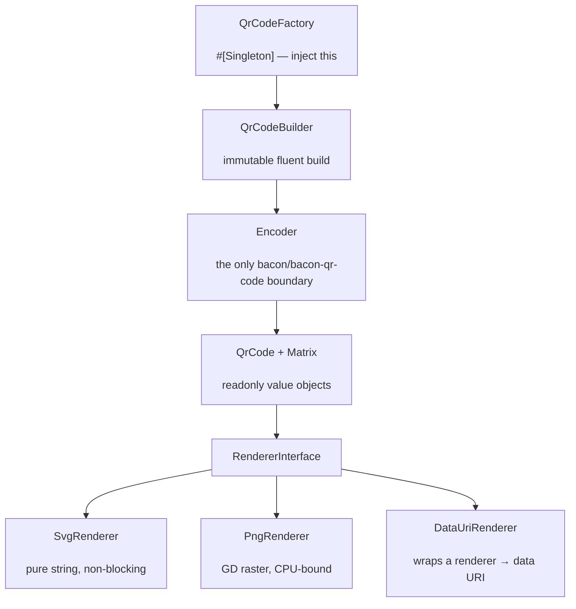

# phpdot/qrcode

Coroutine-safe QR code generation for the PHPdot ecosystem. Encode any string to a QR symbol and render
it as **SVG** (a pure string, no extension), **PNG** (GD), a raw **module matrix**, or an inline **`data:`
URI** — through one immutable, injectable factory. Encoding is delegated to the battle-tested
[`bacon/bacon-qr-code`](https://github.com/Bacon/BaconQrCode) (numeric, alphanumeric, byte and Kanji
modes, ECI, all four error-correction levels, versions 1–40, automatic masking); everything bacon touches
is fenced behind a single `Encoder`, and the rest of the package — the value objects, the renderers, the
fluent builder — is plain PHPdot code.

## Table of Contents

- [Requirements](#requirements)
- [Installation](#installation)
- [Usage](#usage)
- [Architecture](#architecture)
- [Testing](#testing)
- [License](#license)

## Requirements

| Requirement | Constraint |
|---|---|
| PHP | `>= 8.5` |
| `ext-gd` | `*` |
| `bacon/bacon-qr-code` | `^3.0` |

`ext-gd` is used only by the PNG renderer; SVG, the data URI, and the raw matrix need no extension.

## Installation

```bash
composer require phpdot/qrcode
```

## Usage

### One-call helpers

Inject `QrCodeFactory` and call a format helper — each encodes with sensible defaults and returns the
bytes directly:

```php
use PHPdot\QrCode\QrCodeFactory;

final class TicketController
{
    public function __construct(private readonly QrCodeFactory $qr) {}

    public function qr(string $ticketId): string
    {
        return $this->qr->svg("https://phpdot.com/t/{$ticketId}");
    }
}
```

`svg()`, `png()`, and `dataUri()` cover the common cases; `make()` returns the encoded `QrCode` value
object without rendering, and `create()` opens a fluent build for anything more.

### The fluent builder

`create()` returns an immutable `QrCodeBuilder` — every setter returns a new builder, so a configured
builder is a safe reusable template. Terminal methods (`toSvg()`, `toPng()`, `toDataUri()`, `toMatrix()`,
`encode()`) produce the output:

```php
use PHPdot\QrCode\Color;
use PHPdot\QrCode\Enum\ErrorCorrection;

$png = $qr->create('WIFI:T:WPA;S:phpdot;P:secret;;')
    ->errorCorrection(ErrorCorrection::High)
    ->size(512)
    ->margin(2)
    ->foreground(Color::fromHex('#101828'))
    ->background(Color::fromHex('#f8fafc'))
    ->toPng();

file_put_contents('wifi.png', $png);
```

### Colors and options

`Color` is an immutable RGBA value object with channels validated to `0–255`; `RenderOptions` carries the
`size` (target square edge in pixels, default `300`) and `margin` (quiet-zone width in modules, default
`4`):

```php
use PHPdot\QrCode\Color;

Color::fromHex('#0b5');        // #rgb / #rrggbb / #rrggbbaa, '#' optional
Color::black();
Color::transparent();          // real alpha channel in the PNG

$svg = $qr->create('https://phpdot.com')
    ->background(Color::transparent())
    ->toSvg();
```

### Encoding and ECI

Byte-mode content defaults to UTF-8 with an ECI segment, the specification-correct way to signal a
non-ISO-8859-1 charset. Most modern scanners read it fine; for legacy hardware scanners that cannot,
disable it with `eci(false)`. ASCII content (URLs, numbers) is unaffected.

```php
$svg = $qr->create('https://phpdot.com')->eci(false)->toSvg();
```

## Architecture

`QrCodeFactory` is the injected `#[Singleton]` entry point; it hands out immutable `QrCodeBuilder`
instances. A build asks `Encoder` — the single boundary to `bacon/bacon-qr-code` — to produce a `QrCode`
carrying an immutable `Matrix`, then passes that matrix plus `RenderOptions` to a `RendererInterface`. The
SVG renderer is a pure string (non-blocking, the default); the PNG renderer is a CPU-bound GD raster; the
data-URI renderer wraps either and base64-encodes the result.



## Testing

```bash
composer install
composer test        # PHPUnit (Unit + Integration)
composer analyse     # PHPStan, level max + strict rules
composer cs-check    # PHP-CS-Fixer
composer check       # All three
```

The PNG renderer is covered by a pixel round-trip test: a symbol is rendered, its pixels are read back,
the matrix is reconstructed, and it is asserted equal to the source — so a renderer that painted the wrong
cells fails even though the encoder itself is trusted.

## License

MIT — see [LICENSE](LICENSE).

This repository is a **read-only mirror**. The canonical source lives in
[phpdot/monorepo](https://github.com/phpdot/monorepo); pull requests and issues are handled there:
[pulls](https://github.com/phpdot/monorepo/pulls) · [issues](https://github.com/phpdot/monorepo/issues).
