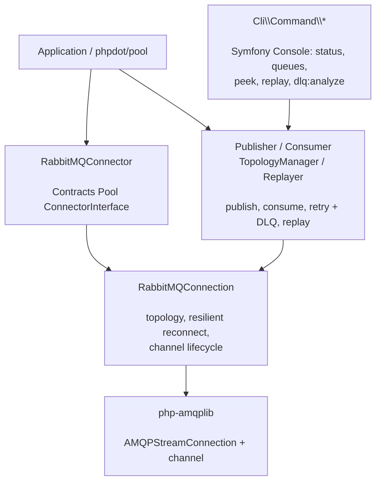

# phpdot/rabbitmq

A RabbitMQ client for PHP built on [php-amqplib](https://github.com/php-amqplib/php-amqplib): declarative
topology (exchanges, queues, bindings), fluent publish and consume, built-in retry with dead-lettering,
message replay, a set of Symfony Console commands for operating queues, and a connector so
[phpdot/pool](https://github.com/phpdot/pool) can hold and recycle connections.

## Table of Contents

- [Requirements](#requirements)
- [Installation](#installation)
- [Usage](#usage)
- [Architecture](#architecture)
- [Testing](#testing)
- [License](#license)

## Requirements

| Requirement | Constraint |
|---|---|
| PHP | `>= 8.5` |
| `php-amqplib/php-amqplib` | `^3.0` |
| `phpdot/contracts` | `^0.1` |
| `psr/log` | `^3.0` |
| `symfony/console` | `^8.0` |

php-amqplib brings `ext-sockets` and `ext-mbstring`. `phpdot/container` is a dev-only suggestion — the
`#[Config('rabbitmq')]` attribute on `RabbitMQConfig` is inert until a phpdot application reflects it.

## Installation

```bash
composer require phpdot/rabbitmq
```

## Usage

### Publish and consume

Topology is declared once in the config; the connection ensures it before publishing or consuming:

```php
use PHPdot\RabbitMQ\RabbitMQConnection;
use PHPdot\RabbitMQ\Config\RabbitMQConfig;
use PHPdot\RabbitMQ\Message;
use PHPdot\RabbitMQ\Enum\TaskStatus;

$conn = new RabbitMQConnection(new RabbitMQConfig(
    host: 'localhost',
    exchanges: ['tasks' => ['type' => 'direct', 'durable' => true]],
    queues: [
        'tasks.process' => [
            'bindings' => [['exchange' => 'tasks', 'routing_key' => 'task.new']],
            'durable' => true,
        ],
    ],
));

$conn->message('{"task":"send_email"}')->publish('tasks', 'task.new');

$conn->consume('tasks.process')->execute(function (Message $msg): TaskStatus {
    processTask(json_decode($msg->body(), true));

    return TaskStatus::SUCCESS;
});
```

Returning `TaskStatus::SUCCESS` acks the message, `RETRY` requeues it through the retry flow, and
`FAILURE` dead-letters it.

### Retry and dead-lettering

A queue can declare a retry flow (delayed re-delivery) and a dead-letter target. Messages that exhaust
their retries land on the dead-letter queue, where they can be inspected and replayed:

```php
$result = $conn->replay('tasks.process.dead')
    ->limit(10)
    ->execute(); // or ->dryRun() to preview
```

### CLI commands

The package ships Symfony Console commands for operating queues — `rabbitmq:status`, `rabbitmq:queues`,
`rabbitmq:topology:declare`, `rabbitmq:peek`, `rabbitmq:replay`, and `rabbitmq:dlq:analyze`. Register
them in your console application.

### Pooling

`RabbitMQConnector` adapts a `RabbitMQConnection` to `phpdot/pool`'s `ConnectorInterface`, so a pool can
build, health-check, and recycle connections — one per coroutine.

## Architecture

`RabbitMQConnection` owns a php-amqplib stream connection and channel, and drives topology declaration,
resilient reconnection, and lifecycle. `Publisher`, `Consumer`, `TopologyManager`, and `Replayer` build
on it; `RabbitMQConnector` bridges to `phpdot/pool`.



## Testing

```bash
composer install
composer test        # PHPUnit
composer analyse     # PHPStan, level max + strict rules
composer cs-check    # PHP-CS-Fixer
composer check       # All three
```

The unit suite runs with no broker. The integration suite connects to a RabbitMQ at `localhost:5672`
and **skips automatically when none is reachable**.

## License

MIT.

**This repository is a read-only mirror**, generated by CI from
[phpdot/monorepo](https://github.com/phpdot/monorepo). [Pull requests](https://github.com/phpdot/monorepo/pulls)
and [issues](https://github.com/phpdot/monorepo/issues) belong in the monorepo.
