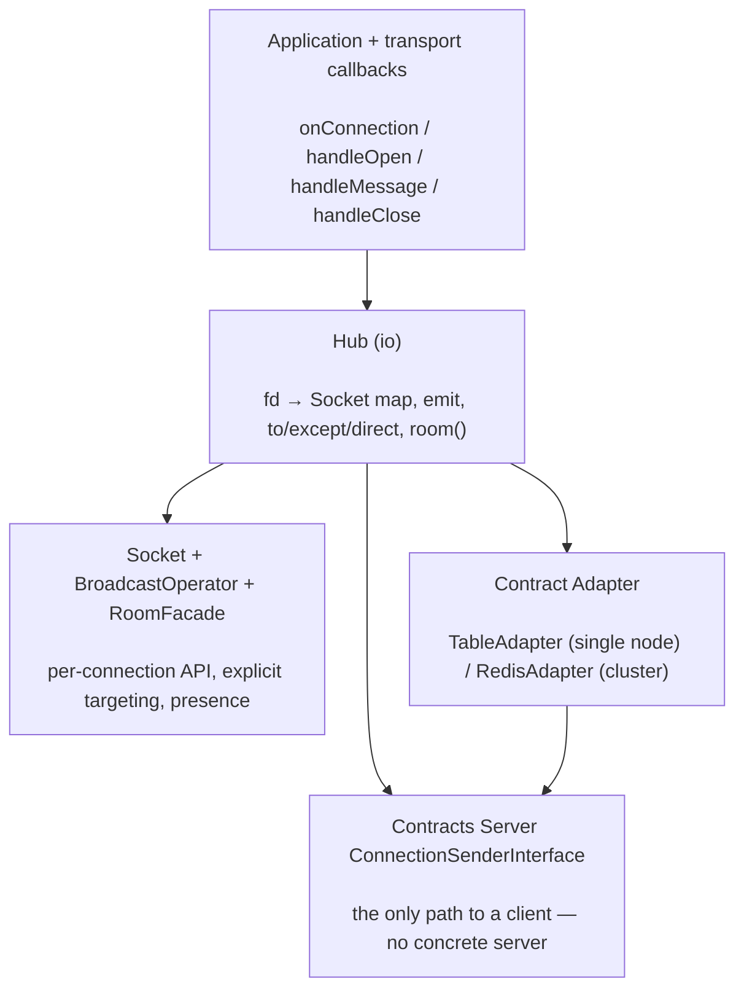

# phpdot/realtime

A real-time WebSocket engine for PHPdot — **rooms, channels, presence, and broadcast** over plain JSON
frames, with a Socket.IO-style `Hub`/`Socket` API and an explicit-targeting broadcast operator. It is
transport-agnostic: it reaches clients only through `PHPdot\Contracts\Server\ConnectionSenderInterface`,
so it never names a concrete server. A pluggable adapter backs membership and presence — a
`Swoole\Table` for a single node, or Redis for a multi-node cluster.

## Table of Contents

- [Requirements](#requirements)
- [Installation](#installation)
- [Usage](#usage)
- [Architecture](#architecture)
- [Testing](#testing)
- [License](#license)

## Requirements

| Requirement | Constraint |
|---|---|
| PHP | `>= 8.5` |
| `ext-swoole` | `>= 6.2` |
| `phpdot/contracts` | `^0.1` |
| `psr/http-message` | `^2.0` |

## Installation

```bash
composer require phpdot/realtime
```

## Usage

`realtime` carries no DI attributes on purpose — you bind the seam in your application. The `Hub` reaches
clients through `ConnectionSenderInterface` (implemented by your server's connection registry), and the
`Adapter`/`Hub` must be resolved **once at bootstrap**, before the server forks workers, because
`Swoole\Table` is shared memory only when created pre-fork:

```php
use PHPdot\Contracts\Server\ConnectionSenderInterface;
use PHPdot\Realtime\Adapter\TableAdapter;
use PHPdot\Realtime\Contract\Adapter;
use PHPdot\Realtime\Hub;

ConnectionSenderInterface::class => fn ($c) => $c->get(ConnectionRegistry::class),
Adapter::class => fn ($c) => new TableAdapter($c->get(ConnectionSenderInterface::class)),
Hub::class     => fn ($c) => new Hub($c->get(Adapter::class), $c->get(ConnectionSenderInterface::class)),
```

The `Hub` is the `io`: it owns the fd → `Socket` map, `onConnection`, `emit`, `to`/`except`/`direct`,
`room()`, and the transport lifecycle (`handleOpen` / `handleMessage` / `handleClose`). Each `Socket`
exposes the per-connection API (`emit`, `broadcast`, `join`/`leave`, `on`, `disconnect`), and
`RoomFacade` answers presence queries (`members()`, `count()`).

### Single node vs cluster

`TableAdapter` coordinates rooms and presence across the workers of one instance through a `Swoole\Table`.
For several instances behind a load balancer, bind `RedisAdapter` instead: every node shares membership
through Redis and relays broadcasts over pub/sub. `RedisSubscriber` runs the blocking SUBSCRIBE loop on a
dedicated connection, and `Maintenance\ClusterMaintenance` heartbeats each node and reaps the membership
of dead peers so leaked rooms and presence are reclaimed automatically.

## Architecture

Application and transport callbacks drive the `Hub`, which resolves `Socket`s and fans events out through
the `Adapter`. The adapter is the only thing that touches storage — a `Swoole\Table` (single node) or
Redis (cluster) — and the `Hub` pushes frames to clients solely through `ConnectionSenderInterface`, so
the engine never depends on a concrete server.



## Testing

```bash
composer install
composer test        # PHPUnit
composer analyse     # PHPStan, level max + strict rules
composer cs-check    # PHP-CS-Fixer
composer check       # All three
```

## License

MIT.

**This repository is a read-only mirror**, generated by CI from
[phpdot/monorepo](https://github.com/phpdot/monorepo). [Pull requests](https://github.com/phpdot/monorepo/pulls)
and [issues](https://github.com/phpdot/monorepo/issues) belong in the monorepo.
