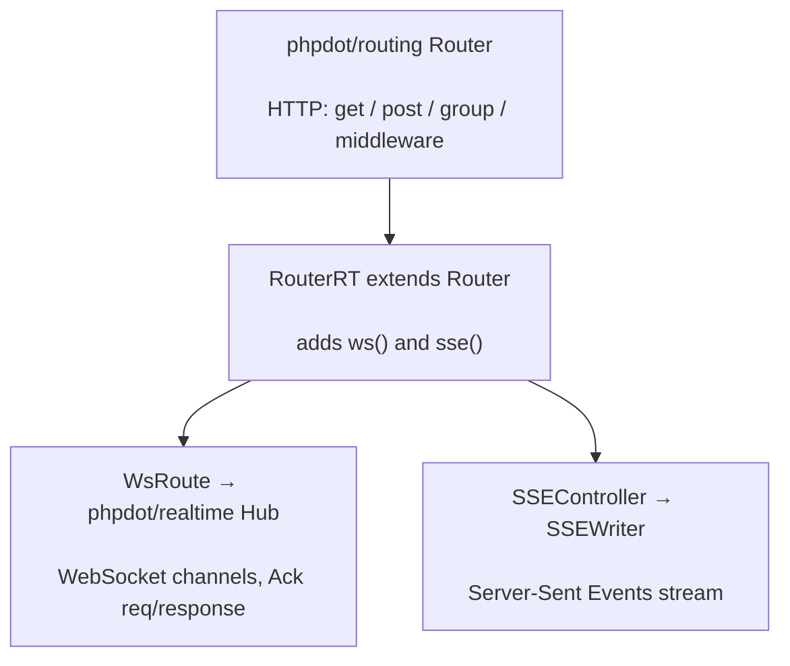

# phpdot/routing-rt

Real-time routing for WebSocket and SSE, layered on [phpdot/routing](https://github.com/phpdot/routing).
`RouterRT` extends the HTTP `Router` and adds `ws()` and `sse()` alongside `get()`/`post()`, so the same
router — and the same groups, middleware, names, and parameter constraints — serves HTTP, WebSocket, and
Server-Sent Events. WebSocket channels dispatch through [phpdot/realtime](https://github.com/phpdot/realtime);
SSE streams through an `SSEWriter`.

## Table of Contents

- [Requirements](#requirements)
- [Installation](#installation)
- [Usage](#usage)
- [Architecture](#architecture)
- [Testing](#testing)
- [License](#license)

## Requirements

| Requirement | Constraint |
|---|---|
| PHP | `>= 8.5` |
| `phpdot/contracts` | `^0.1` |
| `phpdot/realtime` | `^0.1` |
| `phpdot/routing` | `^0.1` |
| `psr/http-message` | `^2.0` |

`phpdot/container` is a dev-only suggestion — the `#[Singleton]` attribute on `RouterRT` is inert until a
phpdot application reflects it.

## Installation

```bash
composer require phpdot/routing-rt
```

## Usage

```php
use PHPdot\Routing\RouterRT\RouterRT;

$app = new RouterRT($container, $responseFactory);

// HTTP — exactly the phpdot/routing API
$app->get('/chat/{room}', [ChatPageController::class, 'show']);

// WebSocket
$app->ws('/chat/{room}', [ChatController::class, 'index']);

// SSE
$app->sse('/dashboard/{id:int}', [DashboardController::class, 'stream']);
```

Groups, middleware, names, and `where` constraints all work across the three, and the same path can serve
both HTTP and WebSocket without collision:

```php
$app->ws('/chat/{room}', [ChatController::class, 'index'])
    ->name('ws.chat')
    ->middleware(AuthMiddleware::class);
```

`list()` returns every route (HTTP, WS, SSE); `compile()` compiles them all.

## Architecture

`RouterRT` extends the HTTP `Router`, so HTTP dispatch is unchanged. `ws()` registers a `WsRoute` whose
frames are dispatched through the phpdot/realtime `Hub` (with `Ack` for request/response over the socket);
`sse()` registers a handler that streams through an `SSEWriter`. Because it *is* a `Router`, one binding
can make `RouterRT` the application's router everywhere.



## Testing

```bash
composer install
composer test        # PHPUnit
composer analyse     # PHPStan, level max + strict rules
composer cs-check    # PHP-CS-Fixer
composer check       # All three
```

## License

MIT.

**This repository is a read-only mirror**, generated by CI from
[phpdot/monorepo](https://github.com/phpdot/monorepo). [Pull requests](https://github.com/phpdot/monorepo/pulls)
and [issues](https://github.com/phpdot/monorepo/issues) belong in the monorepo.
