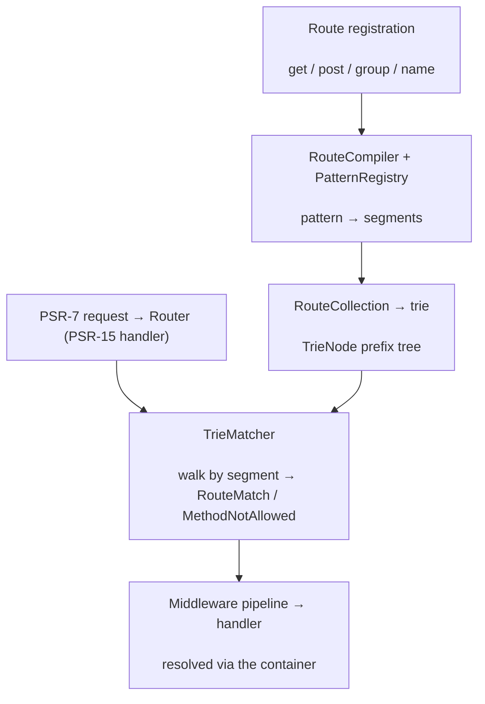

# phpdot/routing

High-performance HTTP routing built on a segment trie: routes compile into a prefix tree, so matching is
proportional to the request path's depth, not the number of routes. Fully PSR-7/15/17 — `Router` is a
PSR-15 `RequestHandlerInterface` with a middleware pipeline, typed route parameters, groups, and reverse
URL generation.

## Table of Contents

- [Requirements](#requirements)
- [Installation](#installation)
- [Usage](#usage)
- [Architecture](#architecture)
- [Testing](#testing)
- [License](#license)

## Requirements

| Requirement | Constraint |
|---|---|
| PHP | `>= 8.5` |
| `psr/container` | `^2.0` |
| `psr/http-factory` | `^1.0` |
| `psr/http-message` | `^2.0` |
| `psr/http-server-handler` | `^1.0` |
| `psr/http-server-middleware` | `^1.0` |

`phpdot/container` is a dev-only suggestion — the `#[Singleton]` attribute on `Router` is inert until a
phpdot application reflects it.

## Installation

```bash
composer require phpdot/routing
```

## Usage

```php
use PHPdot\Routing\Router;

$router = new Router($container, $responseFactory);

$router->get('/users', [UserController::class, 'index']);
$router->get('/users/{id:int}', [UserController::class, 'show']);
$router->post('/users', [UserController::class, 'store']);

$response = $router->handle($request);
```

Route parameters can be typed (`{id:int}`), optional, or catch-all; handlers are `[Controller::class,
'method']` arrays, `Controller::class` strings, or closures. Groups apply a shared prefix, name, and
middleware:

```php
$router->group(['prefix' => '/admin'], function ($r) {
    $r->get('/dashboard', [DashboardController::class, 'index']);
});
```

`UrlGenerator` builds URLs for named routes in reverse, and PSR-15 middleware runs as a pipeline around
the matched handler.

## Architecture

Registered routes are compiled by `RouteCompiler` into segment sequences and inserted into a trie. On
each request `TrieMatcher` walks the trie by path segment, producing a `RouteMatch` (or a
`MethodNotAllowed` when the path exists under a different method). `Router` then runs the route's PSR-15
middleware pipeline and invokes the handler, resolving it through the container.



## Testing

```bash
composer install
composer test        # PHPUnit
composer analyse     # PHPStan, level max + strict rules
composer cs-check    # PHP-CS-Fixer
composer check       # All three
```

## License

MIT.

**This repository is a read-only mirror**, generated by CI from
[phpdot/monorepo](https://github.com/phpdot/monorepo). [Pull requests](https://github.com/phpdot/monorepo/pulls)
and [issues](https://github.com/phpdot/monorepo/issues) belong in the monorepo.
