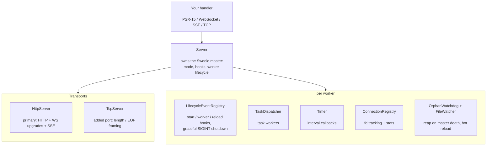

# phpdot/server

Swoole-native application server for PHP 8.5. One process owner, attachable transports, and a
PSR-15 handler in front — HTTP, WebSocket, SSE, and raw TCP served from a single Swoole master.
It builds its PSR-7 messages with `phpdot/http`, so there is no third-party PSR-7 implementation
under the hood.

Beyond request handling it owns the whole runtime: worker and task-worker pools, the full Swoole
lifecycle as typed listener interfaces, a server-wide connection registry (WebSocket push, TCP
broadcast), coroutine-safe timers, live statistics, graceful signal handling with drain
diagnostics, an orphan-reaping watchdog, and a file watcher for hot reload in development.

## Table of Contents

- [Requirements](#requirements)
- [Installation](#installation)
- [Usage](#usage)
  - [Feature overview](#feature-overview)
  - [Quick Start](#quick-start)
  - [Protocols](#protocols)
  - [Transports](#transports)
  - [Connection operations](#connection-operations)
  - [Lifecycle events](#lifecycle-events)
  - [Task workers](#task-workers)
  - [Timers](#timers)
  - [Server control](#server-control)
  - [Statistics](#statistics)
  - [User processes and hot reload](#user-processes-and-hot-reload)
  - [Configuration](#configuration)
  - [Operational behaviour](#operational-behaviour)
- [Architecture](#architecture)
- [Testing](#testing)
- [License](#license)

## Requirements

| Requirement | Constraint |
|---|---|
| PHP | `>= 8.5` |
| ext-swoole | `>= 6.2` |
| `phpdot/contracts` | `^0.1` |
| `phpdot/http` | `^0.1` |
| `psr/http-factory` | `^1.0` |
| `psr/http-message` | `^2.0` |
| `psr/http-server-handler` | `^1.0` |

## Installation

```bash
composer require phpdot/server
```

## Usage

### Feature overview

- **One master, many protocols** — HTTP, WebSocket, and SSE share the primary port; raw TCP
  attaches on its own port. All driven by one PSR-15 handler aggregate.
- **Self-contained PSR-7** — requests and responses are built with `phpdot/http`; no separate
  PSR-7 implementation required.
- **Attachable transports** — `HttpServer` (primary) and `TcpServer` implement a small
  `Transport` contract; the `Server` owns the process and wires them onto the Swoole master.
- **Typed lifecycle** — eleven `On*Interface` hooks (start, shutdown, reload, worker and manager
  events) fanned out from a single registry.
- **Connection registry** — a server-wide surface for WebSocket push/ping/disconnect and TCP
  broadcast, exposed to real-time layers through `ConnectionSenderInterface`.
- **Task workers** — offload blocking work to a task pool, with callback or coroutine-await
  completion.
- **Timers** — coroutine-safe recurring and one-shot timers.
- **Statistics** — master/manager/worker PIDs, worker status, and full Swoole stats.
- **Operational safety** — fail-fast port checks, graceful SIGINT/SIGTERM teardown, drain
  diagnostics, SSE cancellation on worker exit, and an orphan-reaping watchdog.
- **Hot reload** — a file watcher that reloads workers (or restarts) on source changes.

### Quick Start

```php
use PHPdot\Http\Factory\ResponseFactory;
use PHPdot\Server\Config\HttpServerConfig;
use PHPdot\Server\Config\ServerConfig;
use PHPdot\Server\Http\HttpServer;
use PHPdot\Server\Server;

$factory = new ResponseFactory();

$server = new Server(new ServerConfig(workerNum: 4));
$server->attach(new HttpServer($factory, new HttpServerConfig(port: 8080)));
$server->serve($handler); // any PSR-15 RequestHandlerInterface — blocks on the event loop
```

### Protocols

The handler passed to `serve()` is the application's aggregate. It is always a PSR-15
`RequestHandlerInterface`; it opts into the other protocols by additionally implementing the
handler interfaces from `phpdot/contracts`:

| Protocol | Handler interface | Trigger |
|---|---|---|
| HTTP | `Psr\Http\Server\RequestHandlerInterface` | every request |
| WebSocket | `PHPdot\Contracts\Server\WebSocketHandlerInterface` | upgrade on the primary port |
| SSE | `PHPdot\Contracts\Server\SseHandlerInterface` | `Accept: text/event-stream` |
| TCP | `PHPdot\Contracts\Server\TcpHandlerInterface` | data on an attached `TcpServer` port |

A single object may implement all four — the same socket upgrades WebSocket connections, streams
SSE, and serves HTTP, while an attached `TcpServer` routes raw frames to the TCP hooks.

### Transports

`Server` owns the process and the Swoole master; transports attach to it. `HttpServer` is always
the primary transport (it owns the main port). `TcpServer` adds a raw-TCP port alongside it:

```php
use PHPdot\Server\Config\TcpServerConfig;
use PHPdot\Server\Tcp\TcpServer;

$server->attach(new HttpServer($factory, $httpConfig));
$server->attach(new TcpServer(new TcpServerConfig(port: 9501)));
$server->serve($handler); // handler also implements TcpHandlerInterface
```

TCP framing modes (`TcpFraming`): `Eof` (delimiter, default `"\n"`), `Length` (length-prefixed),
`None` (stream — primary-only). A non-primary TCP port requires framing; Swoole never fires
`receive` on an unframed added port.

### Connection operations

`ConnectionRegistry` is the server-wide connection surface, and implements the
`ConnectionSenderInterface` seam a real-time layer depends on to reach clients without naming a
concrete server:

```php
$registry->send($fd, $data);              // raw write to one connection
$registry->pushWs($fd, $frame);           // WebSocket push, established sockets only
$registry->pingWs($fd);                   // WebSocket PING control frame (heartbeats)
$registry->broadcastWs($frame);           // push to every open WebSocket
$registry->broadcast($data, $tcpPort);    // raw-TCP broadcast, never touches HTTP/WS sockets
$registry->disconnect($fd, 4401, 'bye');  // WebSocket close handshake; no-op on dead fds
$registry->close($fd);                    // close a connection
$registry->exists($fd);                   // liveness check
$registry->info($fd);                     // Swoole client info
$registry->list($startFd, $count);        // iterate connected fds
```

### Lifecycle events

Subscribe any object to the lifecycle registry; each `PHPdot\Server\Contract\On*Interface` it
implements is fanned out from a single composite per Swoole event:

```php
final class Bootstrap implements OnWorkerStartInterface, OnBeforeShutdownInterface
{
    public function onWorkerStart(\Swoole\Server $server, int $workerId): void { /* warm caches */ }
    public function onBeforeShutdown(\Swoole\Server $server): void { /* flush */ }
}

$server->events()->subscribe(new Bootstrap());
```

| Hook interface | Fires on |
|---|---|
| `OnStartInterface` | master start |
| `OnManagerStartInterface` / `OnManagerStopInterface` | manager process start / stop |
| `OnWorkerStartInterface` / `OnWorkerStopInterface` | worker start / stop |
| `OnWorkerExitInterface` | worker exit (drain) |
| `OnWorkerErrorInterface` | worker fatal error |
| `OnBeforeReloadInterface` / `OnAfterReloadInterface` | around a reload |
| `OnBeforeShutdownInterface` / `OnShutdownInterface` | around shutdown |

### Task workers

Configure a task pool with `ServerConfig(taskWorkerNum: N)`, then offload blocking work off the
request workers:

```php
$server->onTask(fn (mixed $data) => heavyWork($data));  // runs in a task worker
$server->onFinish(fn (mixed $result) => log($result));  // back on the originating worker

// dispatch (from within a request):
$dispatcher->task($payload, onFinish: fn ($r) => handle($r));  // fire-and-callback
$results = $dispatcher->taskCo([$a, $b, $c], timeout: 0.5);    // dispatch + coroutine-await all
```

### Timers

Coroutine-safe timers over Swoole's timer wheel:

```php
$id = $timer->tick(1000, fn (int $id) => heartbeat());   // recurring, every 1000ms
$timer->after(5000, fn () => runOnce());                 // one-shot, after 5000ms
$timer->clear($id);                                      // cancel
```

### Server control

```php
$server->reload();                 // graceful worker reload (new code, no dropped connections)
$server->reload(onlyReloadTaskWorker: true);
$server->stop($workerId);          // stop one worker (it respawns)
$server->shutdown();               // stop the whole server
$server->ensurePortsAvailable();   // fail-fast port check before serve()
```

### Statistics

```php
$stats->all();            // full Swoole server stats (connections, requests, queued tasks, …)
$stats->masterPid();      // master / manager / worker identity
$stats->managerPid();
$stats->workerId();
$stats->workerPid($id);
$stats->workerStatus($id);
```

### User processes and hot reload

`ProcessManager` (via `$server->processes()`) adds long-running user processes and drives the
file watcher for development hot reload:

```php
$server->processes()->add(fn (\Swoole\Process $p) => customLoop());

use PHPdot\Server\Watch\Watcher;
$server->processes()->watch(new Watcher(
    paths: [__DIR__ . '/src'],       // change here -> reload workers (new code)
    restart: [__DIR__ . '/config'],  // change here -> full server restart
    extensions: ['php'],
));
```

A change under `paths` reloads the workers; a change under `restart` restarts the whole server
(`WatchAction::Reload` / `Restart` / `Ignore` is the resolved per-change decision).

### Configuration

Three config DTOs, one per concern. In a dot application they hydrate from
`config/server/{master,http,tcp}.php` via `#[Config]`; standalone consumers construct them
directly.

**`ServerConfig`** (`#[Config('server.master')]`) — process and pool tuning:

| Field | Default | Purpose |
|---|---|---|
| `workerNum` | `null` (CPU count) | request workers |
| `taskWorkerNum` | `0` | task workers |
| `maxRequest` | `100000` | requests before a worker recycles |
| `mode` | `SWOOLE_PROCESS` | process model (`PROCESS` / `BASE`) |
| `maxWaitTime` | `3` | drain seconds on reload/shutdown |
| `orphanWatchdog` | `true` | reap the tree if the master dies ungracefully |
| `hookFlags` | `SWOOLE_HOOK_ALL` | coroutine runtime hooks |
| `daemonize`, `pidFile`, `logFile`, `logLevel` | — | daemon / logging |
| `tcpNodelay`, `tcpKeepalive`, `backlog`, `bufferOutputSize`, `socketBufferSize`, `packageMaxLength` | — | socket tuning |
| `rawSettings` | `[]` | any Swoole setting without a typed field |

**`HttpServerConfig`** (`#[Config('server.http')]`) — `host`, `port`, `serverSoftware`, `http2`,
`httpCompression` (+ min length), and the `httpParsePost` / `httpParseCookie` / `httpParseFiles`
parsing toggles.

**`TcpServerConfig`** (`#[Config('server.tcp')]`) — `host`, `port`, `sockType`, `framing`, and the
framing parameters (`packageEof`, `packageLengthType`, `lengthOffset`, `bodyOffset`,
`packageMaxLength`).

### Operational behaviour

- **Fail-fast ports** — `serve()` refuses to start when a listen port is held, naming the exact
  host:port.
- **Graceful signals** — Ctrl+C (SIGINT) and SIGTERM tear the whole tree down cleanly, in PROCESS
  and BASE modes.
- **Orphan watchdog** (default on) — if the master dies without teardown, a watchdog process reaps
  the manager and workers instead of leaving an orphaned tree. macOS has no parent-death signal, so
  this is what prevents orphaned trees from poisoning the next boot.
- **Drain diagnostics** — a worker still pinned one second into shutdown logs exactly which
  coroutines and timers hold it, instead of a bare ERRNO 9101 force-kill.
- **SSE cancellation** — in-flight event streams are cancelled on worker exit so recycles never
  hang on a streaming loop.

## Architecture



## Testing

The package is standalone-testable (requires ext-swoole):

```bash
composer install
composer test        # PHPUnit — integration tests boot real servers
composer analyse     # PHPStan, level max + strict rules
composer cs-check    # PHP-CS-Fixer
composer check       # All three
```

Integration tests boot real servers and assert raw bytes on the wire — HTTP parity, WebSocket
frames, SSE streams, TCP framing, signal handling, and orphan reaping. They build all PSR-7 inputs
and responses with `phpdot/http`; no external PSR-7 library is used.

## License

MIT.

**This repository is a read-only mirror**, generated by CI from
[phpdot/monorepo](https://github.com/phpdot/monorepo). [Pull requests](https://github.com/phpdot/monorepo/pulls)
and [issues](https://github.com/phpdot/monorepo/issues) belong in the monorepo.
