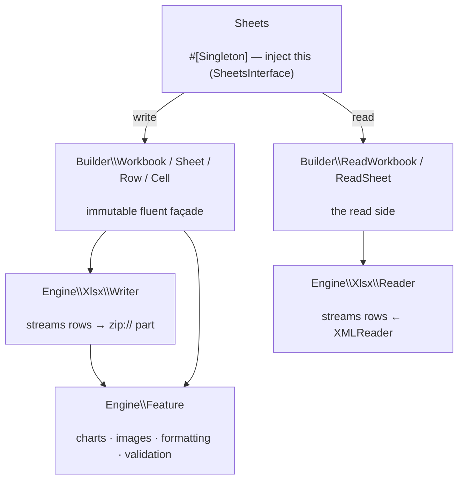

# phpdot/sheets

Streaming, low-memory XLSX reader and writer for the PHPdot ecosystem. Read and write spreadsheets of
**any size in constant memory** — the engine streams each row straight to and from a `zip://` part, so a
million-row export costs the same few megabytes as a hundred-row one. The entire API is one injectable
service and a chain of immutable builders: inject `Sheets`, call `write()` or `read()`, and decorate the
workbook, sheets, rows and cells it hands back. Charts, images, conditional formatting and data validation
are always on. Reading untrusted uploads is guarded against zip bombs, zip-slip and XXE by default, and the
whole engine is coroutine-safe under Swoole.

## Table of Contents

- [Requirements](#requirements)
- [Installation](#installation)
- [Usage](#usage)
- [Architecture](#architecture)
- [Testing](#testing)
- [License](#license)

## Requirements

| Requirement | Constraint |
|---|---|
| PHP | `>= 8.5` |
| `ext-zip` | `*` |
| `ext-mbstring` | `*` |
| `ext-xmlreader` | `*` |
| `ext-simplexml` | `*` |

## Installation

```bash
composer require phpdot/sheets
```

## Usage

### Writing

Inject `SheetsInterface`, open a workbook, add sheets and rows, and `save()`. Rows stream to the `zip://`
part one at a time, so memory stays flat regardless of size:

```php
use PHPdot\Sheets\SheetsInterface;

final class SalesExport
{
    public function __construct(private readonly SheetsInterface $sheets) {}

    public function export(string $path): void
    {
        $xlsx  = $this->sheets->write($path);
        $sheet = $xlsx->addSheet('Sales');

        $sheet->header(['Product', 'Units', 'Revenue']);
        $sheet->addRow(['Widget', 120, 3600.50]);
        $sheet->addRow(['Gadget',  80, 2400.00]);

        $xlsx->save();
    }
}
```

Every `add*()` returns the child you decorate — `addSheet()` → a sheet, `addRow()` → a row, `addCell()` →
a typed cell. Types are picked by value or pinned fluently: `addCell('00123')->asText()` keeps the leading
zeros, `addCell('=SUM(B:B)')->asFormula()` writes a formula, and plain scalar rows infer their own types.
Styling, layout, charts, images, conditional formatting and data validation all chain off the sheet
(`$sheet->addChart('bar')`, `$cell->format('currency_usd')`) — enums power them underneath, but you import
none of them.

### Reading

`read()` streams rows back through `XMLReader`; iterate records keyed by the header row:

```php
$in = $this->sheets->read($path);

foreach ($in->sheet('Sales')->records() as $row) {
    echo "{$row['Product']}: {$row['Revenue']}\n";
}
```

The reader never extracts to disk (no zip-slip), disables XML external entities (no XXE), and refuses
decompression bombs by default — so it is safe to point at untrusted uploads.

## Architecture

`Sheets` is the injected `#[Singleton]` façade and the only class you import; it implements
`SheetsInterface`. `write()` hands back a `Builder\Workbook`, `read()` a `Builder\ReadWorkbook` — a thin,
immutable builder layer you chain through. Underneath, `Engine\Xlsx\Writer` streams each row straight into
the `zip://` part and `Engine\Xlsx\Reader` streams them back through `XMLReader`; `Engine\Feature` supplies
charts, images, conditional formatting and validation, and `Engine\Model`/`Engine\Support` hold the cells,
styles, and helpers. The Builder layer is a façade — the Engine does the work, and application code almost
never names it.



## Testing

```bash
composer install
composer test        # PHPUnit — includes zip-bomb / XXE / zip-slip hardening suites
composer analyse     # PHPStan, level max + strict rules
composer cs-check    # PHP-CS-Fixer
composer check       # All three
```

## License

MIT — see [LICENSE](LICENSE).

This repository is a **read-only mirror**. The canonical source lives in
[phpdot/monorepo](https://github.com/phpdot/monorepo); pull requests and issues are handled there:
[pulls](https://github.com/phpdot/monorepo/pulls) · [issues](https://github.com/phpdot/monorepo/issues).
