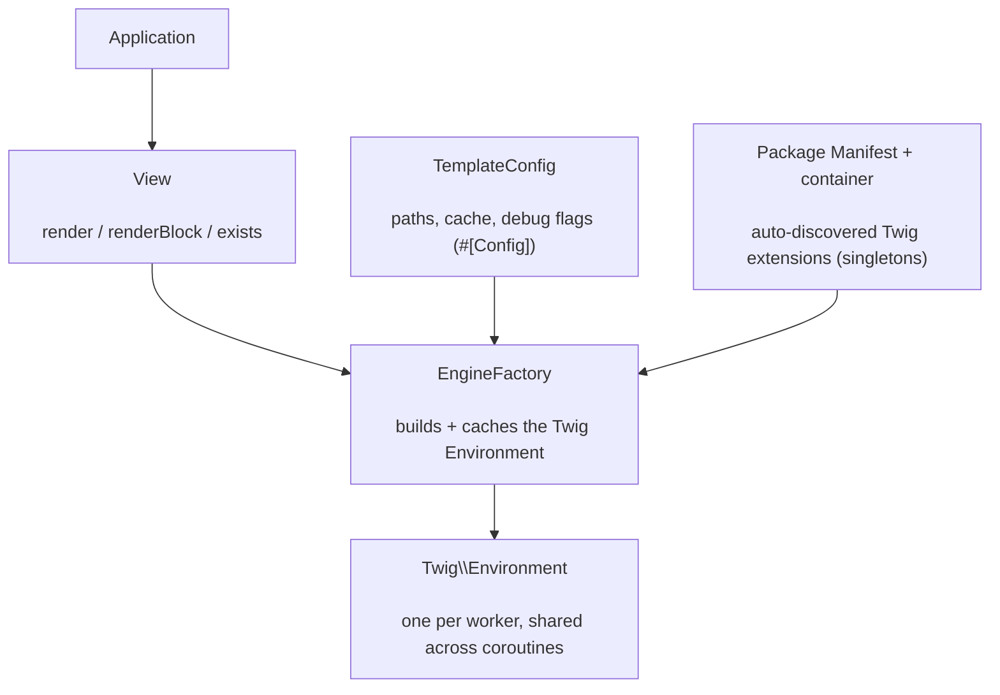

# phpdot/template

Swoole-safe [Twig](https://twig.symfony.com/) integration for PHPdot. A single `Twig\Environment` is
built once per worker and shared across coroutines; Twig extensions are auto-discovered from installed
package manifests and resolved through the container. Application code touches only the small `View`
API.

## Table of Contents

- [Requirements](#requirements)
- [Installation](#installation)
- [Usage](#usage)
- [Architecture](#architecture)
- [Testing](#testing)
- [License](#license)

## Requirements

| Requirement | Constraint |
|---|---|
| PHP | `>= 8.5` |
| `phpdot/package` | `^0.1` |
| `psr/container` | `^2.0` |
| `twig/twig` | `^3.10` |

`phpdot/config` and `phpdot/container` are dev-only suggestions — the `#[Config('template')]` / binding
attributes are inert until a phpdot application reflects them.

## Installation

```bash
composer require phpdot/template
```

## Usage

Three objects; your application code touches only `View`:

```php
use PHPdot\Template\EngineFactory;
use PHPdot\Template\TemplateConfig;
use PHPdot\Template\View;

$config  = new TemplateConfig(paths: ['__main__' => [__DIR__ . '/views']]);
$factory = new EngineFactory($config, $manifest, $container);
$view = new View($factory);

echo $view->render('hello.twig', ['name' => 'Omar']);
```

### The View API

```php
$view->render('mail/welcome.twig', ['user' => $user]);
$view->renderBlock('mail/welcome.twig', 'subject', ['user' => $user]);  // one block
$view->exists('admin/dashboard.twig');                                  // bool

$twig = $view->environment();   // escape hatch to the underlying Twig\Environment
```

`TemplateConfig` carries namespaced paths, an optional compiled-template `cache`, and the `debug`,
`strictVariables`, `autoReload`, and `autoescape` flags.

## Architecture

`View` delegates to `EngineFactory`, which builds the shared `Twig\Environment` on first use — wiring the
filesystem loader from the configured paths and registering every Twig extension advertised by an
installed package's `Manifest`, each resolved as a singleton through the container. The environment is
built once and reused, which keeps it safe to share across Swoole coroutines.



## Testing

```bash
composer install
composer test        # PHPUnit
composer analyse     # PHPStan, level max + strict rules
composer cs-check    # PHP-CS-Fixer
composer check       # All three
```

## License

MIT.

**This repository is a read-only mirror**, generated by CI from
[phpdot/monorepo](https://github.com/phpdot/monorepo). [Pull requests](https://github.com/phpdot/monorepo/pulls)
and [issues](https://github.com/phpdot/monorepo/issues) belong in the monorepo.
