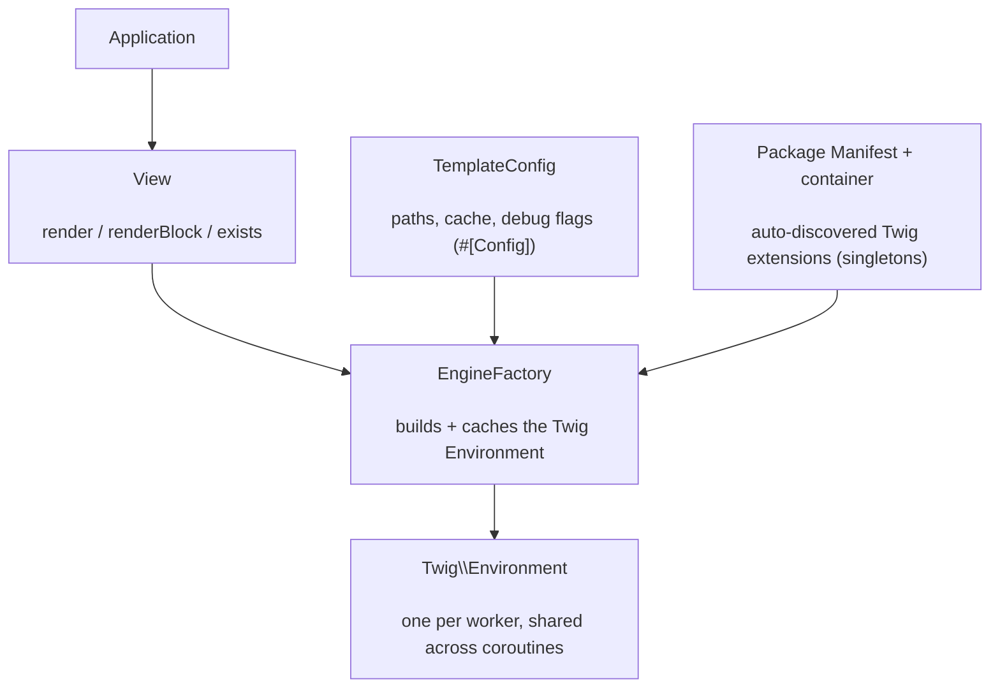

# phpdot/template

Swoole-safe [Twig](https://twig.symfony.com/) integration for PHPdot. A single `Twig\Environment` is
built once per worker and shared across coroutines; Twig extensions are auto-discovered from installed
package manifests and resolved through the container. Application code touches only the small `View`
API.

## Table of Contents

- [Requirements](#requirements)
- [Installation](#installation)
- [Usage](#usage)
- [Architecture](#architecture)
- [Testing](#testing)
- [License](#license)

## Requirements

| Requirement | Constraint |
|---|---|
| PHP | `>= 8.5` |
| `phpdot/package` | `^0.3` |
| `psr/container` | `^2.0` |
| `twig/twig` | `^3.10` |

`phpdot/config` and `phpdot/container` are `require-dev` only (`phpdot/container` also appears in
`suggest`) — the `#[Config('template')]` / binding attributes are inert until a phpdot application
reflects them.

## Installation

```bash
composer require phpdot/template
```

## Usage

Three objects; your application code touches only `View`:

```php
use PHPdot\Template\EngineFactory;
use PHPdot\Template\HtmlFormatter;
use PHPdot\Template\TemplateConfig;
use PHPdot\Template\View;

$config  = new TemplateConfig(paths: ['__main__' => [__DIR__ . '/views']]);
$factory = new EngineFactory($config, $manifest, $container);
$view    = new View($factory, new HtmlFormatter($config));

echo $view->render('hello.twig', ['name' => 'Omar']);
```

### The View API

```php
$view->render('mail/welcome.twig', ['user' => $user]);
$view->renderBlock('mail/welcome.twig', 'subject', ['user' => $user]);  // one block
$view->exists('admin/dashboard.twig');                                  // bool

$twig = $view->environment();   // escape hatch to the underlying Twig\Environment
```

`TemplateConfig` carries namespaced paths, an optional compiled-template `cache`, and the `debug`,
`strictVariables`, `autoReload`, and `autoescape` flags.

### Output formatting

`format` re-indents rendered browser HTML through ext-tidy — **on by default**, off with
`'format' => false`. Only browser HTML is touched (`.html.twig`, `.htm.twig`, or a bare
`.twig`); `.mail.twig`, `.txt`/`.csv`/`.xml.twig` templates are returned exactly as rendered,
because tidy restructures the table layouts and Outlook conditional comments email depends on.
Formatting is fail-open: markup tidy cannot parse comes back unchanged, never lost. With
formatting enabled the constructor requires ext-tidy and fails at boot, naming both remedies.

### Console

When a phpdot application discovers commands, the package contributes one:

```bash
php dot template:clear     # remove every compiled template from the `cache` directory
```

It removes only what Twig writes — the two-character buckets of hash-named `.php` files — so a
misconfigured `cache` path cannot cost application code, and it reports "already empty" when the
directory does not exist yet or "disabled" when no cache path is set. A running Swoole worker keeps
the compiled classes it has already loaded, so clear, then restart the server. Clear on every deploy
that changes templates, `autoescape`, or `charset`: Twig's compiled-class key covers neither of those
two options, so a warm cache keeps the previous setting silently.

`phpdot/console` and `symfony/console` are `require-dev` + `suggest` only: the command class stays
inert until a console loads it, so standalone consumers pay nothing for it.

## Architecture

`View` delegates to `EngineFactory`, which builds the shared `Twig\Environment` on first use — wiring the
filesystem loader from the configured paths and registering every Twig extension advertised by an
installed package's `Manifest`, each resolved as a singleton through the container. The environment is
built once and reused, which keeps it safe to share across Swoole coroutines.


```mermaid
graph TD
    APP["Application"]
    VIEW["View<br/><br/>render / renderBlock / exists"]
    FACTORY["EngineFactory<br/><br/>builds + caches the Twig Environment"]
    CONFIG["TemplateConfig<br/><br/>paths, cache, debug flags (#[Config])"]
    MANIFEST["Package Manifest + container<br/><br/>auto-discovered Twig extensions (singletons)"]
    TWIG["Twig\\Environment<br/><br/>one per worker, shared across coroutines"]

    APP --> VIEW
    VIEW --> FACTORY
    CONFIG --> FACTORY
    MANIFEST --> FACTORY
    FACTORY --> TWIG
```

## Testing

```bash
composer install
composer test        # PHPUnit
composer analyse     # PHPStan, level max + strict rules
composer cs-check    # PHP-CS-Fixer
composer check       # All three
```

## License

MIT.

**This repository is a read-only mirror**, generated by CI from
[phpdot/monorepo](https://github.com/phpdot/monorepo). [Pull requests](https://github.com/phpdot/monorepo/pulls)
and [issues](https://github.com/phpdot/monorepo/issues) belong in the monorepo.
