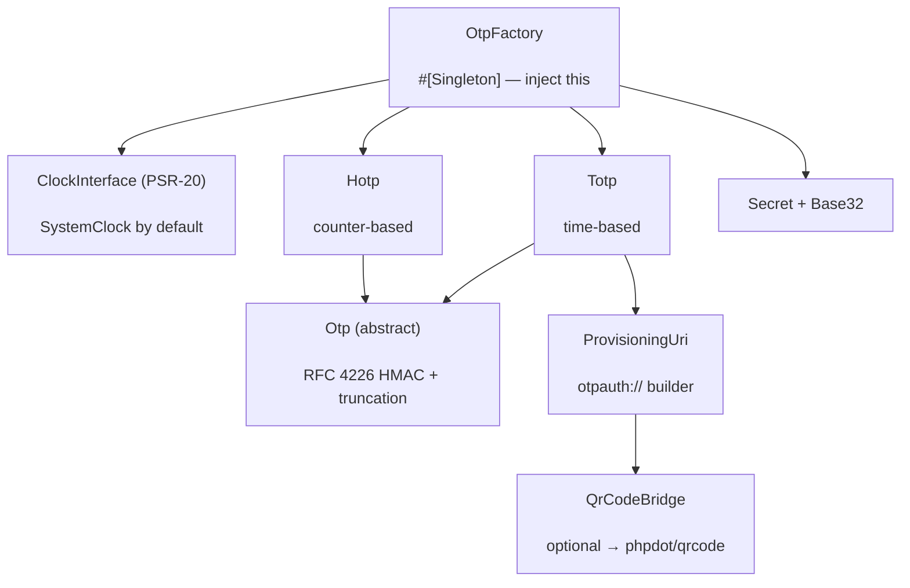

# phpdot/totp

Zero-dependency HOTP/TOTP for the PHPdot ecosystem — RFC 4226 and RFC 6238, built from scratch and
verified against the official RFC test vectors. Generate authenticator secrets, compute and verify codes,
emit `otpauth://` provisioning URIs, and (optionally) render the enrollment QR via `phpdot/qrcode`. Time
is injected as a PSR-20 clock, so codes are testable and read fresh under a long-lived Swoole worker; the
only runtime dependency is the `psr/clock` interface.

## Table of Contents

- [Requirements](#requirements)
- [Installation](#installation)
- [Usage](#usage)
- [Architecture](#architecture)
- [Testing](#testing)
- [License](#license)

## Requirements

| Requirement | Constraint |
|---|---|
| PHP | `>= 8.5` |
| `psr/clock` | `^1.0` |

`phpdot/qrcode` (`^0.1`) is an optional suggestion — install it only if you want `QrCodeBridge` to render
the enrollment QR code; the core (secrets, codes, provisioning URIs) needs nothing but `psr/clock`.

## Installation

```bash
composer require phpdot/totp
```

## Usage

### Quick start

Inject `OtpFactory`, make a secret at enrollment, and verify the typed code at login:

```php
use PHPdot\Totp\OtpFactory;

final class TwoFactor
{
    public function __construct(private readonly OtpFactory $otp) {}

    public function enroll(string $account): string
    {
        $secret = $this->otp->generateSecret();                 // CSPRNG, 160-bit
        // persist $secret->toBase32() against the user — ENCRYPTED (see Security)
        return $this->otp->totp($secret)->provisioningUri($account, 'phpdot');
    }

    public function check(string $secretBase32, string $code): bool
    {
        $secret = \PHPdot\Totp\Secret\Secret::fromBase32($secretBase32);
        return $this->otp->totp($secret)->verify($code)->passed;
    }
}
```

`Totp` exposes `current()`/`previous()`/`next()` and `at($timestamp)` for display, `window($steps)` for a
run of codes around now, and `verify()`/`verifyAt()` for validation. `Hotp` is the counter-based variant.
Defaults are **SHA-1 / 6 digits / 30s** — what every authenticator app expects; SHA-256/512 and 7–8 digits
are available via `Algorithm` but not all scanners honour non-default parameters.

### Security

The cryptography here is small and RFC-verified; the real risks live **around** it, in your application.
This package deliberately does not implement the following — they cannot live in a stateless library:

- **Encrypt the secret at rest.** A TOTP secret is a symmetric credential — it cannot be hashed, since
  verification needs the original bytes. Encrypt it before persisting (app key / KMS / libsodium) and
  decrypt only to verify. `Secret` marks its raw input `#[\SensitiveParameter]` to keep it out of stack
  traces, but storage is on you.
- **Rate-limit the verify endpoint.** A 6-digit code is one of a million values; without throttling and
  lockout an attacker can brute-force it. That is an HTTP/middleware concern the library has no context for.
- **Block replay with `after`.** A code stays valid for its whole step (plus any drift window). `verify()`
  returns the matched `timestep` — persist it and pass it back as `after` to reject any step at or before
  the last one used:

```php
$result = $otp->totp($secret)->verify($userInput, after: $user->lastTotpStep);

if ($result->passed) {
    $user->lastTotpStep = $result->timestep; // that code can never be replayed
}
```

### QR enrollment (optional)

With `phpdot/qrcode` installed, inject `QrCodeBridge` to render the provisioning URI straight to an image
(it disables ECI, since an `otpauth://` URI is pure ASCII):

```php
use PHPdot\Totp\Qr\QrCodeBridge;

$svg = $bridge->svg($otp->totp($secret), 'alice@example.com', 'phpdot');
```

## Architecture

`OtpFactory` is the injected `#[Singleton]` entry point; it builds `Totp` (RFC 6238) and `Hotp` (RFC 4226)
over a shared abstract `Otp` core (HMAC + dynamic truncation) and an injected PSR-20 clock. A `Secret`
holds the raw key and its Base32 codec; `ProvisioningUri` builds the `otpauth://` URI; `Verification` and
`OtpWindow` are the immutable results. `QrCodeBridge` is an optional caller that renders a provisioning URI
through `phpdot/qrcode`.



## Testing

```bash
composer install
composer test        # PHPUnit — includes the RFC 4226 / RFC 6238 vectors
composer analyse     # PHPStan, level max + strict rules
composer cs-check    # PHP-CS-Fixer
composer check       # All three
```

The full RFC 4226 (Appendix D) and RFC 6238 (Appendix B, all three algorithms) test vectors run as tests,
including the per-algorithm seed lengths most implementations get wrong.

## License

MIT — see [LICENSE](LICENSE).

This repository is a **read-only mirror**. The canonical source lives in
[phpdot/monorepo](https://github.com/phpdot/monorepo); pull requests and issues are handled there:
[pulls](https://github.com/phpdot/monorepo/pulls) · [issues](https://github.com/phpdot/monorepo/issues).
