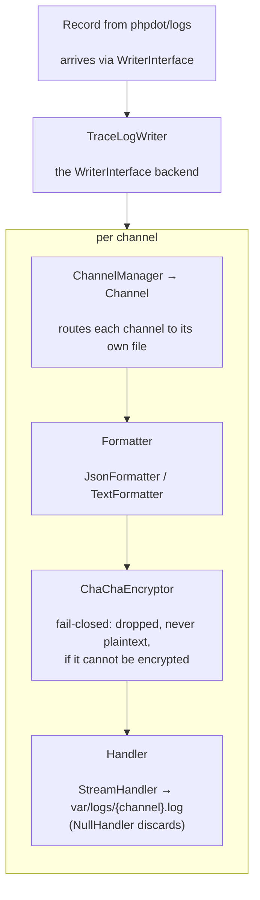

# phpdot/tracelog

The rich, encrypted, file-based writer for the PHPdot observability engine.

`tracelog` is a **backend** for [phpdot/logs](https://github.com/phpdot/logs). It implements the engine's `WriterInterface` and persists every log line and finished span to disk as structured, per-channel JSON — with optional, fail-closed encryption for sensitive records. It owns no trace identity and mints no ids; it only receives records the engine has already correlated and writes them.

It is a **peer** of [phpdot/psr3-bridge](https://github.com/phpdot/psr3-bridge) (the Monolog backend). An application binds exactly one of them as its `WriterInterface`; the packages that log never know which is installed.

## Table of Contents

- [Requirements](#requirements)
- [Installation](#installation)
- [Usage](#usage)
  - [Quick start](#quick-start)
  - [How a record becomes a line](#how-a-record-becomes-a-line)
  - [Channels](#channels--one-file-each)
  - [Record format](#record-format)
  - [Encryption](#encryption)
  - [Durability & crash-safety](#durability--crash-safety)
  - [Configuration](#configuration)
- [Architecture](#architecture)
- [Testing](#testing)
- [License](#license)

## Requirements

| Requirement | Constraint |
|---|---|
| PHP | `>= 8.5` |
| ext-openssl | `*` — record encryption |
| `phpdot/container` | `^0.1` |
| `phpdot/contracts` | `^0.1` |
| `psr/log` | `^3.0` |

## Installation

```bash
composer require phpdot/tracelog
```

## Usage

### Quick start

Bind `TraceLogWriter` as the engine's `WriterInterface`, pointed at a log directory:

```php
use PHPdot\Contracts\Logs\WriterInterface;
use PHPdot\TraceLog\Writer\TraceLogWriter;
use PHPdot\TraceLog\Log\Channel\ChannelManager;

$container->set(WriterInterface::class, static fn () =>
    new TraceLogWriter(
        new ChannelManager(__DIR__ . '/var/logs'),
    ),
);
```

From then on, any package that logs against `TracerInterface` is persisted by tracelog:

```php
$tracer->info('order placed', ['id' => 42]);          // → var/logs/app.log
$tracer->channel('http')->info('GET /orders');         // → var/logs/http.log
```

### How a record becomes a line

`TraceLogWriter::write()` receives a flat `array<string, mixed>` from the engine — a log line or a finished-span snapshot — and:

1. **Normalizes** it to the on-disk shape: the `microtime` float becomes an ISO-8601 `timestamp`, the PSR level string becomes an integer `level` + `level_name`, and a span's timing/status/attributes/events move into `context`.
2. **Routes** it to the record's `channel` (default `app`), resolving a dedicated handler via the `ChannelManager`.
3. **Protects** it if it is marked sensitive (see [Encryption](#encryption)).
4. **Writes** it through the channel's `StreamHandler` to `{channel}.log`.

`write()` never throws — a failure in the write path is swallowed so logging can never bring down the caller or the coroutine-end span flush.

### Channels → one file each

A channel is just a name carried on the record (`$tracer->channel('auth')`). tracelog gives each its own file, creating the handler lazily on first use and evicting the least-recently-used one once `maxChannels` is reached:

```
var/logs/
├── app.log       # default channel
├── http.log      # $tracer->channel('http')
├── auth.log      # $tracer->channel('auth')
└── db.log        # $tracer->channel('db')
```

All channels in one request share the same `trace_id`, so a single trace can be reassembled across files.

### Record format

JSON, one object per line. A **log** record:

```json
{"timestamp":"2026-06-30T12:00:00.123456+00:00","level":200,"level_name":"INFO","message":"order placed","channel":"app","trace_id":"019f15…","span_id":"c17527…","context":{"id":42}}
```

A finished **span** (its name is the message; timing and metadata ride in `context`):

```json
{"timestamp":"2026-06-30T12:00:00.500000+00:00","level":200,"level_name":"INFO","message":"db.query","channel":"db","trace_id":"019f15…","span_id":"a1b2c3…","context":{"parent_span_id":"c17527…","kind":"client","duration_ms":4.2,"status":"ok","attributes":{"db.rows":5},"events":[]}}
```

`trace_id` and `span_id` are always written in plaintext (even for encrypted records) so logs stay queryable.

### Encryption

Mark a single record sensitive with `->secure()` and tracelog encrypts it — **fail-closed**:

```php
$tracer->error('Password reset for ' . $email, ['email' => $email])->secure();  // encrypted
$tracer->info('GET /orders', ['status' => 200]);                                 // plaintext
```

- The **message and context are encrypted together** with ChaCha20-Poly1305 — context is where structured logging usually holds the actual secrets — and the line is written as ciphertext with `"context":{"encrypted":true}`.
- **Fail-closed:** if no encryptor is configured, or encryption fails, the record is **dropped — never written in plaintext**.
- `trace_id` / `span_id` stay in plaintext so an encrypted line is still correlatable.

Enable it by passing an encryptor to the writer:

```php
use PHPdot\TraceLog\Encryption\ChaChaEncryptor;

$key = ChaChaEncryptor::generateKey();   // base64-encoded 256-bit key — store it in your secrets manager

$container->set(WriterInterface::class, static fn () =>
    new TraceLogWriter(
        new ChannelManager(__DIR__ . '/var/logs'),
        new ChaChaEncryptor($key),
    ),
);
```

`ChaChaEncryptor` is authenticated encryption (ChaCha20-Poly1305) with a random 96-bit nonce per record; ciphertext is `base64(nonce . tag . ciphertext)`. There is no pre-encryption compression, which avoids CRIME/BREACH-class length leaks. Bring your own backend by implementing `EncryptorInterface`.

### Durability & crash-safety

- **Write-through:** each record is appended to its file under an exclusive lock (`file_put_contents(..., FILE_APPEND | LOCK_EX)`), so a line written before a `kill -9` survives.
- **Never throws:** `write()` swallows any failure — a broken disk or a misbehaving encryptor cannot crash the request or the span flush.
- **No sampling:** every record received is written. If logging is enabled, nothing is dropped (except a sensitive record that cannot be encrypted, which is dropped rather than leaked).

### Configuration

`ChannelManager` controls where and how records are written:

```php
new ChannelManager(
    basePath:    __DIR__ . '/var/logs',   // directory for the {channel}.log files
    formatter:   new JsonFormatter(),     // default; TextFormatter is also bundled
    minLevel:    100,                     // drop records below this level (100 = debug)
    maxChannels: 50,                      // cached handlers before LRU eviction
);
```

Use the bundled `TextFormatter` for human-readable development logs:

```php
use PHPdot\TraceLog\Log\Formatter\TextFormatter;

new ChannelManager(__DIR__ . '/var/logs', new TextFormatter());
```

## Architecture

The engine and the backend are decoupled. Your code holds one object — `TracerInterface` — and never references tracelog:


Swapping "rich encrypted files" for "Monolog" or "off" is a one-line change in the application's container — no package changes.



## Testing

The package is standalone-testable:

```bash
composer install
composer test        # PHPUnit
composer analyse     # PHPStan, level max + strict rules
composer cs-check    # PHP-CS-Fixer (@PER-CS2.0)
composer check       # all three
```

A Monolog-only application does not need this package — install
[phpdot/psr3-bridge](https://github.com/phpdot/psr3-bridge) instead.

## License

MIT

**This repository is a read-only mirror**, generated by CI from
[phpdot/monorepo](https://github.com/phpdot/monorepo). [Pull requests](https://github.com/phpdot/monorepo/pulls)
and [issues](https://github.com/phpdot/monorepo/issues) belong in the monorepo.
