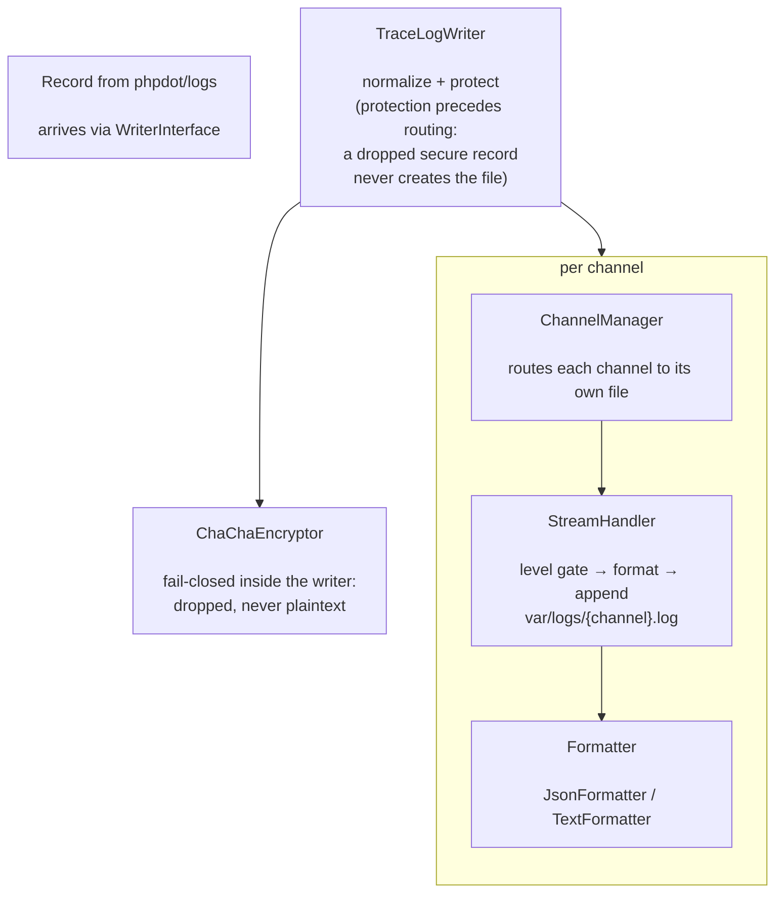

# phpdot/tracelog

The rich, encrypted, file-based writer for the PHPdot observability engine.

`tracelog` is a **backend** for [phpdot/logs](https://github.com/phpdot/logs). It implements the engine's `WriterInterface` and persists every log line and finished span to disk as structured, per-channel JSON — with optional, fail-closed encryption for sensitive records. It owns no trace identity and mints no ids; it only receives records the engine has already correlated and writes them.

It is a **peer** of [phpdot/psr3-bridge](https://github.com/phpdot/psr3-bridge) (the Monolog backend). Installing tracelog makes it the bound `WriterInterface` automatically — composer lists installed packages alphabetically, so the generated container definitions emit this package's binding after the engine's `NullWriter` and it wins deterministically. The packages that log never know which writer is installed.

## Table of Contents

- [Requirements](#requirements)
- [Installation](#installation)
- [Usage](#usage)
  - [Quick start](#quick-start)
  - [How a record becomes a line](#how-a-record-becomes-a-line)
  - [Channels](#channels--one-file-each)
  - [Record format](#record-format)
  - [Encryption](#encryption)
  - [CLI commands](#cli-commands)
  - [Durability & crash-safety](#durability--crash-safety)
  - [Configuration](#configuration)
- [Architecture](#architecture)
- [Testing](#testing)
- [License](#license)

## Requirements

| Requirement | Constraint |
|---|---|
| PHP | `>= 8.5` |
| ext-openssl | `*` — record encryption |
| `phpdot/contracts` | `^0.3` |

`phpdot/container`, `phpdot/console`, `phpdot/logs`, `psr/container`, and `symfony/console` are
`require-dev` + `suggest` entries, never `require`: the container attributes stay inert until a
phpdot application reflects them, and the two CLI commands stay inert until a console loads them —
so standalone consumers install none of them.

## Installation

```bash
composer require phpdot/tracelog
```

If the application runs the [phpdot/package](https://github.com/phpdot/package) composer script (`post-autoload-dump`), installation also scaffolds `config/tracelog.php` and registers `TraceLogWriter` as the bound `WriterInterface` in `vendor/phpdot/definitions.php` — no binding closure needed. A Monolog-only application does not install this package at all (see [phpdot/psr3-bridge](https://github.com/phpdot/psr3-bridge)).

## Usage

### Quick start

Install the package, point `config/tracelog.php` at a writable directory, and every package that logs against `TracerInterface` is persisted by tracelog:

```php
$tracer->info('order placed', ['id' => 42]);          // → var/logs/app.log
$tracer->channel('http')->info('GET /orders');         // → var/logs/http.log
```

Without the container wiring (a script, a test), construct the writer directly from the config DTO:

```php
use PHPdot\TraceLog\TraceLogConfig;
use PHPdot\TraceLog\Writer\TraceLogWriter;

$writer = new TraceLogWriter(new TraceLogConfig(basePath: __DIR__ . '/var/logs'));
```

An application that prefers a different backend registers its own `WriterInterface` definition **after** the package definitions load — a later definition replaces the generated one.

### How a record becomes a line

`TraceLogWriter::write()` receives a flat `array<string, mixed>` from the engine — a log line or a finished-span snapshot — and:

1. **Normalizes** it to the on-disk shape: the `microtime` float becomes an ISO-8601 `timestamp`, the PSR level string becomes an integer `level` + `level_name`, and a span's timing/status/attributes/events move into `context`. A record marked sensitive is **protected inside this step** (see [Encryption](#encryption)) — which is why a dropped sensitive record never even creates the channel file.
2. **Routes** the protected record to its `channel` (default `app`), resolving a dedicated handler via the `ChannelManager`.
3. **Writes** it through the channel's `StreamHandler`: the level gate drops records below `minLevel`, the formatter renders the line, and the handler appends it to `{channel}.log`.

`write()` never throws — a failure in the write path is swallowed so logging can never bring down the caller or the coroutine-end span flush.

### Channels → one file each

A channel is just a name carried on the record (`$tracer->channel('auth')`). tracelog gives each its own file, creating the handler lazily on first use and evicting the least-recently-used one once `maxChannels` is reached:

```
var/logs/
├── app.log       # default channel
├── http.log      # $tracer->channel('http')
├── auth.log      # $tracer->channel('auth')
└── db.log        # $tracer->channel('db')
```

All channels in one request share the same `trace_id`, so a single trace can be reassembled across files.

### Record format

JSON, one object per line. Every line carries its record **`type`** — `log` or `span` — so the split is a one-field filter, not context duck-typing. A **log** record:

```json
{"timestamp":"2026-06-30T12:00:00.123456+00:00","level":200,"level_name":"INFO","message":"order placed","type":"log","trace_id":"019f15…","span_id":"c17527…","channel":"app","context":{"id":42}}
```

A finished **span** (its name is the message; timing and metadata ride in a fixed nine-key `context`; a trace root writes `"parent_span_id":null` — never an empty string):

```json
{"timestamp":"2026-06-30T12:00:00.500000+00:00","level":200,"level_name":"INFO","message":"db.query","type":"span","trace_id":"019f15…","span_id":"a1b2c3…","channel":"db","context":{"parent_span_id":"c17527…","kind":"client","started_at":1782662400.0,"ended_at":1782662400.0042,"duration_ms":4.2,"status":"ok","status_message":"","attributes":{"db.rows":5},"events":[]}}
```

Map fields keep a stable JSON type empty or not: `context` and `attributes` are always objects (`{}`), while `events` is always a list (`[]`). A span is written at `INFO` — `ERROR` when its status is `error`. `trace_id` and `span_id` are always written in plaintext (even for encrypted records) so logs stay queryable. The bundled `TextFormatter` renders the same record for humans:

```
[2026-06-30 12:00:00.123456] app.INFO: order placed {"id":42} [trace:019f15… span:c17527…]
```

### Encryption

Mark a single record sensitive with `->secure()` and tracelog encrypts it — **fail-closed**:

```php
$tracer->error('Password reset for ' . $email, ['email' => $email])->secure();  // encrypted
$tracer->info('GET /orders', ['status' => 200]);                                 // plaintext
```

- The **message and context are encrypted together** with ChaCha20-Poly1305 — context is where structured logging usually holds the actual secrets — and the line is written as ciphertext with `"context":{"encrypted":true}`.
- **Fail-closed:** if no encryptor is configured, or encryption fails, the record is **dropped — never written in plaintext**.
- `trace_id` / `span_id` stay in plaintext so an encrypted line is still correlatable.

Enable it by setting a key in `config/tracelog.php` — typically from the environment:

```php
'tracelog' => [
    'encryptionKey' => env('TRACELOG_KEY'),
],
```

Generate a key with `php dot tracelog:key:generate` (see [CLI commands](#cli-commands)); the writer validates a configured key at construction, so a malformed key fails the boot loudly instead of dropping secure records silently. Without the container wiring, pass the key through the config DTO — or inject any `EncryptorInterface` implementation as the writer's second constructor argument.

`ChaChaEncryptor` is authenticated encryption (ChaCha20-Poly1305) with a random 96-bit nonce per record; ciphertext is `base64(nonce . tag . ciphertext)`. There is no pre-encryption compression, which avoids CRIME/BREACH-class length leaks. Bring your own backend by implementing `EncryptorInterface`.

### CLI commands

With [phpdot/console](https://github.com/phpdot/console) installed (a `require-dev` suggestion of this package — the command classes stay inert without it), two commands ship under the `tracelog` namespace:

```bash
php dot tracelog:key:generate               # prints one bare base64 key — pipeable: | pbcopy
php dot tracelog:check                      # verifies the wiring; exit code 1 gates deploys
```

Setting the key into the environment is the application's business — this package generates and prints, nothing more. `tracelog:check` reports the bound writer, validates the configured key with an encrypt→decrypt round-trip, and probes the channel base path for writability — the failure modes that are byte-silent at runtime.

### Durability & crash-safety

- **Write-through:** each record is appended to its file under an exclusive lock (`file_put_contents(..., FILE_APPEND | LOCK_EX)`), so a line written before a `kill -9` survives.
- **Never throws:** `write()` swallows any failure — a broken disk or a misbehaving encryptor cannot crash the request or the span flush.
- **No sampling:** every record received is written. If logging is enabled, nothing is dropped (except a sensitive record that cannot be encrypted, which is dropped rather than leaked).

### Configuration

`config/tracelog.php` — scaffolded once on install, then application-owned — drives everything (the DTO behind it is `TraceLogConfig`, validated in the constructor):

```php
return [
    'basePath' => '/var/log/app',
    'minLevel' => 100,
    'defaultFormatter' => 'json',
    'maxChannels' => 50,
    'encryptionKey' => null,
    'enabled' => true,
];
```

| Key | Meaning |
|---|---|
| `basePath` | Directory for the `{channel}.log` files, created on first write. |
| `minLevel` | Drop records below this PSR-3 integer (100 = debug … 600 = emergency). |
| `defaultFormatter` | `'json'` (machine) or `'text'` (human) line format for every channel. |
| `maxChannels` | Cached channel handlers before LRU eviction. |
| `encryptionKey` | Base64 256-bit key for `->secure()` records; `null` — or an empty string, the shape a blank `TRACELOG_KEY=` line yields — disables encryption. A non-empty malformed key fails the boot loudly. |
| `enabled` | Master switch: `false` discards every record at the writer. |

Environment blocks (`development`/`production`/`staging`) merge over these defaults via [phpdot/config](https://github.com/phpdot/config); `env()` values resolve when the application boots [phpdot/env](https://github.com/phpdot/env).

## Architecture

The engine and the backend are decoupled. Your code holds one object — `TracerInterface` — and never references tracelog:


Swapping "rich encrypted files" for "Monolog" or "off" is a one-line change in the application's container — no package changes.


```mermaid
graph TD
    REC["Record from phpdot/logs<br/><br/>arrives via WriterInterface"]
    WRITER["TraceLogWriter<br/><br/>normalize + protect<br/>(protection precedes routing:<br/>a dropped secure record<br/>never creates the file)"]

    subgraph Pipeline["per channel"]
        direction TB
        CHAN["ChannelManager<br/><br/>routes each channel to its own file"]
        HAND["StreamHandler<br/><br/>level gate → format → append<br/>var/logs/{channel}.log"]
        FMT["Formatter<br/><br/>JsonFormatter / TextFormatter"]
        CHAN --> HAND --> FMT
    end

    ENC["ChaChaEncryptor<br/><br/>fail-closed inside the writer:<br/>dropped, never plaintext"]
    WRITER --> ENC
    WRITER --> Pipeline
```

## Testing

The package is standalone-testable:

```bash
composer install
composer test        # PHPUnit
composer analyse     # PHPStan, level max + strict rules
composer cs-check    # PHP-CS-Fixer (@PER-CS2.0)
composer check       # all three
```

A Monolog-only application does not need this package — install
[phpdot/psr3-bridge](https://github.com/phpdot/psr3-bridge) instead.

## License

MIT

**This repository is a read-only mirror**, generated by CI from
[phpdot/monorepo](https://github.com/phpdot/monorepo). [Pull requests](https://github.com/phpdot/monorepo/pulls)
and [issues](https://github.com/phpdot/monorepo/issues) belong in the monorepo.
