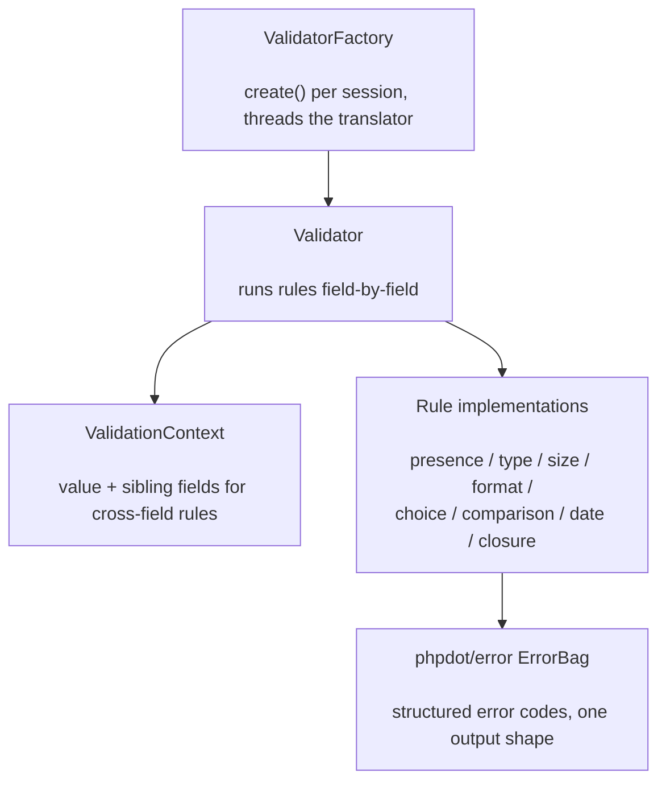

# phpdot/validator

Strict, type-safe validation that speaks [phpdot/error](https://github.com/phpdot/error): every rule
failure is a structured error code, so validation errors flow through the same `ErrorBag` as the rest of
your application — one output shape everywhere. Rules are objects, bound to your domain error codes, and
the factory threads any registered message translator into the bag automatically.

## Table of Contents

- [Requirements](#requirements)
- [Installation](#installation)
- [Usage](#usage)
- [Architecture](#architecture)
- [Testing](#testing)
- [License](#license)

## Requirements

| Requirement | Constraint |
|---|---|
| PHP | `>= 8.5` |
| `phpdot/error` | `^0.1` |

`phpdot/container` is a dev-only suggestion for auto-wiring `ValidatorFactory`.

## Installation

```bash
composer require phpdot/validator
```

## Usage

Each rule is bound to one of your domain error codes with `withError()`. Create a fresh `Validator` per
validation session from the injected factory:

```php
use PHPdot\Validator\Rule\Email;
use PHPdot\Validator\Rule\Min;
use PHPdot\Validator\Rule\Required;
use PHPdot\Validator\ValidatorFactory;

$validator = (new ValidatorFactory())->create();

$errors = $validator->validate($request->all(), [
    'username' => [
        (new Required())->withError(UserErrorCode::UsernameRequired),
        (new Min(3))->withError(UserErrorCode::UsernameTooShort),
    ],
    'email' => [
        (new Required())->withError(UserErrorCode::EmailRequired),
        (new Email())->withError(UserErrorCode::EmailInvalid),
    ],
]);

if ($errors->hasErrors()) {
    return $response->json($errors->toArray(), $errors->getHttpStatus());
}
```

`$errors` is a `phpdot/error` `ErrorBag` — the same value your controllers, services, and responders
already handle.

### Auto-wired with DI

Inject `ValidatorFactory` and call `create()` per validation. The factory threads any registered
`MessageTranslatorInterface` into the bag, so your services never import the translator:

```php
public function __construct(private readonly ValidatorFactory $validators) {}

$bag = $this->validators->create()->validate($input, $rules);
```

### Accumulating across payloads

Reuse one validator across several `validate()` calls; errors accumulate into one bag:

```php
$v = $this->validators->create();
$v->validate($userInput, $userRules);
$v->validate($paymentInput, $paymentRules);
$bag = $v->errors();   // both payloads' errors combined
```

The rule set covers presence, type, size, format, choice, cross-field comparison, date, and closure
rules; implement the `Rule` contract for your own.

## Architecture

`ValidatorFactory` builds a `Validator` (wiring in the translator). `validate()` runs each field's rules
against the input inside a `ValidationContext` (which exposes sibling fields for cross-field rules); a
failing rule contributes its bound error code to the `ErrorBag` from phpdot/error.



## Testing

```bash
composer install
composer test        # PHPUnit
composer analyse     # PHPStan, level max + strict rules
composer cs-check    # PHP-CS-Fixer
composer check       # All three
```

## License

MIT.

**This repository is a read-only mirror**, generated by CI from
[phpdot/monorepo](https://github.com/phpdot/monorepo). [Pull requests](https://github.com/phpdot/monorepo/pulls)
and [issues](https://github.com/phpdot/monorepo/issues) belong in the monorepo.
